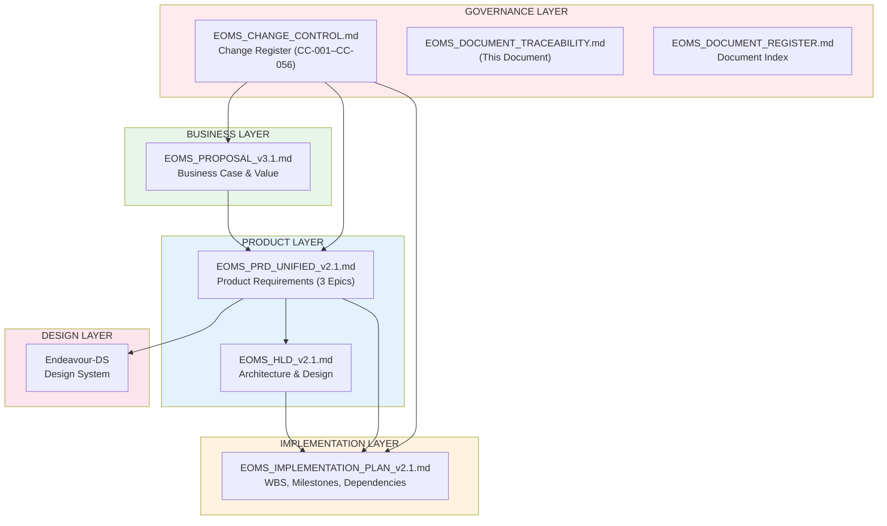

# EOMS DOCUMENT TRACEABILITY MATRIX

## Proposal v3.1 ↔ PRD v2.1 ↔ HLD v2.1 ↔ Implementation Plan v2.1

---

| Document Control | |
|-----------------|---|
| **Document Number** | EOMS-TM-001 |
| **Version** | 2.1 |
| **Date** | 19 February 2026 |
| **Purpose** | Ensure alignment and traceability across re-scoped document suite |

---

## 1. DOCUMENT HIERARCHY

---

## 2. CROSS-DOCUMENT TRACEABILITY

### 2.1 Proposal v3.1 → PRD v2.1 Mapping

| Proposal Section | PRD Section | Alignment Status |
|------------------|-------------|------------------|
| 1. Executive Summary | 1. Executive Summary | Aligned |
| 2. Problem to Solve | 1.1 Business Problem | Aligned |
| 3. Value, Benefits & ROI | 2. Business Case Summary | Aligned |
| 4. The Solution: EOMS | 4-6 Product Definition | Aligned |
| 4.1 Order Entry Wizard | Epic 1: Order Management | Aligned |
| 4.2 Product Search | Epic 2: Product Catalogue | Aligned |
| 4.3 Order Export to Finance | Epic 3: Order Export to Finance | Aligned |
| 5. Risk Summary | Appendix (reference) | Aligned |
| 6. Governance | 3.3 Governance Model | Aligned |
| 7. Recommendation | 1.3 Phase 1 Scope | Aligned |
| Appendix A: PBS | PRD Section 5 (PBS) | Aligned |
| Appendix B: Architecture | HLD cross-reference | Aligned |
| Appendix D: Benefits | PRD Section 2 (Business Case) | Aligned |

### 2.2 PRD v2.1 → HLD v2.1 Mapping

| PRD Section | HLD Section | Alignment |
|-------------|-------------|-----------|
| 5. PBS (Product Breakdown) | 4. System Architecture | Mapped |
| 5.1 PBS 1.0 Platform | 3. Technology Stack | Mapped |
| 5.2 PBS 2.0 Data | 5. Data Architecture | Mapped |
| 5.3 PBS 3.0 Frontend | 4. System Architecture (Frontend) | Mapped |
| 5.4 PBS 5.0 Integration | 8. Integration Architecture | Mapped |
| 6. Functional Requirements | 4. System Architecture | Derived |
| 6. NFRs | 9. Infrastructure & Deployment | Mapped |
| Epic 1: Order Management | 5.2 Order Schema | Mapped |
| Epic 2: Product Catalogue | 5.3 Product Schema | Mapped |
| Epic 3: Order Export to Finance | 8. Integration Architecture | Mapped |

### 2.3 PRD v2.1 → Implementation Plan v2.1 Mapping

| PRD Section | Implementation Plan Section | Alignment |
|-------------|----------------------------|-----------|
| 5. PBS | 1. WBS (PBS Reference column) | Mapped |
| 4. Epics/Features/Stories | 1. WBS (Epic Reference column) | Mapped |
| 6. Functional Requirements | WBS task detail | Derived |
| MoSCoW Priorities | WBS task prioritisation | Aligned |

### 2.4 PRD v2.1 → Design System Mapping

| PRD Section | Design System | Purpose |
|-------------|---------------|---------|
| PBS 3.2 | Endeavour-DS Primitives | Colours, spacing, typography |
| PBS 6.1 | DS Components | Component specifications |
| UI/UX Requirements | DS Tokens | Semantic design tokens |

---

## 3. CHANGE CONTROL TRACEABILITY

### 3.1 Re-Scoping Changes (CC-049–CC-056) → Document Impact

| CC# | Proposal | PRD | HLD | Impl Plan |
|-----|----------|-----|-----|-----------|
| CC-049 | Rewrite (v3.0) | Rewrite (v2.0) | Rewrite (v2.0) | Rewrite (v2.0) |
| CC-050 | **v2.1→v3.0** | - | - | - |
| CC-051 | - | **v1.7→v2.0** | - | - |
| CC-052 | - | - | **v1.0→v2.0** | - |
| CC-053 | - | - | - | **v1.0→v2.0** |
| CC-054 | Update | Update | Update | Update |
| CC-055 | Update | Update | - | - |
| CC-056 | Update | Update | Update | Update |

### 3.2 Historical CC Register → Document Impact (CC-001–CC-048)

| CC# | Proposal | PRD | HLD | Impl Plan |
|-----|----------|-----|-----|-----------|
| CC-001–CC-010 | - | Update | - | - |
| CC-011–CC-015 | Update | - | - | - |
| CC-016–CC-019 | - | Update | - | - |
| CC-020–CC-028 | - | Update | - | - |
| CC-029 | - | Update | - | Create |
| CC-030 | - | - | Create | - |
| CC-031 | - | - | Update | - |
| CC-032–CC-038 | - | - | - | - |
| CC-039–CC-043 | - | Update | - | - |
| CC-044–CC-048 | - | Update | - | - |

---

## 4. REQUIREMENTS TRACEABILITY

### 4.1 Business Requirement → Epic → PBS (Re-Scoped)

| Business Requirement | Epic | PBS Components | Status |
|---------------------|------|----------------|--------|
| BR-01: Reduce order entry time | Epic 1: Order Management | PBS 3.4, 3.5 | Phase 1 |
| BR-02: Reduce data entry errors | Epic 1: Order Management | PBS 2.1, 3.4 | Phase 1 |
| BR-03: Structured product data | Epic 2: Product Catalogue | PBS 2.2, 2.5, 3.4 | Phase 1 |
| BR-04: Finance-compatible order export | Epic 3: Order Export to Finance | PBS 5.1 | Phase 1 |
| BR-05: Audit trail | Epic 1: Order Management | PBS 2.1 | Phase 1 |
| BR-06: Basic access control | Epic 1: Order Management | PBS 1.2, 1.3 | Phase 1 |
| ~~BR-07: FX accuracy~~ | ~~Epic 4: FX Management~~ | ~~PBS 2.4, 3.7~~ | **Deferred** |
| ~~BR-08: AI validation~~ | ~~Epic 3: AI Validation~~ | ~~PBS 4.1-4.4~~ | **Deferred** |
| ~~BR-09: Dashboard/analytics~~ | ~~Epic 5: Dashboard~~ | ~~PBS 3.3~~ | **Deferred** |
| ~~BR-10: Compliance automation~~ | ~~Epic 3: AI Validation~~ | ~~PBS 4.4~~ | **Deferred** |

### 4.2 Epic → User Story → WBS Task (Phase 1)

| Epic | Key User Stories | WBS Tasks |
|------|------------------|-----------|
| Epic 1: Order Management | US-1.1.1 (Create Order), US-1.1.2 (Search Products), US-1.2.1 (Add Line Items), US-1.3.1 (Submit Order) | WBS 3.2, 3.4 |
| Epic 2: Product Catalogue | US-2.1.1 (Search 7,816 Products), US-2.1.2 (Market Eligibility) | WBS 2.4, 3.3 |
| Epic 3: Order Export to Finance | US-3.1.1 (Export to CSV/JSON), US-3.1.2 (Field Mapping) | WBS 3.3.7, 3.4.4 |

### 4.3 Functional Requirement → PBS → WBS

| FR ID | Description | PBS | WBS |
|-------|-------------|-----|-----|
| FR-ORD-001 | Order Creation Wizard | PBS 3.4 | WBS 3.2 |
| FR-ORD-002 | Order Line Item Management | PBS 3.5 | WBS 3.4 |
| FR-ORD-004 | Order Lifecycle (Draft→Complete→Exported) | PBS 3.4 | WBS 3.2 |
| FR-PRD-001 | Product Search & Filtering | PBS 2.2, 3.4 | WBS 3.3 |
| FR-PRD-002 | Market Eligibility Checking | PBS 2.5, 3.4 | WBS 3.3 |
| FR-EXP-001 | Finance-Ready Order Export (CSV/JSON) | PBS 5.1 | WBS 3.3.7, 3.4.4 |

### 4.4 Removed Functional Requirements (Deferred)

| FR ID | Description | Reason |
|-------|-------------|--------|
| FR-ORD-003 | FX Contract Integration | FX booked separately by client |
| FR-APR-001 | Approval Workflows | No approval chain in Phase 1 |
| FR-DSH-001 | Trader Dashboard | Deferred to future phase |
| FR-DSH-002 | Executive Dashboard | Deferred to future phase |
| FR-AI-* | All AI Validation FRs | Prove workflow efficiency first |

---

## 5. ARCHITECTURE TRACEABILITY

### 5.1 PRD PBS → HLD Architecture Components

| PBS Node | HLD Component | Technology |
|----------|---------------|------------|
| PBS 1.1 Next.js Application | Frontend Application | Next.js 14, TypeScript |
| PBS 1.2 Supabase Backend | Database & Auth | Supabase PostgreSQL |
| PBS 1.3 Authentication | Auth Module | Supabase Auth + RLS |
| PBS 2.1 Order Schema | Order Data Model | JSONB + SQL |
| PBS 2.2 Product Catalogue | Product Data Model | Static import + search |
| PBS 2.3 Customer Database | Customer Data Model | SQL tables |
| PBS 3.4 Order Module | Order Wizard UI | React + shadcn/ui |
| PBS 3.5 Line Item Module | Line Item Management UI | React + shadcn/ui |
| PBS 5.1 Order Export Integration | Export Module | CSV/JSON generation |

### 5.2 Removed Architecture Components (Deferred)

| PBS Node | HLD Component | Reason |
|----------|---------------|--------|
| ~~PBS 4.0 AI Agent Layer~~ | ~~AI Architecture (Section 6)~~ | No AI in Phase 1 |
| ~~PBS 2.4 FX Ontology~~ | ~~FX Data Model~~ | FX handled externally |
| ~~PBS 3.3 Dashboard~~ | ~~Dashboard Components~~ | Deferred |
| ~~PBS 3.6 Approval Module~~ | ~~Approval Workflow~~ | No approval chain |
| ~~PBS 3.7 FX Module~~ | ~~FX UI Components~~ | FX handled externally |
| ~~PBS 3.8 Analytics~~ | ~~Analytics Engine~~ | Deferred |

---

## 6. DOCUMENT VERSION MATRIX

| Document | Previous Version | Current Version | Status | Last Updated |
|----------|-----------------|-----------------|--------|--------------|
| EOMS_PROPOSAL | v3.0 | **v3.1** | For Sign-Off | 19-Feb-2026 |
| EOMS_PRD_UNIFIED | v2.0 | **v2.1** | For Implementation | 19-Feb-2026 |
| EOMS_HLD | v2.0 | **v2.1** | For Implementation | 19-Feb-2026 |
| EOMS_IMPLEMENTATION_PLAN | v2.0 | **v2.1** | For Implementation | 19-Feb-2026 |
| EOMS_CHANGE_CONTROL | v1.0 | v1.0 (updated) | Active | 19-Feb-2026 |
| EOMS_DOCUMENT_TRACEABILITY | v2.0 | **v2.1** | Active | 19-Feb-2026 |
| EOMS_DOCUMENT_REGISTER | v2.0 | **v2.1** | Active | 19-Feb-2026 |

---

## 7. REVIEW CHECKLIST

### Post Re-Scoping Verification

- [x] All AI/FX/Dashboard/Analytics language removed from v3.0/v2.0 documents
- [x] Order export promoted to Phase 1 core in all documents
- [x] Proposal scope matches PRD epics (3 epics)
- [x] PRD epics match HLD architecture components
- [x] HLD architecture matches Implementation Plan WBS
- [x] Benefit figures consistent across Proposal and PRD
- [x] Deferred items explicitly documented in all documents
- [x] Change Control entries CC-049–CC-056 document all re-scoping decisions
- [x] Document Register updated with new versions and superseded documents
- [x] Order lifecycle consistent: Draft → Complete → Exported (all docs)

---

**--- END OF TRACEABILITY MATRIX ---**

*Version 2.1 | Active*
*19 February 2026*
