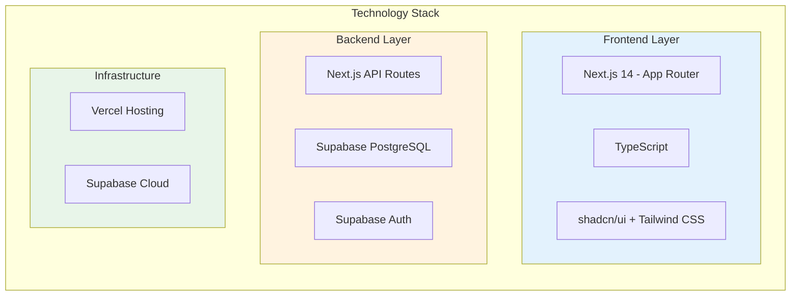
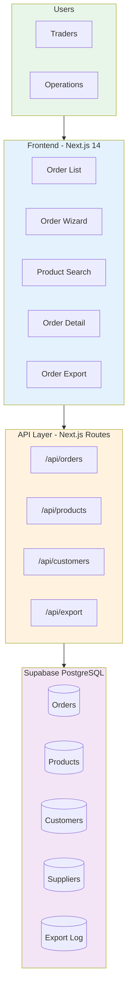
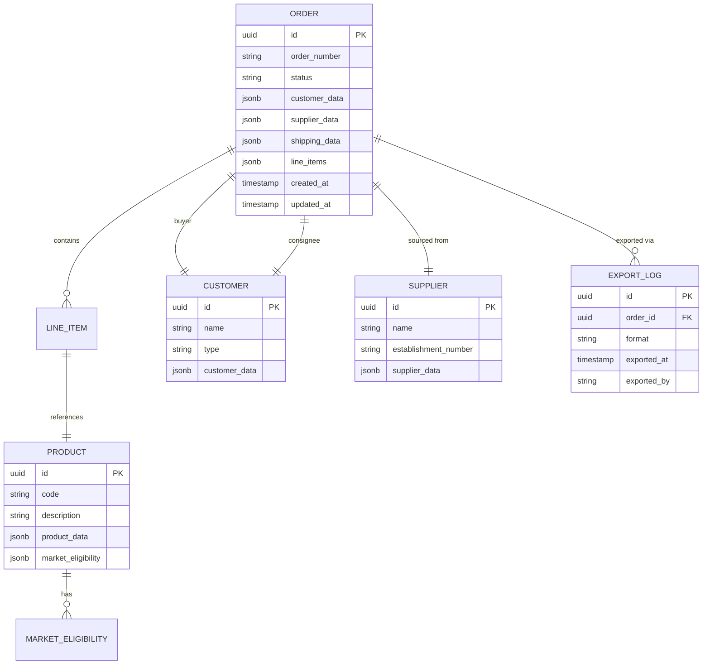
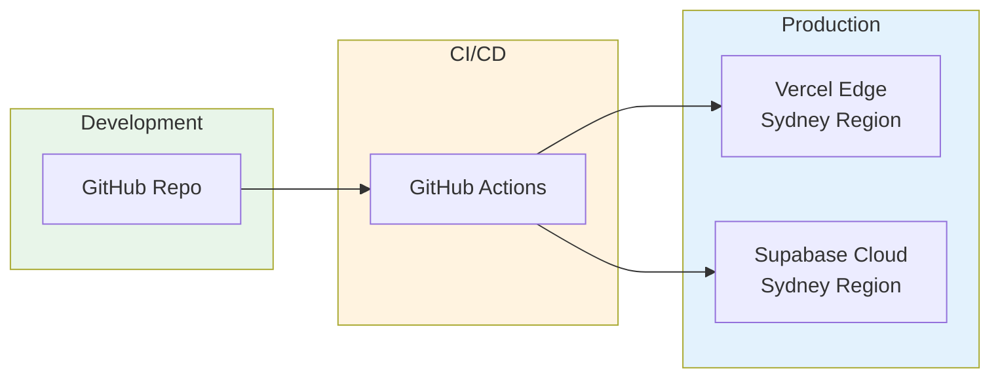

# EOMS HIGH-LEVEL DESIGN (HLD)
## Technical Architecture & Design Decisions — Phase 1: Order Entry Foundation

---

| Document Control | |
|-----------------|---|
| **Document Number** | EOMS-HLD-002 |
| **Version** | 2.1 |
| **Status** | Draft |
| **Date** | 19 February 2026 |
| **Related PRD** | EOMS_PRD_UNIFIED_v2.1.md |
| **Related Proposal** | EOMS_PROPOSAL_v3.1.md |
| **Related Impl Plan** | EOMS_IMPLEMENTATION_PLAN_v2.1.md |
| **Supersedes** | EOMS-HLD-002 (v2.0, 19 February 2026) |

---

## Document Purpose

This High-Level Design (HLD) document describes **HOW** the EOMS Phase 1 system will be built. It sits between the PRD (WHAT we're building) and the Implementation Plan (WHEN we build it).


---

## Table of Contents

1. [System Overview](#1-system-overview)
2. [Architecture Principles](#2-architecture-principles)
3. [Technology Stack](#3-technology-stack)
4. [System Architecture](#4-system-architecture)
5. [Data Architecture](#5-data-architecture)
6. [Security Architecture](#6-security-architecture)
7. [Integration Architecture](#7-integration-architecture)
8. [Infrastructure & Deployment](#8-infrastructure--deployment)
9. [Design Decisions Log](#9-design-decisions-log)

---

## 1. System Overview

### 1.1 System Context

EOMS Phase 1 is a focused order entry system for Endeavour Meats' international meat export operations. The system provides:

- **Order Entry**: Guided wizard for structured export order creation
- **Product Catalogue**: Fast search across 7,816+ product codes with market eligibility
- **Customer/Supplier Lookup**: Central database for buyers, consignees, and suppliers
- **Order Export to Finance**: Clean CSV/JSON export format for downstream processing

### 1.2 Key Characteristics

| Characteristic | Design Approach |
|----------------|-----------------|
| **Users** | 5-10 concurrent (traders, operations) |
| **Data Volume** | ~10,000 orders/year, 7,816+ products |
| **Availability** | Business hours primary, mobile access |
| **Performance** | < 200ms search response, < 2s page load |
| **Security** | RBAC, RLS, audit logging |

---

## 2. Architecture Principles

| Principle | Description | Rationale |
|-----------|-------------|-----------|
| **Simplicity First** | Build only what Phase 1 requires | Focused scope, fast delivery |
| **Data-Driven** | JSONB flexible schemas in PostgreSQL | Adapt to business domain evolution |
| **Cloud-Native** | Serverless, managed services | Minimise operational overhead |
| **Security by Default** | RLS at database level, RBAC in app | Protect sensitive commercial data |
| **Integration-Ready** | Clean APIs and data structures | Future AI and finance system additions plug straight in |

---

## 3. Technology Stack

### 3.1 Core Stack (Phase 1)



### 3.2 Technology Decisions

| Layer | Technology | Version | Decision Rationale |
|-------|------------|---------|-------------------|
| **Frontend Framework** | Next.js | 14+ | App Router, SSR, TypeScript support, Vercel integration |
| **UI Components** | shadcn/ui | Latest | Accessible, customisable, Tailwind-native |
| **Styling** | Tailwind CSS | 3.x | Utility-first, rapid prototyping, Figma token alignment |
| **Database** | Supabase PostgreSQL | Latest | Managed PostgreSQL, real-time, RLS, JSONB support |
| **Authentication** | Supabase Auth | Latest | SSO-ready, session management |
| **Hosting** | Vercel | Latest | Edge deployment, Sydney region, Git-based deploys |
| **Design Tokens** | Tailwind CSS config | - | Brand tokens applied directly in code (Endeavour-DS). No Figma design phase. |

*No AI services required for Phase 1. Claude API and PF-Core agent framework are planned for Phase 2.*

---

## 4. System Architecture

### 4.1 Architecture Overview



### 4.2 Component Responsibilities

| Component | Responsibility | Key Interfaces |
|-----------|---------------|----------------|
| **Order List** | Display, filter, search orders | Order API |
| **Order Wizard** | Step-by-step order creation | Order API, Product API, Customer API |
| **Product Search** | Product lookup with filtering | Product API |
| **Order Detail** | View/edit order, audit trail | Order API |
| **Order Export** | Generate and download export files | Export API |

---

## 5. Data Architecture

### 5.1 Data Model Overview

*Reference: PRD v2.0 Section 8*



### 5.2 Data Entities

| Entity | Purpose | Key Fields |
|--------|---------|------------|
| **Order** | Order header and lifecycle | order_number, status, customer_data, shipping_data, line_items |
| **Product** | Product master (7,816+ codes) | code, description, product_data, market_eligibility |
| **Customer** | Buyers and consignees | name, type, customer_data |
| **Supplier** | Suppliers and establishments | name, establishment_number, supplier_data |
| **Export Log** | Record of order exports | order_id, format, exported_at, exported_by |

### 5.3 Data Access Patterns

| Pattern | Implementation | Security |
|---------|---------------|----------|
| **Read Orders** | Supabase client with RLS | User can see own orders + team orders |
| **Write Orders** | API route with validation | Role-based write permissions |
| **Search Products** | Full-text search + filters | All authenticated users |
| **Export Orders** | API route generating CSV/JSON | Operations and Admin roles only |

---

## 6. Security Architecture

### 6.1 Security Layers

| Layer | Implementation | Standard |
|-------|---------------|----------|
| **Authentication** | Supabase Auth (email/password, SSO-ready) | MCSB v1 |
| **Authorisation** | RBAC + RLS | OWASP Top 10 |
| **Data Protection** | Encryption at rest/transit | TLS 1.3, AES-256 |
| **Audit** | Supabase audit logs, export log | Business requirement |

### 6.2 Role-Based Access

| Role | Orders | Products | Export | Admin |
|------|--------|----------|--------|-------|
| **Trader** | Create, Edit own, View all, Export | Read | Export | - |
| **Admin** | Full | Full | Full | User Management |

*Simplified to 2 roles for Phase 1. Traders handle all order operations including export. Admin role is for user account management only.*

---

## 7. Integration Architecture

### 7.1 Phase 1 Integrations

| System | Type | Purpose |
|--------|------|---------|
| **Supabase** | Database | Primary data store |
| **Vercel** | Hosting | Edge deployment |
| **Order Export to Finance** | Output | CSV/JSON export files for finance import |

### 7.2 Data Import (Phase 1)

| Data Source | Format | Frequency |
|-------------|--------|-----------|
| Product codes (7,816+) | Excel/CSV | Initial load + periodic refresh |
| Customer data | Excel/CSV | Initial load + periodic refresh |
| Supplier data | Excel/CSV | Initial load |

### 7.3 Order Export Format

| Field | Description | Format |
|-------|-------------|--------|
| Order Number | Unique order identifier | ORD-YYYYMM-NNNN |
| Order Date | Date order completed | ISO 8601 |
| Buyer | Buyer name and reference | String |
| Consignee | Consignee name | String |
| Supplier | Supplier name and establishment | String |
| Shipping | Container, incoterm, ports, dates | Structured |
| Line Items | Product code, description, qty, price, currency | Array |
| Total | Order total in order currency | Decimal |

*Export format will be finalised with Endeavour Operations/Finance team to match finance system import requirements.*

### 7.4 Future Integrations (Post Phase 1)

| System | Type | Phase |
|--------|------|-------|
| **Claude API** | AI | Phase 2 — Validation agents |
| **Finance System** | Direct integration | Phase 3+ — API-based |
| **External FX** | Import | Phase 3 — FX contract data |

---

## 8. Infrastructure & Deployment

### 8.1 Deployment Architecture



### 8.2 Environment Configuration

| Environment | Purpose | URL Pattern |
|-------------|---------|-------------|
| **Development** | Local dev | localhost:3000 |
| **Staging** | UAT, testing | staging.eoms.endeavour.com.au |
| **Production** | Live system | eoms.endeavour.com.au |

### 8.3 Estimated Operating Costs (Phase 1)

| Service | Tier | Est. Monthly |
|---------|------|--------------|
| Vercel | Pro | $20 |
| Supabase | Pro | $25 |
| Domain & SSL | - | ~$4 |
| **Total** | | **~$50** |

*Infrastructure costs are operational expenses to be borne by Endeavour. No AI API costs in Phase 1.*

---

## 9. Design Decisions Log

| ID | Decision | Rationale | Date | Status |
|----|----------|-----------|------|--------|
| DD-001 | Next.js 14 with App Router | Modern React, Vercel integration | 26-Jan-2026 | Approved |
| DD-002 | Supabase over Firebase | PostgreSQL, RLS, better pricing | 26-Jan-2026 | Approved |
| DD-003 | shadcn/ui over MUI | Tailwind-native, customisable | 26-Jan-2026 | Approved |
| DD-004 | JSONB for data schemas | Flexible schema evolution | 26-Jan-2026 | Approved |
| DD-005 | Vercel over AWS | Simpler deployment, lower ops | 26-Jan-2026 | Approved |
| DD-006 | No AI in Phase 1 | Client preference: prove workflow first, add intelligence later | 19-Feb-2026 | Approved |
| DD-007 | Order export to finance as core Phase 1 feature | Client need for clean downstream data format | 19-Feb-2026 | Approved |
| DD-008 | No Figma design phase — tokens in code | Existing Endeavour-DS sufficient; brand tokens applied via Tailwind config | 19-Feb-2026 | Approved |
| DD-009 | 2 RBAC roles (Trader, Admin) | Simplified from 3 roles; traders handle all order ops including export | 19-Feb-2026 | Approved |

---

## Appendix A: Glossary

| Term | Definition |
|------|------------|
| **AHECC** | Australian Harmonised Export Commodity Classification — product codes for export customs |
| **API Route** | A Next.js server-side endpoint that handles data requests (e.g. `/api/orders`) |
| **App Router** | Next.js 14's file-based routing system for pages and API endpoints |
| **CSV** | Comma-Separated Values — tabular export format supported by spreadsheets and finance systems |
| **EOMS** | Endeavour Order Management System |
| **HLD** | High-Level Design — this document |
| **Incoterm** | International Commercial Terms — standard trade terms defining buyer/seller shipping responsibilities |
| **JSON / JSONB** | JavaScript Object Notation / JSON Binary — structured data format; JSONB is PostgreSQL's compressed binary variant enabling fast queries |
| **Market Eligibility** | Per-product flags indicating which countries a product is approved for export to |
| **Next.js** | React-based web framework (v14, App Router) — builds the EOMS frontend and API layer |
| **PBS** | Product Breakdown Structure — hierarchical decomposition of system components |
| **PostgreSQL** | Open-source relational database powering the Supabase backend |
| **RBAC** | Role-Based Access Control — Trader and Admin roles in Phase 1 |
| **RLS** | Row Level Security — database-level access control (Supabase/PostgreSQL) restricting which rows users can read/write |
| **shadcn/ui** | React component library — pre-built accessible UI elements styled with Tailwind CSS |
| **Supabase** | Managed backend platform providing PostgreSQL, authentication, and real-time features (Sydney region) |
| **Tailwind CSS** | Utility-first CSS framework — applies Endeavour-DS design tokens (colours, typography, spacing) in code |
| **TLS 1.3** | Transport Layer Security v1.3 — encryption protocol for data in transit |
| **TypeScript** | Typed superset of JavaScript adding compile-time type safety |
| **UUID** | Universally Unique Identifier — 128-bit ID used as primary keys (e.g. `550e8400-e29b-41d4-a716-446655440000`) |
| **Vercel** | Cloud hosting platform deploying the EOMS frontend via edge servers (Sydney region) |

---

## Appendix B: References

| Document | Purpose |
|----------|---------|
| EOMS_PRD_UNIFIED_v2.1.md | Product requirements (WHAT) |
| EOMS_PROPOSAL_v3.1.md | Business case (WHY) |
| EOMS_IMPLEMENTATION_PLAN_v2.1.md | Schedule & resources (WHEN) |
| EOMS_CHANGE_CONTROL.md | Change register |
| Endeavour-DS | Design System |

---

## Approval

| Role | Name | Date | Signature |
|------|------|------|-----------|
| CFO / Acting COO (Anthony) | | | |
| Technical Adviser | | | |

---

## Appendix C: Data Schemas

### C.1 Order Schema

```json
{
  "$schema": "https://json-schema.org/draft/2020-12/schema",
  "$id": "https://endeavourmeats.com/schemas/order-v2.json",
  "title": "Order (Phase 1)",
  "type": "object",
  "properties": {
    "id": { "type": "string", "format": "uuid" },
    "orderNumber": { "type": "string", "pattern": "^ORD-\\d{6}-\\d{4}$" },
    "status": {
      "type": "string",
      "enum": ["draft", "complete", "exported"]
    },
    "buyer": {
      "type": "object",
      "properties": {
        "id": { "type": "string", "format": "uuid" },
        "name": { "type": "string" },
        "reference": { "type": "string" }
      }
    },
    "consignee": {
      "type": "object",
      "properties": {
        "id": { "type": "string", "format": "uuid" },
        "name": { "type": "string" },
        "notifyParty": { "type": "string" }
      }
    },
    "supplier": {
      "type": "object",
      "properties": {
        "id": { "type": "string", "format": "uuid" },
        "establishmentNumber": { "type": "string" },
        "program": { "type": "string" }
      }
    },
    "shipping": {
      "type": "object",
      "properties": {
        "containerType": { "type": "string", "enum": ["AVE", "20_FCL", "40_FCL"] },
        "incoterm": { "type": "string", "enum": ["CFR", "FOB", "CIF", "EXW", "DDP"] },
        "loadPort": { "type": "string" },
        "destinationPort": { "type": "string" },
        "destinationCountry": { "type": "string" },
        "contractDateStart": { "type": "string", "format": "date" },
        "contractDateEnd": { "type": "string", "format": "date" }
      }
    },
    "lineItems": {
      "type": "array",
      "items": {
        "type": "object",
        "properties": {
          "productCode": { "type": "string" },
          "description": { "type": "string" },
          "quantity": { "type": "number", "minimum": 0 },
          "uom": { "type": "string" },
          "unitPrice": { "type": "number" },
          "currency": { "type": "string" },
          "lineTotal": { "type": "number" },
          "marketEligible": { "type": "boolean" }
        }
      }
    }
  }
}
```

### C.2 Product Schema

```json
{
  "$schema": "https://json-schema.org/draft/2020-12/schema",
  "$id": "https://endeavourmeats.com/schemas/product.json",
  "title": "Product",
  "type": "object",
  "properties": {
    "code": { "type": "string" },
    "description": { "type": "string" },
    "plu": { "type": "string" },
    "ean": { "type": "string" },
    "pricingUom": { "type": "string" },
    "orderingUom": { "type": "string" },
    "aheccCode": { "type": "string" },
    "brand": { "type": "string" },
    "feedType": { "type": "string", "enum": ["Grain Fed", "Grass Fed", "Mixed"] },
    "productState": { "type": "string", "enum": ["Chilled", "Frozen"] },
    "shelfLifeDays": { "type": "integer" },
    "marketEligibility": {
      "type": "object",
      "properties": {
        "japan": { "type": "boolean" },
        "usa": { "type": "boolean" },
        "korea": { "type": "boolean" },
        "vietnam": { "type": "boolean" },
        "china": { "type": "boolean" },
        "eu": { "type": "boolean" },
        "halalCertified": { "type": "boolean" }
      }
    }
  }
}
```

---

## Appendix D: Design System (Endeavour-DS)

### D.1 Design Principles

| Principle | Implementation |
|-----------|----------------|
| **Speed to Action** | Order creation < 20 minutes, minimal clicks |
| **Mobile-Responsive** | Responsive from 320px, touch targets 44px min |
| **Error Prevention** | Inline validation, required fields, confirmation dialogs |
| **Glanceable Status** | Colour-coded badges for order status |

### D.2 Colour Palette

| Token | Hex | Usage |
|-------|-----|-------|
| **Primary** | #19253B | Main actions, headers, branding |
| **Primary Light** | #4E74BA | Hover states, secondary elements |
| **Primary Dark** | #0C121E | Active states, emphasis |
| **Secondary (CTA)** | #BC4620 | Call-to-action buttons, highlights |
| **Accent** | #6B9EFE | Links, interactive elements |
| **Neutral Base** | #C6E8F5 | Backgrounds, dividers |
| **Neutral 50** | #F8FAFC | Page backgrounds |
| **Success** | #00E5CE | Complete status, success states |
| **Warning** | #B363BA | Pending, caution |
| **Error** | #EEC800 | Errors |
| **Info** | #FF3736 | Notifications |

### D.3 Typography

| Style | Font | Size | Weight | Line Height | Usage |
|-------|------|------|--------|-------------|-------|
| Display XL | Baskervville | 48px | SemiBold | 1.25 | Page titles |
| Display LG | Baskervville | 40px | SemiBold | 1.25 | Section headers |
| Display MD | Baskervville | 32px | Medium | 1.25 | Card titles |
| Heading LG | Baskervville | 28px | Medium | 1.25 | Panel headers |
| Heading MD | Baskervville | 24px | Medium | 1.25 | Group titles |
| Heading SM | Baskervville | 20px | Medium | 1.25 | Subheadings |
| Body LG | Lato | 18px | Regular | 1.5 | Featured content |
| Body MD | Lato | 16px | Regular | 1.5 | Body text |
| Body SM | Lato | 14px | Regular | 1.5 | Secondary text |
| Body XS | Lato | 12px | Regular | 1.5 | Captions |
| Code | JetBrains Mono | 14px | Regular | 1.5 | Product codes |

### D.4 Spacing Scale (4px base)

| Token | Value |
|-------|-------|
| space-1 | 4px |
| space-2 | 8px |
| space-3 | 12px |
| space-4 | 16px |
| space-6 | 24px |
| space-8 | 32px |
| space-12 | 48px |
| space-16 | 64px |

### D.5 Component Library (shadcn/ui)

| Component | Usage | Custom Props |
|-----------|-------|--------------|
| Button | Actions, submissions | variant, size, loading |
| Input | Text entry | error, helper text |
| Select | Dropdowns, enums | searchable, multi |
| Combobox | Product/customer search | async loading |
| DataTable | Order list, products | sorting, filtering, pagination |
| Card | Content grouping | - |
| Dialog | Confirmations | size |
| Toast | Notifications | type, duration |
| Badge | Status indicators (Draft, Complete, Exported) | variant |
| Form | Order wizard forms | validation |

---

**--- END OF HIGH-LEVEL DESIGN ---**

*Version 2.1 | Draft*
*19 February 2026*
