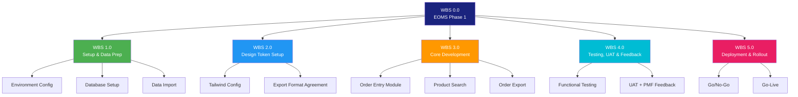
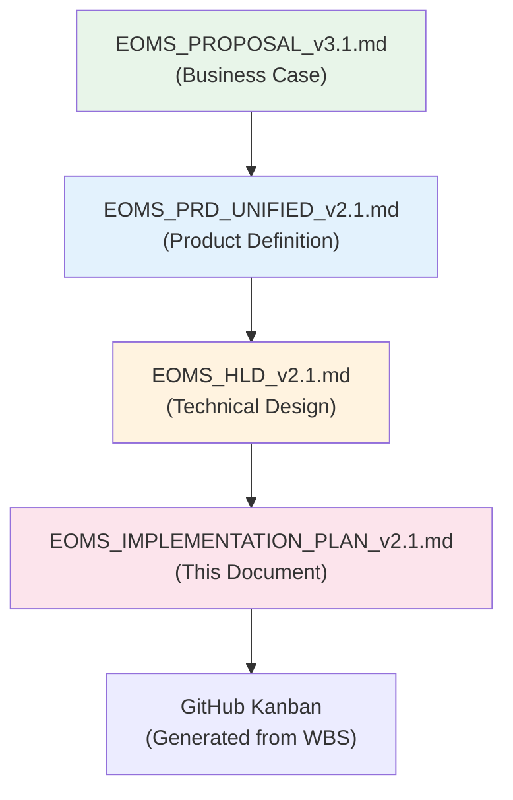

# EOMS IMPLEMENTATION PLAN
## Work Breakdown Structure, Schedule & References — Phase 1: Order Entry Foundation

---

| Document Control | |
|-----------------|---|
| **Document Number** | EOMS-IMP-002 |
| **Version** | 2.1 |
| **Status** | Draft |
| **Date** | 19 February 2026 |
| **Related PRD** | EOMS_PRD_UNIFIED_v2.1.md |
| **Related Proposal** | EOMS_PROPOSAL_v3.1.md |
| **Related HLD** | EOMS_HLD_v2.1.md |
| **Supersedes** | EOMS-IMP-002 (v2.0, 19 February 2026) |

---

## 1. WORK BREAKDOWN STRUCTURE (WBS)

### WBS Overview Diagram



### WBS Detailed Breakdown

| WBS ID | Task | PBS Reference | Epic Reference | Dependencies |
|--------|------|---------------|----------------|--------------|
| **1.0** | **Setup & Data Preparation** | PBS 1.0, 3.0 | - | - |
| 1.1 | Environment configuration (Vercel, Supabase, Git) | PBS 1.1 | - | - |
| 1.2 | Database schema implementation | PBS 3.1 | - | 1.1 |
| 1.3 | Authentication setup | PBS 1.3 | - | 1.1 |
| 1.4 | Product data import (7,816+ codes) | PBS 5.1.1 | Epic 2 | 1.2 |
| 1.5 | Customer data import | PBS 5.1.2 | Epic 1 | 1.2 |
| 1.6 | Supplier data import | PBS 5.1.3 | Epic 1 | 1.2 |
| **2.0** | **Design Token Setup** | PBS 6.0 | - | - |
| 2.1 | Tailwind config with Endeavour-DS brand tokens | PBS 6.1 | - | - |
| 2.2 | Order export format design & IT agreement | PBS 5.2 | Epic 3 | - |
| **3.0** | **Core Development** | PBS 2.0, 4.0, 5.0 | Epics 1,2,3 | 1.0, 2.0 |
| 3.1 | Next.js project setup, Tailwind, shadcn/ui | PBS 1.1 | - | 1.1 |
| 3.2 | Supabase integration (client, auth) | PBS 1.2, 1.3 | - | 1.1, 1.3 |
| 3.3 | Layout & navigation | PBS 2.2 | - | 3.1 |
| 3.4 | Order entry wizard (3-step) | PBS 2.1 | Epic 1 | 3.2, 3.3 |
| 3.5 | Product search component | PBS 4.1 | Epic 2 | 3.2, 1.4 |
| 3.6 | Customer/supplier lookup | PBS 3.2, 3.3 | Epic 1 | 3.2, 1.5 |
| 3.7 | Order list view & filtering | PBS 2.2 | Epic 1 | 3.4 |
| 3.8 | Order detail (wizard re-use in read/edit mode) | PBS 2.3 | Epic 1 | 3.4 |
| 3.9 | Order export module (CSV/JSON) | PBS 5.2 | Epic 3 | 3.4, 2.4 |
| 3.10 | Order CRUD APIs | PBS 5.3.1 | Epic 1 | 3.2 |
| 3.11 | Product search API | PBS 5.3.2 | Epic 2 | 3.2 |
| 3.12 | Export API | PBS 5.3.4 | Epic 3 | 3.10 |
| ~~3.13~~ | ~~Mobile responsiveness~~ | ~~PBS 2.0~~ | - | ~~3.4-3.9~~ | *Optional extra — not in core scope* |
| **4.0** | **Testing & UAT** | PBS 8.0 | - | 3.0 |
| 4.1 | Functional testing | PBS 8.1 | - | 3.0 |
| 4.2 | Cross-browser testing | PBS 8.1 | - | 3.13 |
| 4.3 | UAT environment setup | PBS 8.2 | - | 4.1 |
| 4.4 | UAT execution (Sales/Traders) | PBS 8.2 | - | 4.3 |
| 4.5 | Management demo | PBS 8.2 | - | 4.4 |
| 4.6 | PMF feedback collection (integrated into UAT) | PBS 8.3 | - | 4.4 |
| 4.7 | Priority bug fixes & UX improvements | - | - | 4.6 |
| **5.0** | **Deployment & Rollout** | - | - | 4.0 |
| 5.1 | Stakeholder review (CEO, CFO/COO) | - | - | 4.7 |
| 5.2 | Go/No-Go decision | - | - | 5.1 |
| 5.3 | Production deployment | - | - | 5.2 |
| 5.4 | Documentation & handover | PBS 7.0 | - | 5.3 |

---

## 2. SCHEDULE & MILESTONES

### Milestone Gates

| Gate | Milestone | Deliverables | Approver |
|------|-----------|--------------|----------|
| **G0** | Project Kickoff | Scope approved, team assigned, accounts provisioned | CFO/COO |
| **G1** | Design Tokens & Export Format Agreed | Tailwind config complete, Order export format agreed with Finance/IT | CFO/COO |
| **G2** | Core Feature Complete | Order entry, product search, order export functional | CFO/COO |
| **G3** | UAT & PMF Feedback Complete | > 90% task success rate, trader sign-off, PMF feedback collected | CFO/COO |
| **G4** | Go-Live | Production deployment, team trained | CEO |

### GitHub Kanban Board Structure

| Column | Description | WIP Limit |
|--------|-------------|-----------|
| **Backlog** | Prioritised work items | Unlimited |
| **Ready** | Refined, ready to start | 10 |
| **In Progress** | Active development | 5 |
| **Review** | Code review, QA | 5 |
| **Done** | Completed, verified | Unlimited |

---

## 3. RESOURCE ASSIGNMENTS

### Team Roles

| Role | Responsibilities | Allocation |
|------|------------------|------------|
| **CFO/Acting COO (Anthony)** | Product owner, approvals, stakeholder liaison | Part-time |
| **Technical Adviser (wings4mind.ai)** | Architecture, development, delivery guidance | Per agreement |
| **Internal Team** | UAT participation, feedback, domain expertise, data extracts | As scheduled |

### Skills & Tools

| Area | Tools/Skills |
|------|-------------|
| **Design** | Tailwind CSS config, Endeavour-DS brand tokens |
| **Frontend** | Next.js 14, TypeScript, shadcn/ui, Tailwind |
| **Backend** | Supabase, PostgreSQL, API routes |
| **DevOps** | Vercel, GitHub Actions |

---

## 4. DEPENDENCIES & CRITICAL PATH

### Critical Path


### External Dependencies

| Dependency | Owner | Status |
|------------|-------|--------|
| Product data extract (7,816+ codes) | Operations | Pending |
| Customer data extract | Finance / Operations | Pending |
| Supplier data extract | Operations | Pending |
| Finance import format specification | Operations / Finance | Pending |
| Supabase account | IT / Adviser | Pending |
| Vercel account | IT / Adviser | Pending |
| Domain configuration | IT | Pending |

---

## 5. RISK REGISTER (Implementation-Specific)

| Risk | Likelihood | Impact | Mitigation |
|------|------------|--------|------------|
| Data extract delays (product/customer) | Medium | Medium | Start development with sample data, iterative import |
| Export format uncertainty | Low | Low | Flexible export (CSV/JSON), adapt to requirements |
| User availability for UAT | Medium | High | Schedule early, flexible sessions |
| Scope creep | Medium | Medium | Fixed Phase 1 scope, strict change control |
| Data quality issues | Medium | Medium | Validation during import, feedback loop with Operations |

---

## 6. REFERENCES & EXTERNAL DOCUMENTS

### Document Hierarchy



---

## 7. APPROVAL

| Role | Name | Date | Signature |
|------|------|------|-----------|
| CFO / Acting COO (Anthony) | | | |
| Technical Adviser | | | |
| CEO (James) | | | |

---

## APPENDIX A: DEVELOPMENT IMPLEMENTATION GUIDE

### A.1 Prerequisites

```bash
# Ensure you have installed:
- Node.js 18+ (node -v)
- npm 9+ or pnpm (npm -v)
- Git (git --version)
- VS Code or preferred IDE
```

### A.2 Create Next.js Project

```bash
# Create new Next.js 14 project with TypeScript
npx create-next-app@latest eoms-mvp --typescript --tailwind --eslint --app --src-dir --import-alias "@/*"

# Navigate to project
cd eoms-mvp
```

### A.3 Install Dependencies

```bash
# Install core dependencies
npm install @supabase/supabase-js @supabase/ssr
npm install zod react-hook-form @hookform/resolvers
npm install date-fns
npm install lucide-react

# Install shadcn/ui
npx shadcn@latest init

# When prompted:
# - Style: Default
# - Base color: Slate
# - CSS variables: Yes
# - Tailwind CSS: yes
# - Components location: @/components
# - Utils location: @/lib/utils

# Add shadcn components
npx shadcn@latest add button input label card dialog toast table badge tabs select command form
```

### A.4 Configure Tailwind with Endeavour Brand

```typescript
// tailwind.config.ts
import type { Config } from "tailwindcss"

const config: Config = {
  darkMode: ["class"],
  content: [
    "./src/pages/**/*.{js,ts,jsx,tsx,mdx}",
    "./src/components/**/*.{js,ts,jsx,tsx,mdx}",
    "./src/app/**/*.{js,ts,jsx,tsx,mdx}",
  ],
  theme: {
    extend: {
      colors: {
        primary: {
          DEFAULT: "#19253B",
          light: "#4E74BA",
          dark: "#0C121E",
          foreground: "#FFFFFF",
        },
        secondary: {
          DEFAULT: "#BC4620",
          foreground: "#FFFFFF",
        },
        accent: {
          DEFAULT: "#6B9EFE",
          foreground: "#19253B",
        },
        neutral: {
          base: "#C6E8F5",
          50: "#F8FAFC",
        },
        success: "#00E5CE",
        warning: "#B363BA",
        error: "#EEC800",
        info: "#FF3736",
      },
      fontFamily: {
        heading: ["Baskervville", "Georgia", "serif"],
        sans: ["Lato", "Helvetica", "Arial", "sans-serif"],
        mono: ["JetBrains Mono", "monospace"],
      },
    },
  },
  plugins: [require("tailwindcss-animate")],
}

export default config
```

### A.5 Set Up Supabase Database

#### Create Supabase Project

```
ACTION: Go to supabase.com

1. Sign in / Create account
2. Click "New Project"
3. Set:
   - Organization: [your org]
   - Project name: eoms-mvp
   - Database password: [generate strong password - SAVE THIS]
   - Region: Sydney (closest to Australia)
4. Click "Create new project"
5. Wait for project to provision (~2 minutes)
```

#### Create Environment File

```bash
# Create .env.local in project root
touch .env.local

# Add these values:
NEXT_PUBLIC_SUPABASE_URL=https://[your-project].supabase.co
NEXT_PUBLIC_SUPABASE_ANON_KEY=eyJ...
SUPABASE_SERVICE_KEY=eyJ...
NEXT_PUBLIC_APP_URL=http://localhost:3000
```

#### Create Database Tables

```sql
-- Run in Supabase SQL Editor

-- Products table
CREATE TABLE products (
  id UUID PRIMARY KEY DEFAULT gen_random_uuid(),
  code VARCHAR(50) UNIQUE NOT NULL,
  description TEXT NOT NULL,
  product_data JSONB DEFAULT '{}',
  market_eligibility JSONB DEFAULT '{}',
  is_active BOOLEAN DEFAULT true,
  search_vector tsvector GENERATED ALWAYS AS (
    to_tsvector('english', code || ' ' || description)
  ) STORED,
  created_at TIMESTAMPTZ DEFAULT NOW(),
  updated_at TIMESTAMPTZ DEFAULT NOW()
);

CREATE INDEX idx_products_code ON products(code);
CREATE INDEX idx_products_search ON products USING GIN(search_vector);

-- Customers table
CREATE TABLE customers (
  id UUID PRIMARY KEY DEFAULT gen_random_uuid(),
  customer_type VARCHAR(20) NOT NULL,
  name VARCHAR(255) NOT NULL,
  code VARCHAR(50),
  customer_data JSONB DEFAULT '{}',
  is_active BOOLEAN DEFAULT true,
  created_at TIMESTAMPTZ DEFAULT NOW()
);

-- Suppliers table
CREATE TABLE suppliers (
  id UUID PRIMARY KEY DEFAULT gen_random_uuid(),
  name VARCHAR(255) NOT NULL,
  establishment_number VARCHAR(50),
  supplier_data JSONB DEFAULT '{}',
  is_active BOOLEAN DEFAULT true,
  created_at TIMESTAMPTZ DEFAULT NOW()
);

-- Orders table
CREATE TABLE orders (
  id UUID PRIMARY KEY DEFAULT gen_random_uuid(),
  order_number VARCHAR(50) UNIQUE NOT NULL,
  status VARCHAR(20) DEFAULT 'draft' CHECK (status IN ('draft', 'complete', 'exported')),
  customer_data JSONB DEFAULT '{}',
  supplier_data JSONB DEFAULT '{}',
  shipping_data JSONB DEFAULT '{}',
  line_items JSONB DEFAULT '[]',
  created_by UUID REFERENCES auth.users(id),
  created_at TIMESTAMPTZ DEFAULT NOW(),
  updated_at TIMESTAMPTZ DEFAULT NOW()
);

-- Export log table
CREATE TABLE export_log (
  id UUID PRIMARY KEY DEFAULT gen_random_uuid(),
  order_id UUID REFERENCES orders(id),
  format VARCHAR(10) NOT NULL CHECK (format IN ('csv', 'json')),
  exported_by UUID REFERENCES auth.users(id),
  exported_at TIMESTAMPTZ DEFAULT NOW()
);

-- Enable Row Level Security
ALTER TABLE products ENABLE ROW LEVEL SECURITY;
ALTER TABLE customers ENABLE ROW LEVEL SECURITY;
ALTER TABLE suppliers ENABLE ROW LEVEL SECURITY;
ALTER TABLE orders ENABLE ROW LEVEL SECURITY;
ALTER TABLE export_log ENABLE ROW LEVEL SECURITY;
```

### A.6 Project Structure

```
/eoms-mvp
+-- app/
|   +-- layout.tsx          # Root layout with providers
|   +-- page.tsx            # Order list (landing page)
|   +-- orders/
|   |   +-- new/
|   |   |   +-- page.tsx    # Order creation wizard
|   |   +-- [id]/
|   |       +-- page.tsx    # Order detail / edit
|   +-- products/
|   |   +-- page.tsx        # Product catalogue
|   +-- api/
|       +-- orders/
|       |   +-- route.ts    # Orders CRUD API
|       +-- products/
|       |   +-- search/
|       |       +-- route.ts # Product search API
|       +-- customers/
|       |   +-- route.ts    # Customer lookup API
|       +-- export/
|           +-- route.ts    # Order export API
+-- components/
|   +-- ui/                 # shadcn/ui components
|   +-- layout/             # Header, Sidebar, etc.
|   +-- orders/             # Order form components
|   +-- products/           # Product search component
|   +-- export/             # Export components
+-- lib/
|   +-- supabase/
|   |   +-- client.ts       # Browser client
|   |   +-- server.ts       # Server client
|   +-- utils/
|       +-- index.ts        # Utilities
+-- types/
|   +-- index.ts            # TypeScript types
+-- hooks/
|   +-- use-toast.ts        # Toast hook
+-- data/
    +-- seed/
        +-- products.json   # Product seed data
```

### A.7 Deploy

```bash
# Install Vercel CLI
npm i -g vercel

# Login
vercel login

# Deploy
vercel

# Set environment variables
vercel env add NEXT_PUBLIC_SUPABASE_URL
vercel env add NEXT_PUBLIC_SUPABASE_ANON_KEY
vercel env add SUPABASE_SERVICE_KEY

# Deploy to production
vercel --prod
```

---

## APPENDIX B: WBS DETAILED BREAKDOWN

```
WBS 0.0 EOMS PHASE 1 PROJECT
|
+-- WBS 1.0 PROJECT INITIATION & SETUP
|   +-- WBS 1.1 Stakeholder Alignment
|   |   +-- WBS 1.1.1 CEO/CFO Kickoff
|   |   +-- WBS 1.1.2 Requirements Confirmation
|   +-- WBS 1.2 Environment Setup
|   |   +-- WBS 1.2.1 Supabase Project Creation (Sydney Region)
|   |   +-- WBS 1.2.2 Git Repository Setup
|   |   +-- WBS 1.2.3 Vercel Account Setup
|   +-- WBS 1.3 Data Preparation
|       +-- WBS 1.3.1 Product Data Extract (Excel -> JSON, 7,816+ codes)
|       +-- WBS 1.3.2 Customer Data Extract
|       +-- WBS 1.3.3 Supplier Data Extract
|       +-- WBS 1.3.4 Order Export Format Agreement
|
+-- WBS 2.0 DESIGN TOKEN SETUP
|   +-- WBS 2.1 Tailwind Config with Endeavour-DS Brand Tokens
|   |   +-- WBS 2.1.1 Colour, Typography & Spacing Tokens
|   |   +-- WBS 2.1.2 shadcn/ui Theme Override
|   +-- WBS 2.2 Order Export Format Agreement
|       +-- WBS 2.2.1 IT Format Discussion
|       +-- WBS 2.2.2 Field Mapping Specification
|
+-- WBS 3.0 DEVELOPMENT PHASE
|   +-- WBS 3.1 Platform Setup
|   |   +-- WBS 3.1.1 Next.js Project Initialisation
|   |   +-- WBS 3.1.2 Tailwind & shadcn/ui Setup
|   |   +-- WBS 3.1.3 Supabase Integration
|   +-- WBS 3.2 Database Implementation
|   |   +-- WBS 3.2.1 Order Schema Creation
|   |   +-- WBS 3.2.2 Product Schema Creation
|   |   +-- WBS 3.2.3 Customer/Supplier Schema Creation
|   |   +-- WBS 3.2.4 Export Log Schema Creation
|   |   +-- WBS 3.2.5 RLS Policy Configuration
|   |   +-- WBS 3.2.6 Data Import (Products, Customers, Suppliers)
|   +-- WBS 3.3 Frontend Development
|   |   +-- WBS 3.3.1 Layout & Navigation
|   |   +-- WBS 3.3.2 Order Entry Wizard (3-step)
|   |   +-- WBS 3.3.3 Product Search Component
|   |   +-- WBS 3.3.4 Customer/Supplier Lookup Component
|   |   +-- WBS 3.3.5 Order List View
|   |   +-- WBS 3.3.6 Order Detail (Wizard Re-use in Read/Edit Mode)
|   |   +-- WBS 3.3.7 Order Export Interface
|   +-- WBS 3.4 API Development
|       +-- WBS 3.4.1 Order CRUD APIs
|       +-- WBS 3.4.2 Product Search API
|       +-- WBS 3.4.3 Customer/Supplier Lookup API
|       +-- WBS 3.4.4 Order Export API (CSV/JSON)
|
+-- WBS 4.0 TESTING PHASE
|   +-- WBS 4.1 Internal Testing
|   |   +-- WBS 4.1.1 Functional Testing
|   |   +-- WBS 4.1.2 Cross-browser Testing
|   |   |   +-- WBS 4.1.3 Bug Fixing
|   +-- WBS 4.2 UAT Preparation
|   |   +-- WBS 4.2.1 UAT Environment Setup
|   |   +-- WBS 4.2.2 Test Scenario Documentation
|   +-- WBS 4.3 User Acceptance Testing & PMF Feedback
|       +-- WBS 4.3.1 Trader UAT Sessions
|       +-- WBS 4.3.2 Order Export Validation
|       +-- WBS 4.3.3 PMF Feedback Collection (Integrated)
|       +-- WBS 4.3.4 Management Demo
|       +-- WBS 4.3.5 Priority Bug Fixes & UX Improvements
|
+-- WBS 5.0 APPROVAL & ROLLOUT
    +-- WBS 5.1 Stakeholder Review
    |   +-- WBS 5.1.1 CEO Demo & Review
    |   +-- WBS 5.1.2 CFO/COO Operational Review
    +-- WBS 5.2 Go/No-Go Decision
    |   +-- WBS 5.2.1 Success Criteria Review
    |   +-- WBS 5.2.2 Rollout Decision
    +-- WBS 5.3 Rollout
        +-- WBS 5.3.1 User Guide & Quick Reference
        +-- WBS 5.3.2 Go-Live
```

---

## APPENDIX C: DESIGN TOKEN REFERENCE

*No Figma design phase in Phase 1. Brand tokens are applied directly in Tailwind CSS config (see Appendix A, Section A.4). The shadcn/ui component library provides the UI patterns.*

### C.1 Brand Token Summary (Endeavour-DS)

| Token | Value | Usage |
|-------|-------|-------|
| **primary** | #19253B (Navy) | Headers, nav, primary actions |
| **primary/light** | #4E74BA | Hover states, links |
| **secondary** | #BC4620 (Rust) | CTA buttons, accents |
| **accent** | #6B9EFE | Info highlights |
| **neutral/base** | #C6E8F5 | Backgrounds |
| **success** | #00E5CE | Status: Complete |
| **error** | #FF3736 | Validation errors |
| **heading font** | Baskervville | Page/section headings |
| **body font** | Lato | Body text, labels |
| **mono font** | JetBrains Mono | Product codes, data fields |

### C.2 Key UI Flows (Built with shadcn/ui)

```
FLOW 1: Order Creation

Order List
  | Click "+ New Order"
  v
Order Wizard Step 1 (Customer & Shipping)
  | Click "Next: Products"
  v
Order Wizard Step 2 (Product Line Items)
  | Click "Next: Review"
  v
Order Wizard Step 3 (Review & Complete)
  | Click "Mark Complete"
  v
Order List (with success toast)
```

---

**--- END OF IMPLEMENTATION PLAN ---**

*Version 2.1 | Draft*
*19 February 2026*
