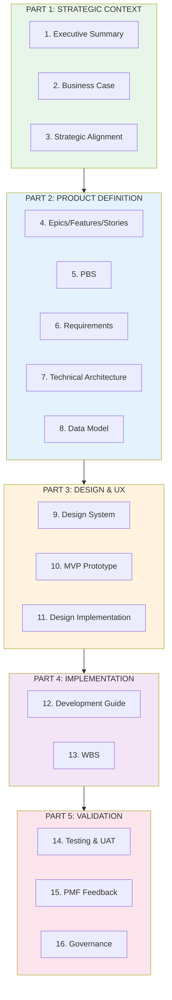
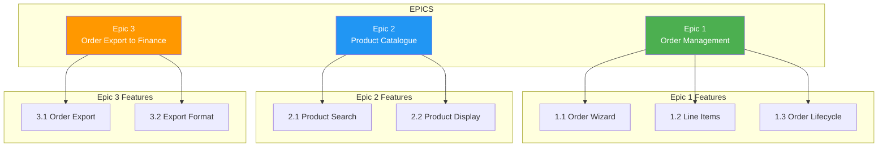
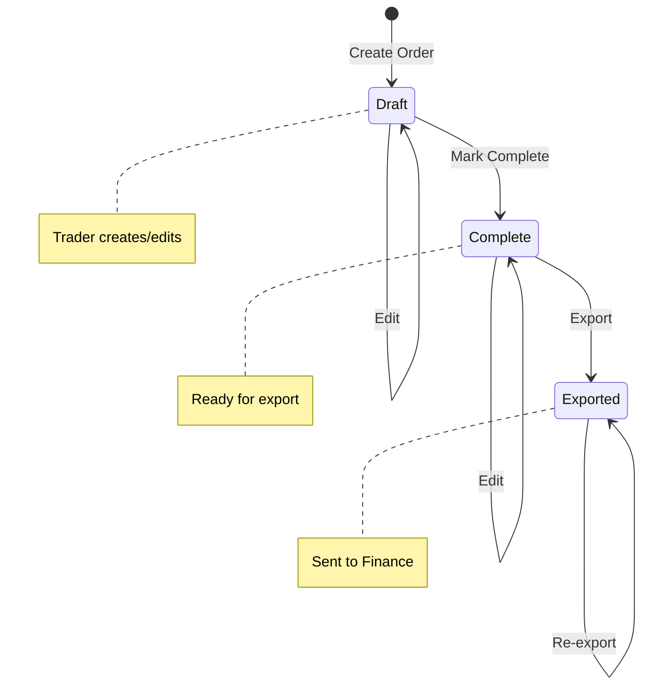
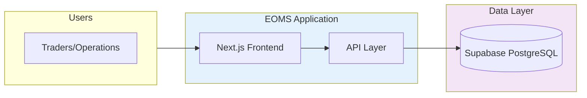
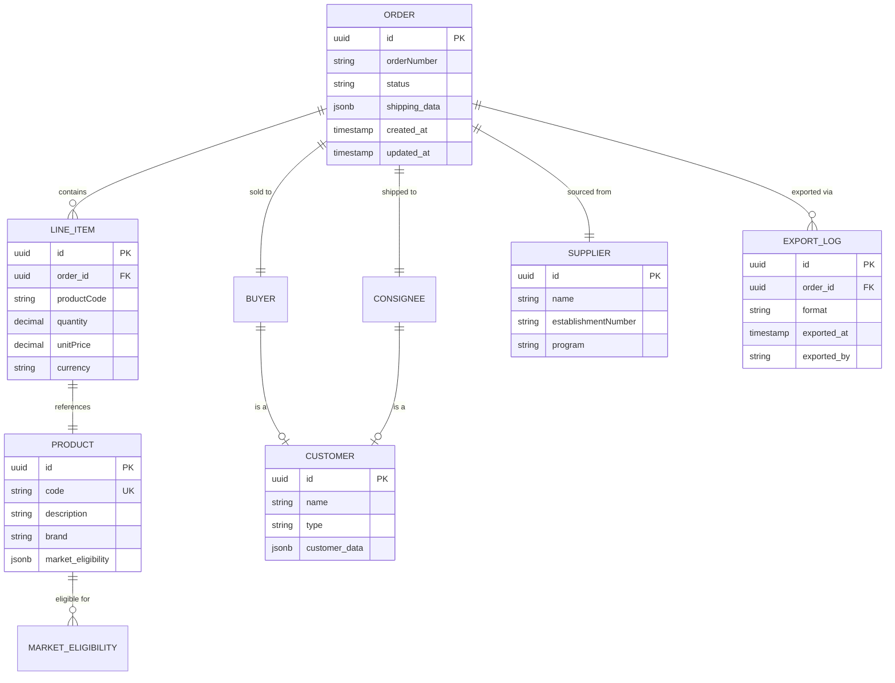
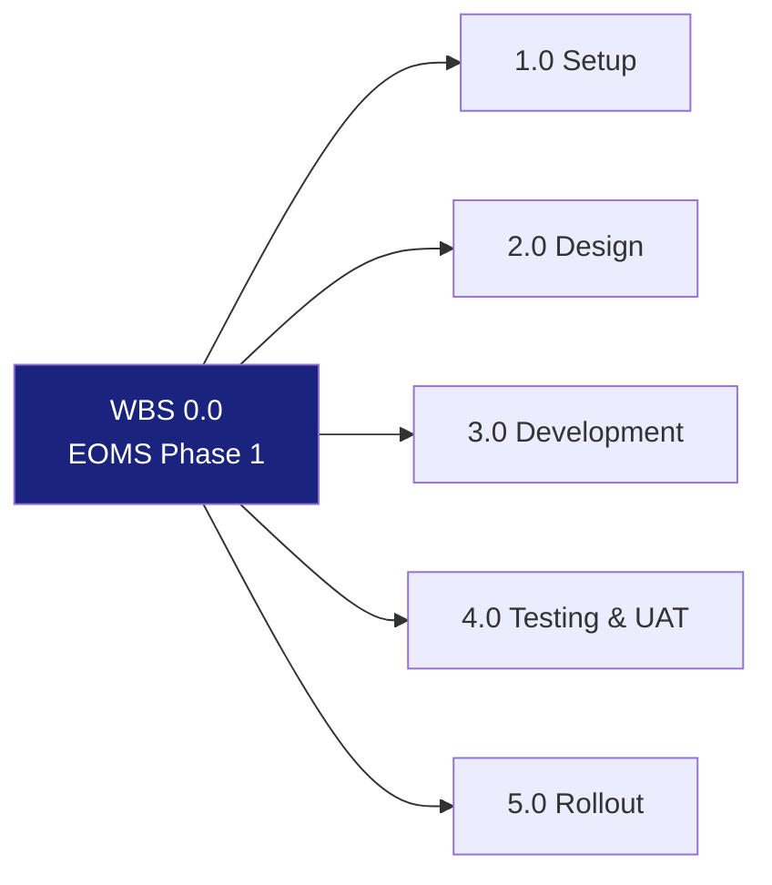

# ENDEAVOUR ORDER MANAGEMENT SYSTEM (EOMS)
## Unified Product Requirements Document v2.0
## Phase 1 — Order Entry Foundation

---

| Document Control | |
|-----------------|---|
| **Document Number** | EOMS-PRD-UNIFIED-002 |
| **Version** | 2.1 |
| **Status** | For Implementation |
| **Created** | 26 January 2026 |
| **Last Modified** | 19 February 2026 |
| **Authors** | Fin Blacket / Amanda Moore (wings4mind.ai) |
| **Classification** | CONFIDENTIAL |
| **Supersedes** | EOMS-PRD-UNIFIED-002 (v2.0, 19 February 2026) |

---

## Version History

| Version | Date | Author | Changes |
|---------|------|--------|---------|
| 0.1 | 03-Dec-2025 | F. Blacket / A. Moore | Initial PRD draft |
| 0.2 | 03-Dec-2025 | F. Blacket / A. Moore | Added PBS, WBS, Figma UI/UX, MVP specs |
| 1.1-1.7 | 26-Jan-2026 | F. Blacket / A. Moore | Unified PRD, business case alignment, VSOM, epics, AI agents, PBS, NFRs |
| 2.0 | 19-Feb-2026 | F. Blacket / A. Moore | Phase 1 re-scope: narrowed to order entry foundation. Removed AI/FX/dashboards. Added order export to finance. Simplified order lifecycle. |
| **2.1** | **19-Feb-2026** | **F. Blacket / A. Moore** | **Lean scope: 2 RBAC roles (Trader, Admin), no Figma design phase (tokens in code), mobile responsive as optional, order detail simplified (wizard re-use), PMF folded into UAT.** |

---

## Table of Contents

**PART 1: STRATEGIC CONTEXT**
1. [Executive Summary](#1-executive-summary)
2. [Business Case Summary](#2-business-case-summary)
3. [Strategic Alignment](#3-strategic-alignment)

**PART 2: PRODUCT DEFINITION**
4. [Epics, Features & User Stories](#4-epics-features--user-stories)
5. [Product Breakdown Structure (PBS)](#5-product-breakdown-structure-pbs)
6. [Requirements](#6-requirements)
7. [Technical Architecture](#7-technical-architecture)
8. [Data Model](#8-data-model)

**PART 3: DESIGN & UX**
9. [UI/UX Design System](#9-uiux-design-system)
10. [MVP Prototype Specification](#10-mvp-prototype-specification)
11. [Design Implementation](#11-design-implementation)

**PART 4: IMPLEMENTATION**
12. [Development Implementation Guide](#12-development-implementation-guide)
13. [Work Breakdown Structure (WBS)](#13-work-breakdown-structure-wbs)

**PART 5: VALIDATION & GOVERNANCE**
14. [Testing & UAT](#14-testing--uat)
15. [PMF & Feedback Process](#15-pmf--feedback-process)
16. [Governance & Sign-off](#16-governance--sign-off)

---

## Document Structure Overview



---

# PART 1: STRATEGIC CONTEXT

---

## 1. Executive Summary

### 1.1 Business Problem

**Strategic Context:** Endeavour Meats has grown to **$600M AUD revenue** with ambitions to scale further. The current export order management processes are spreadsheet-based, error-prone, and cannot scale to support growth.

Current pain points:
- **5-8% data entry error rate** in product codes, pricing, and customer details
- **45-60 minute** average order processing time
- **No real-time visibility** across Sales, Finance, Operations
- **7,816 product codes** requiring manual lookup
- **No audit trail** for order changes
- **Inability to scale** without proportional headcount

**Risk Scale:** Each export container represents **$200,000-$300,000 AUD** in value.

### 1.2 The Solution: EOMS Phase 1

A focused **order entry system** that replaces the spreadsheet process:
- Digital order creation replacing the Excel template
- Product search across 7,816+ codes with market eligibility display
- Customer/buyer/consignee lookup from central database
- Simple order lifecycle (Draft, Complete, Exported)
- Clean finance-ready export format
- Full audit trail

### 1.3 Phase 1: Order Entry Foundation

**Phase 1 objective:** Prove that we can materially improve workflow efficiency in a simple and cost-effective way before layering intelligence and automation.

Phase 1 is deliberately focused on **order entry only**. AI validation, FX integration, dashboards, and analytics are planned for future phases once the data foundation is proven.

### 1.4 Delivery Approach

**Phased Rapid Deployment:**
- Environment and database setup
- Core order entry build (wizard, product search, customer lookup)
- Order export to finance capability
- Internal testing and UAT
- Go-live and stabilisation

### 1.5 Success Criteria

| Metric | Current | Target |
|--------|---------|--------|
| Order creation time | 45-60 min | < 20 min |
| Data entry errors | 5-8% | < 3% |
| Stakeholder buy-in | N/A | 80%+ adoption intent |
| Finance export available | None | Clean CSV/JSON export |
| Audit trail | None | Full order history |

---

## 2. Business Case Summary

This section provides a summary of the business case for EOMS Phase 1. The full business case is documented in the EOMS Proposal (EOMS-PROPOSAL-003 v3.0).

### 2.1 Phase 1 Scope

| In Scope | Out of Scope (Future Phases) |
|----------|------------------------------|
| Order entry wizard | AI validation agents |
| Product search (7,816+ codes) | FX contract integration |
| Customer/supplier lookup | Margin threshold alerts |
| Finance-ready export | Approval workflows |
| Basic auth & access control | Dashboards & analytics |
| Audit trail | Compliance automation |
| Order list & filtering | Pattern recognition |

### 2.2 Benefits Focus

Phase 1 benefits derive from:
- **Labour Efficiency** — faster order entry, less rework
- **Error Reduction** — structured data entry, database-driven lookups, required fields
- **Data Foundation** — structured data that enables future AI, analytics, and finance system integration

*For detailed benefit analysis, see Proposal v3.0 Appendix D.*

---

## 3. Strategic Alignment

### 3.1 Business Objectives Mapping

| Objective | Phase 1 Contribution |
|-----------|---------------------|
| Operational Excellence | Structured order entry replaces manual spreadsheet process |
| Data Foundation | Products, customers, orders in central database |
| Risk Reduction | Fewer data entry errors on $200K-$300K orders |
| Future Readiness | Platform designed for AI, analytics, and finance system integration |

### 3.2 Phase 1 Objectives

| Objective | Metric | Target |
|-----------|--------|--------|
| O1: Reduce order entry time | Time per order | < 20 min (from 45-60 min) |
| O2: Reduce data entry errors | Error rate | < 3% (from 5-8%) |
| O3: Achieve user adoption | Export orders via EOMS | 100% |
| O4: Enable Finance Export Readiness | Export format available | Clean CSV/JSON |
| O5: Establish data foundation | Structured order data | All orders in database |

### 3.3 Value Proposition

**For Endeavour Traders and Operations team** who need to process export orders accurately and efficiently,

**EOMS Phase 1 is a** focused order entry system

**That provides:**
- 55-65% faster order entry via guided wizard
- 50%+ reduction in data entry errors via structured fields and database lookups
- Product search across 7,816+ codes with market eligibility display
- Clean finance-ready export format for downstream processing

**Unlike** the current Excel spreadsheet system,

**EOMS Phase 1 enables:**
- Consistent data structure for every order
- Single source of truth for products, customers, and suppliers
- Full audit trail of order creation and changes
- A data foundation for future AI, analytics, and finance system integration

### 3.4 Internal Product-Market Fit (PMF) Measurement

#### Internal Customer Groups
| Customer Group | Primary Needs | Success Criteria |
|----------------|---------------|------------------|
| **Traders** | Fast, accurate order entry | < 20 min/order, < 3% errors |
| **Operations** | Clear order data, finance export | Complete order data, clean export format |
| **Management** | Efficiency gains, cost savings | Measurable time savings, adoption |

#### PMF Measurement Framework
| Dimension | Question | Target |
|-----------|----------|--------|
| **Problem-Solution Fit** | Does EOMS solve the pain points? | > 80% "Yes" |
| **Usability** | Can users complete tasks without help? | > 90% task success |
| **Adoption Intent** | Would users choose EOMS over Excel? | > 80% "Yes" |
| **Value Perception** | Do users see measurable benefit? | > 4/5 rating |

---

# PART 2: PRODUCT DEFINITION

---

## 4. Epics, Features & User Stories

This section defines what we're building from a user perspective.



### 4.1 Epic 1: Order Management
*PBS Reference: PBS 2.0, PBS 3.0*

**Feature 1.1: Order Creation Wizard**
- US-1.1.1: As a trader, I can create a new export order with customer and shipping details
- US-1.1.2: As a trader, I can search and select from existing customers (buyers/consignees)
- US-1.1.3: As a trader, I can specify container type, incoterms, and shipping dates
- US-1.1.4: As a trader, I can save an order as draft to complete later
- US-1.1.5: As a trader, I can select a supplier and establishment number

**Feature 1.2: Order Line Items**
- US-1.2.1: As a trader, I can add products to an order with quantity and pricing
- US-1.2.2: As a trader, I can search 7,816+ products by code, description, or brand
- US-1.2.3: As a trader, I can see market eligibility for selected products against the destination
- US-1.2.4: As a trader, I can edit or remove line items before completing the order

**Feature 1.3: Order Lifecycle**
- US-1.3.1: As a trader, I can mark an order as complete when all details are entered
- US-1.3.2: As a trader, I can view a list of all my orders with status filtering
- US-1.3.3: As a trader, I can view the full details and history of any order
- US-1.3.4: As a trader, I can edit a draft order

### 4.2 Epic 2: Product Catalogue
*PBS Reference: PBS 4.0*

**Feature 2.1: Product Search**
- US-2.1.1: As a trader, I can search products with < 200ms response time
- US-2.1.2: As a trader, I can filter products by market eligibility
- US-2.1.3: As a trader, I can filter products by brand, feed type, and product state
- US-2.1.4: As a trader, I can see recently used products for quick access

**Feature 2.2: Product Data Display**
- US-2.2.1: As a trader, I can view full product details including all market eligibility flags
- US-2.2.2: As a trader, I can see product codes in a monospace font for easy reading

### 4.3 Epic 3: Order Export to Finance
*PBS Reference: PBS 5.0*

**Feature 3.1: Order Export**
- US-3.1.1: As a trader, I can export a completed order in a clean format
- US-3.1.2: As operations, I can export multiple orders in a batch
- US-3.1.3: As operations, I can see which orders have been exported

**Feature 3.2: Export Format**
- US-3.2.1: As operations, the export format contains all order, line item, and customer data
- US-3.2.2: As operations, the export format is compatible with finance system import requirements
- US-3.2.3: As operations, I can choose between CSV and JSON export formats

### 4.4 Deferred Epics (Future Phases)

The following epics from v1.7 are **explicitly deferred** to future phases:

| Original Epic | Reason for Deferral | Future Phase |
|---------------|--------------------|----|
| Epic 3: AI Validation & Insights | Prove workflow first, add intelligence later | Phase 2 |
| Epic 4: FX Management | FX booked separately; daily PnL reporting covers actual rates | Phase 3 |
| Epic 5: Dashboard & Analytics | Requires data flowing through system first | Phase 4 |

---

## 5. Product Breakdown Structure (PBS)

The PBS defines all deliverable components of EOMS Phase 1.

### PBS Visual Overview

```mermaid
flowchart TB
    EOMS["EOMS<br/>Phase 1: Order Entry Foundation"]

    EOMS --> PBS1["PBS 1.0<br/>Platform Infrastructure"]
    EOMS --> PBS2["PBS 2.0<br/>Order Entry Module"]
    EOMS --> PBS3["PBS 3.0<br/>Data Architecture"]
    EOMS --> PBS4["PBS 4.0<br/>Product Catalogue"]
    EOMS --> PBS5["PBS 5.0<br/>Integration & Export"]
    EOMS --> PBS6["PBS 6.0<br/>Design Assets"]
    EOMS --> PBS7["PBS 7.0<br/>Documentation"]
    EOMS --> PBS8["PBS 8.0<br/>Quality & Testing"]

    PBS1 --> P11[Hosting]
    PBS1 --> P12[Database]
    PBS1 --> P13[Auth & Security]

    PBS2 --> P21[Order Wizard]
    PBS2 --> P22[Order List]
    PBS2 --> P23[Order Detail]

    PBS3 --> P31[Order Schema]
    PBS3 --> P32[Customer Data]
    PBS3 --> P33[Supplier Data]
    PBS3 --> P34[Market Data]

    PBS4 --> P41[Product Search]
    PBS4 --> P42[Product Display]
    PBS4 --> P43[Market Eligibility]

    PBS5 --> P51[Data Import]
    PBS5 --> P52[Order Export]
    PBS5 --> P53[API Endpoints]

    style EOMS fill:#1a237e,color:#fff
    style PBS1 fill:#4caf50,color:#fff
    style PBS2 fill:#2196f3,color:#fff
    style PBS3 fill:#ff9800,color:#fff
    style PBS4 fill:#9c27b0,color:#fff
    style PBS5 fill:#795548,color:#fff
    style PBS6 fill:#e91e63,color:#fff
    style PBS7 fill:#607d8b,color:#fff
    style PBS8 fill:#00bcd4,color:#fff
```



### PBS Detailed Breakdown

```
PBS 0.0 EOMS - PHASE 1: ORDER ENTRY FOUNDATION
|
+-- PBS 1.0 PLATFORM INFRASTRUCTURE
|   +-- PBS 1.1 Hosting Environment
|   |   +-- PBS 1.1.1 Vercel Setup
|   |   +-- PBS 1.1.2 Australian Region Configuration
|   |   +-- PBS 1.1.3 Domain & SSL Configuration
|   +-- PBS 1.2 Database Layer
|   |   +-- PBS 1.2.1 Supabase Project Setup
|   |   +-- PBS 1.2.2 PostgreSQL Configuration
|   |   +-- PBS 1.2.3 Row Level Security Policies
|   +-- PBS 1.3 Authentication & Security
|       +-- PBS 1.3.1 Supabase Auth Configuration
|       +-- PBS 1.3.2 Role-Based Access Control (Trader, Admin)
|
+-- PBS 2.0 ORDER ENTRY MODULE
|   +-- PBS 2.1 Order Creation Wizard
|   |   +-- PBS 2.1.1 Step 1: Customer & Shipping Selection
|   |   +-- PBS 2.1.2 Step 2: Product Line Items
|   |   +-- PBS 2.1.3 Step 3: Review & Complete
|   +-- PBS 2.2 Order List View
|   |   +-- PBS 2.2.1 Order Table with Sorting/Filtering
|   |   +-- PBS 2.2.2 Status Filter (Draft, Complete, Exported)
|   |   +-- PBS 2.2.3 Search & Quick Filters
|   +-- PBS 2.3 Order Detail/Edit (Simplified)
|   |   +-- PBS 2.3.1 Wizard re-use for view/edit (simplified for cost)
|   |   +-- PBS 2.3.2 Audit Trail Display
|
+-- PBS 3.0 DATA ARCHITECTURE
|   +-- PBS 3.1 Order Schema
|   |   +-- PBS 3.1.1 Order Schema Definition
|   |   +-- PBS 3.1.2 Order Status Lifecycle
|   |   +-- PBS 3.1.3 Line Item Schema
|   +-- PBS 3.2 Customer Data
|   |   +-- PBS 3.2.1 Buyer Schema
|   |   +-- PBS 3.2.2 Consignee Schema
|   |   +-- PBS 3.2.3 Payment Terms
|   +-- PBS 3.3 Supplier Data
|   |   +-- PBS 3.3.1 Supplier Schema
|   |   +-- PBS 3.3.2 Establishment Numbers
|   |   +-- PBS 3.3.3 Program Mapping
|   +-- PBS 3.4 Market Data
|       +-- PBS 3.4.1 Country/Region Schema
|       +-- PBS 3.4.2 Port Definitions
|
+-- PBS 4.0 PRODUCT CATALOGUE
|   +-- PBS 4.1 Product Search
|   |   +-- PBS 4.1.1 Full-Text Search Engine
|   |   +-- PBS 4.1.2 Market Eligibility Filter
|   |   +-- PBS 4.1.3 Brand/Category Filter
|   |   +-- PBS 4.1.4 Recently Used Products
|   +-- PBS 4.2 Product Display
|   |   +-- PBS 4.2.1 Product Detail View
|   |   +-- PBS 4.2.2 Market Eligibility Matrix Display
|   +-- PBS 4.3 Product Data
|       +-- PBS 4.3.1 Product Master Schema (7,816+ codes)
|       +-- PBS 4.3.2 Brand/Category Hierarchy
|       +-- PBS 4.3.3 Market Eligibility Matrix
|
+-- PBS 5.0 INTEGRATION & EXPORT
|   +-- PBS 5.1 Data Import
|   |   +-- PBS 5.1.1 Product Code Import (7,816+)
|   |   +-- PBS 5.1.2 Customer Data Import
|   |   +-- PBS 5.1.3 Supplier Data Import
|   +-- PBS 5.2 Order Export
|   |   +-- PBS 5.2.1 CSV Export Format
|   |   +-- PBS 5.2.2 JSON Export Format
|   |   +-- PBS 5.2.3 Batch Export
|   |   +-- PBS 5.2.4 Export Log/History
|   +-- PBS 5.3 API Endpoints
|       +-- PBS 5.3.1 Order API
|       +-- PBS 5.3.2 Product API
|       +-- PBS 5.3.3 Customer API
|       +-- PBS 5.3.4 Export API
|
+-- PBS 6.0 DESIGN ASSETS
|   +-- PBS 6.1 Design Token Setup (Tailwind Config)
|   |   +-- PBS 6.1.1 Colour Palette (Endeavour-DS brand tokens)
|   |   +-- PBS 6.1.2 Typography Scale (Baskervville/Lato/JetBrains Mono)
|   |   +-- PBS 6.1.3 Spacing System (4px base)
|   +-- PBS 6.2 Component Library (shadcn/ui with brand tokens)
|
|   *No Figma wireframes, mockups, or prototypes in Phase 1. Design tokens applied directly in code via Tailwind config. Existing Endeavour-DS design system provides sufficient guidance.*
|
+-- PBS 7.0 DOCUMENTATION
|   +-- PBS 7.1 Technical Documentation
|   |   +-- PBS 7.1.1 API Documentation
|   |   +-- PBS 7.1.2 Database Schema Docs
|   +-- PBS 7.2 User Documentation
|       +-- PBS 7.2.1 User Guide
|       +-- PBS 7.2.2 Quick Reference Card
|
+-- PBS 8.0 QUALITY & TESTING
    +-- PBS 8.1 Test Artefacts
    |   +-- PBS 8.1.1 Test Plan
    |   +-- PBS 8.1.2 Test Cases
    |   +-- PBS 8.1.3 Test Data
    +-- PBS 8.2 UAT Package (includes PMF feedback)
        +-- PBS 8.2.1 UAT Scenarios
        +-- PBS 8.2.2 UAT Scripts
        +-- PBS 8.2.3 UAT Sign-off Forms
        +-- PBS 8.2.4 PMF Feedback Forms (integrated into UAT)
```

### 5.1 PBS Priority Summary (Phase 1)

| PBS Code | Component | Priority |
|----------|-----------|----------|
| PBS 1.0 | Platform Infrastructure | MUST |
| PBS 2.0 | Order Entry Module | MUST |
| PBS 3.0 | Data Architecture | MUST |
| PBS 4.0 | Product Catalogue | MUST |
| PBS 5.0 | Integration & Export | MUST |
| PBS 6.0 | Design Assets | MUST |
| PBS 7.0 | Documentation | SHOULD |
| PBS 8.0 | Quality & Testing | MUST |

### 5.2 MoSCoW Prioritisation

| Priority | Items |
|----------|-------|
| **MUST** | Order wizard, product search, customer lookup, order export to finance, basic auth, order list, audit trail |
| **SHOULD** | Mobile-responsive layout, advanced product filtering, order duplication/templates, bulk line item import, recently used products |
| **COULD** | Order notes/attachments, print-friendly order view, advanced search operators |
| **WON'T (Phase 1)** | AI agents, FX integration, dashboards, analytics, approval workflows, pattern recognition |

### 5.3 Deferred PBS Components

The following PBS components from v1.7 are deferred to future phases:

| Former PBS | Component | Deferred To |
|------------|-----------|-------------|
| PBS 1.4 | AI Integration (Anthropic API, Claude SDK, PF-Core) | Phase 2 |
| PBS 2.4 | FX Ontology (contracts, rates, weighted average) | Phase 3 |
| PBS 3.3 | Dashboard Module (Executive, Trader, Finance) | Phase 4 |
| PBS 3.6 | Approval Module (queue, rules, delegation) | Phase 2+ |
| PBS 3.7 | FX Module (contract list, utilisation, amendment) | Phase 3 |
| PBS 3.8 | Analytics Module (KPIs, trends, charts) | Phase 4 |
| PBS 4.0 | AI Agent Layer (all 6 agents) | Phase 2 |

---

## 6. Requirements

### 6.1 Functional Requirements

#### 6.1.1 Order Management (PBS 2.0)

#### FR-ORD-001: Order Creation
**Priority:** MUST HAVE

| Field | Source | Type | Validation |
|-------|--------|------|------------|
| Order Number | Auto-generated | String | Unique, format: ORD-YYYYMM-NNNN |
| Buyer | Customer data | Lookup | Required |
| Buyer Reference | User input | String | Optional |
| Consignee | Customer data | Lookup | Required |
| Notify Party | User input | String | Optional |
| Establishment No. | Supplier data | Lookup | Required, validated |
| Supplier/Program | Supplier data | Lookup | Required |
| Container Type | Enum | Select | AVE, 20 FCL, 40 FCL |
| Contract Date Start | User input | Date | Required, <= End |
| Contract Date End | User input | Date | Required, >= Start |
| Incoterm | Enum | Select | CFR, FOB, CIF, EXW, DDP |
| Load Port | Market data | Lookup | Required |
| Destination Port | Market data | Lookup | Required |
| Destination Country | Market data | Lookup | Required, auto-populate from port |

#### FR-ORD-002: Product Line Items
**Priority:** MUST HAVE

| Field | Source | Type | Validation |
|-------|--------|------|------------|
| Product Code | Product data | Search/Lookup | Required, 7,816+ codes |
| Description | Auto-populated | String | Read-only from product master |
| Quantity | User input | Number | Required, > 0 |
| UoM | Auto-populated | String | From product master |
| Unit Price | User input | Decimal | Required |
| Currency | Enum | Select | AUD, USD, JPY, EUR, GBP, SGD |
| Market Eligible | Data check | Boolean | Display eligibility against destination |

#### FR-ORD-003: Order Lifecycle
**Priority:** MUST HAVE

| Status | Trigger | Next Status | Actions |
|--------|---------|-------------|---------|
| Draft | Create order | Draft | Edit, Delete, Complete |
| Complete | Mark as complete | Exported | View, Export, Edit |
| Exported | Export action | Exported | View, Re-export |



*Note: The v1.7 approval workflow (Pending Approval, Approved, Rejected, Confirmed, Processing, Shipped) is deferred to future phases. Phase 1 uses a simple Draft → Complete → Exported lifecycle.*

#### 6.1.2 Product Catalogue (PBS 4.0)

#### FR-PRD-001: Product Search
**Priority:** MUST HAVE

- Full-text search across Code, Description, PLU, Brand
- Filter by: Market eligibility, Brand, Feed type, Product state
- Sort by: Code, Description, Brand, Recently used
- Results display: Code, Description, Brand, Feed type, Markets
- Performance: < 200ms response for 7,816+ records

#### FR-PRD-002: Product Data Structure
**Priority:** MUST HAVE

Based on Excel reference file (7,816 products):

| Field | Example | Required |
|-------|---------|----------|
| Code | ABTGR024 | Yes |
| Description | Australian Beef Tenderloin | Yes |
| PLU | 123456 | No |
| EAN | 9312345678901 | No |
| Pricing UoM | KG | Yes |
| Ordering UoM | CTN | Yes |
| AHECC Code | 0201.30.00 | Yes |
| Brand | Five Founders | Yes |
| Cipher | FF | No |
| Cut Code | TEND | No |
| Bone Status | Boneless | Yes |
| Feed Type | Grain Fed / Grass Fed | Yes |
| Product State | Chilled / Frozen | Yes |
| Shelf Life (Days) | 90 | Yes |
| Market: Japan | Yes/No | Yes |
| Market: USA | Yes/No | Yes |
| Market: Korea | Yes/No | Yes |
| Market: Vietnam | Yes/No | Yes |
| Compliance: Halal-certified | Yes/No | Yes |

#### 6.1.3 Order Export to Finance (PBS 5.2)

#### FR-EXP-001: Order Export
**Priority:** MUST HAVE

| Requirement | Detail |
|-------------|--------|
| Export formats | CSV and JSON |
| Export content | Full order header, all line items, customer/supplier details |
| Batch export | Select multiple orders for batch export |
| Export log | Record of all exports with timestamp and user |
| Field mapping | Configurable field mapping for finance system compatibility |
| Re-export | Ability to re-export previously exported orders |

#### 6.1.4 Deferred Functional Requirements

| Requirement | v1.7 Reference | Phase 1 Status |
|-------------|----------------|:--------------:|
| FR-ORD-003: FX & Pricing | PBS 2.4, 3.7 | Deferred |
| FR-APR-001: Approval Rules | PBS 3.6 | Deferred |
| FR-APR-002: Approval Interface | PBS 3.6 | Deferred |
| FR-DSH-001: Executive Dashboard | PBS 3.3 | Deferred |
| FR-DSH-002: Trader Dashboard | PBS 3.3 | Deferred |

### 6.5 Non-Functional Requirements

#### NFR-PERF: Performance Requirements

| Requirement | Target | Priority |
|-------------|--------|----------|
| **NFR-PERF-001:** Page load time | < 2 seconds (95th percentile) | MUST |
| **NFR-PERF-002:** Order creation end-to-end | < 20 minutes (vs 45 min current) | MUST |
| **NFR-PERF-003:** Product search response | < 200ms for 7,816+ records | MUST |
| **NFR-PERF-004:** Concurrent users supported | 50+ simultaneous users | MUST |

#### NFR-SEC: Security Requirements

| Requirement | Target | Priority |
|-------------|--------|----------|
| **NFR-SEC-001:** Authentication | Supabase Auth (email/password, SSO-ready) | MUST |
| **NFR-SEC-002:** Authorisation | Role-based access control (Trader, Admin) | MUST |
| **NFR-SEC-003:** Data encryption at rest | AES-256 via Supabase | MUST |
| **NFR-SEC-004:** Data encryption in transit | TLS 1.3 | MUST |
| **NFR-SEC-005:** Audit logging | All create/update/delete actions logged | MUST |
| **NFR-SEC-006:** API security | Rate limiting, input validation | MUST |

#### NFR-AVL: Availability Requirements

| Requirement | Target | Priority |
|-------------|--------|----------|
| **NFR-AVL-001:** System uptime | 99.5% availability during business hours | MUST |
| **NFR-AVL-002:** Planned maintenance window | Outside AEST business hours | MUST |
| **NFR-AVL-003:** Recovery time objective (RTO) | < 4 hours | SHOULD |
| **NFR-AVL-004:** Recovery point objective (RPO) | < 1 hour (hourly backups) | SHOULD |

#### NFR-SCL: Scalability Requirements

| Requirement | Target | Priority |
|-------------|--------|----------|
| **NFR-SCL-001:** Order volume | Support 150+ orders/day | MUST |
| **NFR-SCL-002:** Data growth | Support 5 years of order history | MUST |
| **NFR-SCL-003:** Product catalogue | Support 10,000+ product codes | SHOULD |

#### NFR-CMP: Compliance Requirements

| Requirement | Target | Priority |
|-------------|--------|----------|
| **NFR-CMP-001:** Data residency | Australian data sovereignty (Sydney region) | MUST |
| **NFR-CMP-002:** Market eligibility data | Display market eligibility per product | MUST |
| **NFR-CMP-003:** Audit trail | Immutable audit log for all transactions | MUST |
| **NFR-CMP-004:** Privacy | Personal data handling per Privacy Act | SHOULD |

#### NFR-USR: Usability Requirements

| Requirement | Target | Priority |
|-------------|--------|----------|
| **NFR-USR-001:** Mobile responsiveness | Full functionality on tablet, responsive on mobile | SHOULD |
| **NFR-USR-002:** Browser support | Chrome, Edge, Safari (last 2 versions) | MUST |
| **NFR-USR-003:** Localisation | English (AU), date/currency formatting | MUST |

---

## 7. Technical Architecture

*For detailed technical architecture, see **EOMS_HLD_v2.1.md**.*

### 7.1 Technology Stack Summary

| Layer | Technology | Rationale |
|-------|------------|-----------|
| **Frontend** | Next.js 14 + shadcn/ui + Tailwind CSS | Modern React, accessible components |
| **Database** | Supabase PostgreSQL | Managed, real-time, RLS security |
| **Hosting** | Vercel | Edge deployment, Sydney region |
| **Auth** | Supabase Auth | Simple, SSO-ready for future |

*No AI services required for Phase 1.*

### 7.2 Architecture Overview



**Architecture Principles:**
- Simplicity first
- Data-driven (structured JSONB schemas)
- Cloud-native (serverless, managed services)
- Security by default (RLS, RBAC)
- Integration-ready (designed for future AI and finance system additions)

---

## 8. Data Model

*For detailed JSON schemas, see **EOMS_HLD_v2.1.md** Appendix C.*

### 8.1 Data Model Overview



### 8.2 Core Data Entities

| Entity | Purpose | Key Fields |
|--------|---------|------------|
| **Order** | Order header and lifecycle | orderNumber, status, shipping, dates |
| **Line Item** | Product lines within an order | productCode, quantity, price, currency |
| **Product** | Product master (7,816+ codes) | code, description, brand, market eligibility |
| **Customer** | Buyer and consignee records | name, type, contact, address |
| **Supplier** | Supplier and establishment | name, establishment number, program |
| **Market Eligibility** | Product-market matrix | product, market, eligible (boolean) |
| **Export Log** | Record of finance exports | order, format, timestamp, user |

---

# PART 3: DESIGN & UX

---

## 9. UI/UX Design System

*For detailed design tokens, see **EOMS_HLD_v2.1.md** Appendix E (Endeavour-DS).*

### 9.1 Design Principles

| Principle | Implementation |
|-----------|----------------|
| **Speed to Action** | Order creation < 20 minutes, minimal clicks to common actions |
| **Mobile-Responsive** | Responsive from 320px, touch targets 44px min *(SHOULD — optional extra)* |
| **Error Prevention** | Inline validation, required fields, confirmation dialogs |
| **Glanceable Status** | Colour-coded badges for order status |

### 9.2 Design System Summary

**Brand Theme: Endeavour-DS**
- **Primary Colour:** #19253B (Navy)
- **Secondary/CTA:** #BC4620 (Rust)
- **Fonts:** Baskervville (headings), Lato (body), JetBrains Mono (product codes)
- **Component Library:** shadcn/ui with Tailwind CSS

---

## 10. MVP Prototype Specification

### 10.1 Prototype Scope

**In Scope (Phase 1):**
- Order creation wizard (3 steps)
- Product code search (all 7,816+ codes)
- Customer/supplier lookup
- Order list with status filtering
- Finance-ready export

**Out of Scope (Phase 1):**
- Mobile-responsive layout *(SHOULD — offered as optional add-on)*
- AI validation
- FX integration
- Dashboards and analytics
- Approval workflows
- Complex reporting

### 10.2 Key Screens

| Screen | Purpose | Key Features |
|--------|---------|--------------|
| **Order List** | Landing page, all orders | Status filter, search, create new order |
| **Order Wizard Step 1** | Customer & shipping | Buyer/consignee search, shipping details |
| **Order Wizard Step 2** | Product line items | Product search, add/edit/remove items |
| **Order Wizard Step 3** | Review & complete | Summary of all data, mark complete |
| **Order Detail** | View/edit order | Wizard re-use in read mode, audit trail, export button *(simplified for cost)* |
| **Product Search** | Product lookup | Search, filter, market eligibility display |

---

## 11. Design Implementation

**Summary:**
- Design tokens (colours, typography, spacing) applied directly in Tailwind CSS config
- Component library built on shadcn/ui patterns — no separate Figma mockups or interactive prototypes
- Brand identity (Endeavour-DS) maintained through token setup (~0.5 day)

*No Figma design phase in Phase 1. Design system applied directly in code to reduce cost.*

---

# PART 4: IMPLEMENTATION

*Detailed implementation guidance in **EOMS_IMPLEMENTATION_PLAN_v2.1.md**.*

---

## 12. Development Implementation Guide

*See **Implementation Plan Appendix A** for detailed development setup.*

**Summary:**
- Prerequisites: Node.js 18+, npm/pnpm, Git, VS Code
- Stack: Next.js 14 + TypeScript + shadcn/ui + Tailwind
- Database: Supabase PostgreSQL with JSONB schemas
- Deployment: Vercel (Sydney edge)

**Project Structure:**
```
/eoms-mvp
+-- app/           # Next.js App Router pages
+-- components/    # UI and feature components
+-- lib/           # Supabase client, utils
+-- types/         # TypeScript definitions
```

---

## 13. Work Breakdown Structure (WBS)

*See **EOMS_IMPLEMENTATION_PLAN_v2.1.md** for detailed WBS.*

### 13.1 WBS Overview



| Phase | Key Deliverables |
|-------|-----------------|
| **1.0 Setup** | Stakeholder alignment, environment setup, data preparation |
| **2.0 Design** | Design token setup in Tailwind config, export format agreement |
| **3.0 Development** | Platform setup, database, order entry, product search, order export to finance |
| **4.0 Testing & UAT** | Functional testing, UAT, integrated PMF feedback |
| **5.0 Rollout** | Stakeholder review, go/no-go, go-live |

---

# PART 5: VALIDATION & GOVERNANCE

---

## 14. Testing & UAT

### 14.1 Functional Testing Checklist

```
TEST EACH FEATURE:

[ ] Authentication
  [ ] Login with valid credentials
  [ ] Login with invalid credentials
  [ ] Logout functionality

[ ] Order List
  [ ] Table displays orders
  [ ] Status filter works (Draft, Complete, Exported)
  [ ] Search works
  [ ] Pagination works
  [ ] Create new order button works

[ ] Order Creation
  [ ] Step 1: Customer search and selection
  [ ] Step 1: Consignee search and selection
  [ ] Step 1: Supplier/establishment selection
  [ ] Step 1: Shipping details (container, incoterm, ports, dates)
  [ ] Step 2: Product search works
  [ ] Step 2: Add product to order
  [ ] Step 2: Remove product from order
  [ ] Step 2: Update quantity and pricing
  [ ] Step 2: Market eligibility displays
  [ ] Step 3: Review shows all data correctly
  [ ] Submit creates order as Draft
  [ ] Mark as Complete works
  [ ] Save as Draft works

[ ] Order Detail
  [ ] Full order data displays
  [ ] Line items display
  [ ] Audit trail displays
  [ ] Edit draft order works
  [ ] Export button works

[ ] Product Search
  [ ] Search returns results < 200ms
  [ ] Market eligibility filter works
  [ ] Brand filter works
  [ ] Results display correctly
  [ ] Selection adds to order

[ ] Order Export to Finance
  [ ] CSV export generates correct file
  [ ] JSON export generates correct file
  [ ] Batch export works
  [ ] Export log records export
  [ ] Re-export works

[ ] Mobile Responsive
  [ ] Navigation works on mobile
  [ ] Order list renders on mobile
  [ ] Order form works on tablet
```

### 14.2 Cross-Browser Testing

```
Desktop:
[ ] Chrome (latest)
[ ] Safari (latest)
[ ] Edge (latest)

Mobile:
[ ] iOS Safari
[ ] Android Chrome
```

### 14.3 Performance Targets

```
[ ] First Contentful Paint (FCP): < 1.5s
[ ] Largest Contentful Paint (LCP): < 2.5s
[ ] Time to Interactive (TTI): < 3.0s
[ ] Product search response: < 200ms
[ ] Order save response: < 1.0s
```

---

## 15. PMF & Feedback Process

*PMF feedback is integrated into UAT (Section 14) to reduce delivery effort. No separate PMF phase.*

### 15.1 PMF Criteria (Assessed During UAT)

1. **Problem-Solution Fit:** Does EOMS solve the identified pain points?
2. **Usability:** Can users complete core tasks without assistance?
3. **Adoption Intent:** Would users choose EOMS over Excel?
4. **Value Perception:** Do users see measurable benefit?

### 15.2 Feedback Collection (Integrated into UAT Sessions)

| Method | Participants | Owner |
|--------|--------------|-------|
| **UAT Sessions** | 3-5 Sales/Traders | COO |
| **Feedback Forms** | All UAT participants | COO |
| **Management Demo** | CEO, CFO/COO | COO |

### 15.3 Feedback Form Template

```
EOMS Phase 1 Feedback Form
===========================

User Role: [ ] Sales/Trader  [ ] Management

Overall Experience (1-5): O 1  O 2  O 3  O 4  O 5

Task Completion:
- Order Creation:    [ ] Easy  [ ] Moderate  [ ] Difficult  [ ] Failed
- Product Search:    [ ] Easy  [ ] Moderate  [ ] Difficult  [ ] Failed
- Finance Export:    [ ] Easy  [ ] Moderate  [ ] Difficult  [ ] Failed

Time Comparison:
- Order creation compared to Excel:  [ ] Much Faster  [ ] Faster  [ ] Same  [ ] Slower

Would you use EOMS instead of Excel?  [ ] Yes  [ ] Maybe  [ ] No

Top 3 Issues:
1. _______________________________________________
2. _______________________________________________
3. _______________________________________________

Top 3 Positive Aspects:
1. _______________________________________________
2. _______________________________________________
3. _______________________________________________
```

### 15.4 Success Metrics for Go/No-Go

| Metric | Target | Measurement |
|--------|--------|-------------|
| **Task Success Rate** | > 90% | UAT completion rate |
| **User Satisfaction** | > 4.0/5.0 | Feedback form average |
| **Adoption Intent** | > 80% "Yes" | Survey response |
| **Order Time Reduction** | > 50% | Timed tests vs spreadsheet |
| **Error Rate** | < 3% | Validation failures |

---

## 16. Governance & Sign-off

### 16.1 Decision Gates

| Gate | Decision | Approver |
|------|----------|----------|
| **G1: Phase 1 Approval** | Approve scope and commence | CEO / CFO |
| **G2: UAT Sign-off** | System ready for production | CFO (Acting COO) |
| **G3: Go/No-Go** | Full production rollout | CEO |

### 16.2 Roles & Responsibilities

| Role | Responsibilities | Reports To |
|------|-----------------|------------|
| **CEO (James)** | Strategic direction, final Go/No-Go authority | Board |
| **CFO/Acting COO (Anthony)** | Operations oversight, project sponsor, UAT approval | CEO |
| **Sales/Trader** | Order creation, UAT participation, feedback | CFO |
| **Operations Team** | Finance export validation, data quality feedback | CFO |
| **Technical Adviser (wings4mind.ai)** | System design, implementation, delivery | CFO (Project) |

### 16.3 RBAC System Permissions (Phase 1)

*Simplified to 2 roles. Traders handle all order operations including export. Admin role for user management only.*

| Permission | Trader | Admin |
|------------|:------:|:-----:|
| **Order: Create** | Yes | Yes |
| **Order: Edit (Draft)** | Yes | Yes |
| **Order: Complete** | Yes | Yes |
| **Order: Delete (Draft)** | Own only | Yes |
| **Order: Export** | Yes | Yes |
| **Product: View** | Yes | Yes |
| **Export: Download** | Yes | Yes |
| **Admin: User Management** | No | Yes |

### 16.4 RACI Matrix

| Activity | CEO | CFO/COO | Adviser | Traders |
|----------|:---:|:-------:|:-------:|:-------:|
| Phase 1 Approval | A | R | C | I |
| Design Review | I | A | R | C |
| Development | I | A | R | I |
| UAT Execution | I | A | C | R |
| Feedback Analysis | I | R | C | C |
| Go/No-Go Decision | A | R | C | I |

**Legend:** R = Responsible, A = Accountable, C = Consulted, I = Informed

### 16.5 Sign-off Template

```
===================================================================
EOMS PHASE 1 SIGN-OFF FORM
===================================================================

Project: Endeavour Order Management System (EOMS) Phase 1
Gate: [ ] G1-Approval  [ ] G2-UAT  [ ] G3-Go/No-Go

Date: _________________

Decision:  [ ] APPROVED - Proceed to next phase
           [ ] APPROVED WITH CONDITIONS - See comments
           [ ] NOT APPROVED - See comments

Conditions/Comments:
___________________________________________________________________
___________________________________________________________________

Signatures:

CEO (James):         ________________________  Date: ____________

CFO/COO (Anthony):   ________________________  Date: ____________

External Adviser:    ________________________  Date: ____________

===================================================================
```

### 16.6 Risk Register

| Risk | Likelihood | Impact | Mitigation |
|------|:----------:|:------:|------------|
| User adoption resistance | Medium | High | Simple UI, trader involvement in UAT |
| Data quality issues | Medium | Medium | Pre-launch data review and cleanse |
| Scope creep | Medium | Medium | Fixed Phase 1 scope, strict change control |
| Resource availability | Medium | Medium | Clear RACI, focused scope |
| Export format uncertainty | Low | Low | Flexible export format (CSV/JSON) |

---

## Appendix A: Excel Reference File Mapping

Source: `Copy_of_Order_Sheet_Template__2_.xlsx`

### Order Sheet Fields -> EOMS Mapping

| Excel Field | EOMS Field | PBS Reference |
|-------------|------------|---------------|
| Buyer | buyer.name | PBS 3.2.1 |
| Buyer Reference Number | order.buyerReference | PBS 3.1.1 |
| Consignee | consignee.name | PBS 3.2.2 |
| Est No. | supplier.establishmentNumber | PBS 3.3.2 |
| Supplier / Program | supplier.program | PBS 3.3.3 |
| AVE / 20 FCL / 40 FCL | shipping.containerType | PBS 3.1.1 |
| Contract Date Start | dates.contractStart | PBS 3.1.1 |
| Sale Term / Incoterm | shipping.incoterm | PBS 3.1.1 |
| Load Port | shipping.loadPort | PBS 3.4.2 |
| Destination Port | shipping.destinationPort | PBS 3.4.2 |
| Halal Product | product.halalCertified | PBS 4.3.1 |

### Product Code List Fields -> EOMS Mapping

| Excel Field | EOMS Field | Count |
|-------------|------------|-------|
| Code | code | 7,816 |
| Description | description | 7,816 |
| PLU | plu | varies |
| Brand | brand | 15+ brands |
| Feed Type | feedType | Grain/Grass |
| Product State | productState | Chilled/Frozen |
| Market Eligible | marketEligibility.{market} | 7 markets |

---

## Appendix B: Glossary

### Business & Domain Terms

| Term | Definition |
|------|------------|
| **AHECC** | Australian Harmonised Export Commodity Classification — the Australian system for classifying goods for export. Each product has an AHECC code used by customs and regulatory bodies |
| **AVE** | Average — a container type where mixed products share a single container, as opposed to a dedicated Full Container Load |
| **Buyer** | The customer placing the order — the entity purchasing meat products from Endeavour |
| **CIF** | Cost, Insurance and Freight — an Incoterm where the seller covers cost, insurance, and freight to the destination port |
| **CFR** | Cost and Freight — an Incoterm where the seller covers cost and freight to the destination port (buyer arranges insurance) |
| **Consignee** | The recipient of the shipped goods at the destination — may differ from the buyer (e.g. a distributor or warehouse) |
| **DDP** | Delivered Duty Paid — an Incoterm where the seller bears all costs and risks until goods are delivered to the buyer's premises |
| **Establishment Number** | A government-issued identifier for a meat processing facility, required for export compliance and traceability |
| **EXW** | Ex Works — an Incoterm where the buyer collects goods from the seller's premises and bears all transport costs |
| **FCL** | Full Container Load — a shipping container dedicated to a single order or consignment (20-foot or 40-foot) |
| **Feed Type** | Classification of how livestock was raised: Grain Fed, Grass Fed, or Mixed — affects product eligibility for certain markets |
| **Incoterm** | International Commercial Terms — standardised trade terms (published by ICC) defining responsibilities between buyer and seller for shipping, insurance, and customs |
| **Market Eligibility** | Whether a specific product is approved for export to a particular country, based on trade agreements, regulatory approvals, and certification requirements |
| **Notify Party** | The party to be notified when goods arrive at the destination port — typically the consignee's agent or customs broker |
| **Order Lifecycle** | The states an order passes through in EOMS: **Draft** (being created/edited) → **Complete** (finalised, ready to export) → **Exported** (sent to finance) |
| **PLU** | Price Look-Up code — a product identifier used at point of sale |
| **Product Code** | Endeavour's internal identifier for a specific meat cut/product. EOMS holds 7,816+ active product codes |
| **Product State** | Whether a product is shipped Chilled or Frozen — affects shelf life, shipping requirements, and market eligibility |
| **Shelf Life** | The number of days a product remains safe and saleable from production date — critical for export logistics planning |
| **UoM** | Unit of Measure — how a product is quantified (e.g. kg, carton, pallet) |

### Technical Terms

| Term | Definition |
|------|------------|
| **API** | Application Programming Interface — the communication layer between the frontend (what users see) and the backend (database and business logic) |
| **App Router** | Next.js 14's routing system — organises pages and API endpoints using a file-based folder structure |
| **CSV** | Comma-Separated Values — a simple file format for tabular data, widely supported by spreadsheets and finance systems |
| **EOMS** | Endeavour Order Management System — the application being built in this project |
| **JSON** | JavaScript Object Notation — a structured data format used for the order export and internal data storage |
| **JSONB** | JSON Binary — a PostgreSQL data type that stores JSON data in a compressed binary format, enabling fast queries and flexible schemas |
| **Next.js** | A React-based web framework (by Vercel) used to build the EOMS frontend and API. Version 14 with App Router |
| **PostgreSQL** | An open-source relational database — powers the Supabase backend for EOMS |
| **RBAC** | Role-Based Access Control — controls what each user can do based on their role. EOMS Phase 1 has two roles: **Trader** (creates/manages/exports orders) and **Admin** (manages users) |
| **RLS** | Row Level Security — a PostgreSQL/Supabase feature that restricts which database rows a user can access, enforced at the database level for security |
| **shadcn/ui** | A component library for React — provides pre-built, accessible UI elements (buttons, forms, tables, dialogs) styled with Tailwind CSS |
| **Supabase** | A managed backend-as-a-service platform providing PostgreSQL database, authentication, and real-time features. Hosts the EOMS database in Sydney |
| **Tailwind CSS** | A utility-first CSS framework — used to apply the Endeavour-DS design tokens (colours, typography, spacing) directly in code |
| **TypeScript** | A typed superset of JavaScript — adds type safety to catch errors at development time rather than in production |
| **Vercel** | A cloud hosting platform — deploys the EOMS frontend globally with edge servers. Sydney region used for Australian data residency |

### Project Management Terms

| Term | Definition |
|------|------------|
| **Acceptance Criteria** | The specific conditions that must be met for a feature or story to be considered complete |
| **Epic** | A large body of work that can be broken down into features and stories. EOMS Phase 1 has 6 epics (0–3, 6–7) |
| **Feature** | A group of related user stories within an epic (e.g. F0.1: Environment Setup) |
| **Gate / Milestone** | A checkpoint where deliverables are reviewed before proceeding. EOMS has gates G0–G4 |
| **MoSCoW** | A prioritisation method: **Must** have, **Should** have, **Could** have, **Won't** have (this phase) |
| **MVP** | Minimum Viable Product — the smallest set of features that delivers value. Phase 1 is the EOMS MVP |
| **PBS** | Product Breakdown Structure — a hierarchical decomposition of what the system contains (components, modules, data) |
| **PMF** | Product-Market Fit — validation that the product solves real user problems. In EOMS, PMF feedback is collected during UAT |
| **Story** | A user story — a single unit of work described from the user's perspective (e.g. "As a Trader, I want to search products") |
| **UAT** | User Acceptance Testing — testing by real users (traders, operations) to confirm the system works as expected before go-live |
| **WBS** | Work Breakdown Structure — a hierarchical decomposition of when and how the work gets done (tasks, phases, milestones) |

---

## Appendix C: Document References

| Document | Version | Purpose |
|----------|---------|---------|
| EOMS_PROPOSAL_v3.1.md | 3.1 | Business case, benefits analysis |
| EOMS_HLD_v2.1.md | 2.1 | High-Level Design, architecture, schemas |
| EOMS_IMPLEMENTATION_PLAN_v2.1.md | 2.1 | WBS, phases, resources, development guide |
| EOMS_CHANGE_CONTROL.md | 1.1 | Change register |
| EOMS_DOCUMENT_TRACEABILITY.md | 2.0 | Cross-document alignment |

---

**--- END OF UNIFIED PRD ---**

*Version 2.1 | EOMS Phase 1 — Order Entry Foundation*
*Prepared by Fin Blacket / Amanda Moore (wings4mind.ai)*
*19 February 2026*
