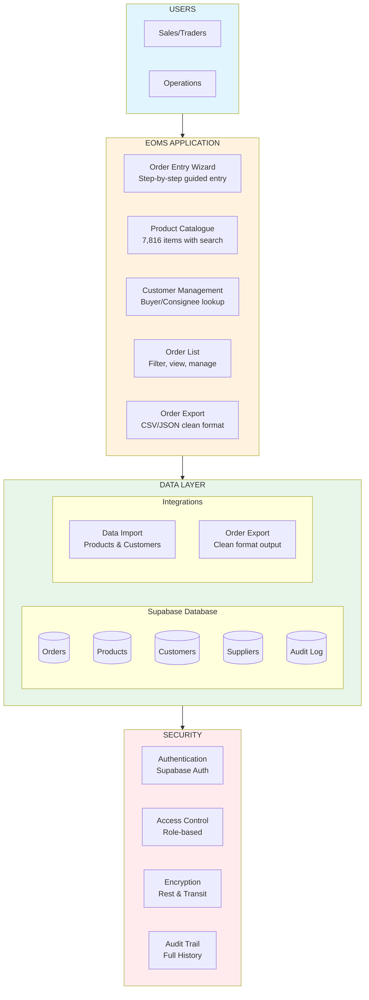

# EOMS BUSINESS PROPOSAL
## Endeavour Order Management System — Phase 1: Order Entry Foundation

---

| Document Control | |
|-----------------|---|
| **Document Number** | EOMS-PROPOSAL-003 |
| **Version** | 3.1 |
| **Status** | FOR BOARD APPROVAL |
| **Date** | 19 February 2026 |
| **Classification** | Board / Executive |
| **Prepared by** | wings4mind.ai |
| **Supersedes** | EOMS-PROPOSAL-003 (v3.0, 19 February 2026) |

---

## TABLE OF CONTENTS

1. [Executive Summary](#1-executive-summary)
2. [The Problem to Solve](#2-the-problem-to-solve)
3. [Value, Benefits & ROI Summary](#3-value-benefits--roi-summary)
4. [The Solution: EOMS Phase 1](#4-the-solution-eoms-phase-1)
5. [Risk Summary](#5-risk-summary)
6. [Governance & Success Criteria](#6-governance--success-criteria)
7. [Recommendation & Next Steps](#7-recommendation--next-steps)

**Appendices**
- [A: PRD Summary](#appendix-a-prd-summary)
- [B: Architecture Overview](#appendix-b-architecture-overview)
- [C: Implementation Phases](#appendix-c-implementation-phases)
- [D: Benefits Analysis](#appendix-d-benefits-analysis)
- [E: Risk Management Framework](#appendix-e-risk-management-framework)

---

# 1. EXECUTIVE SUMMARY

## The Opportunity

Endeavour Meats processes approximately **$600M AUD annually** through manual spreadsheet-based order management. The current system is cumbersome, error-prone, and cannot scale. The proposed **EOMS Phase 1** replaces the spreadsheet-based export order process with a **simple, purpose-built order entry system** — giving the trade team a faster, more reliable way to enter, manage, and export orders.

### Market Focus

| Market | Current Focus | EOMS Phase 1 |
|--------|---------------|---------------|
| **Export** | Primary revenue driver | **Phase 1 Focus** |
| **Domestic** | Secondary market | Future phase |

*Phase 1 focuses exclusively on the Export market, replacing the existing spreadsheet-based system with structured digital order entry.*

## Phase 1 Objective

> **Prove that we can materially improve workflow efficiency in a simple and cost-effective way before layering intelligence and automation.**

Phase 1 delivers:
- A **simple, accessible order entry interface** for the trade team
- **Structured data** (products, customers, suppliers) from a central database
- **Reduced manual rework** and time savings for traders
- A **clean export format** that can later feed into the finance system

## Value Proposition at a Glance

| Metric | Current State | Phase 1 Target | Improvement |
|--------|---------------|----------------|-------------|
| **Order Entry Time** | 45 min | 15-20 min | -55% to -65% |
| **Error Rate** | 5-8% | <3% | -50%+ |
| **Data Consistency** | Manual / variable | Structured / validated | Step change |
| **Finance Export Readiness** | None | Clean export format | Foundation built |
| **Audit Trail** | None | Full order history | Complete |

## Recommendation

**PROCEED** with EOMS Phase 1. A focused, contained investment in order entry delivers immediate time savings and error reduction for the trade team, while building the data foundation for future AI-powered validation, analytics, and finance system integration.

---

# 2. THE PROBLEM TO SOLVE

## 2.1 Business Rationale

All Sales/Traders and team members find the current spreadsheet system **cumbersome and a friction point** that delays easy processing and confirmation of trades.

### The Core Problem

The spreadsheet system is **operationally cumbersome** and creates reliance on manual checks and balances that:

- **Introduce errors** in order entry and data capture
- **Slow response times** to customers
- **Delay order processing** through the pipeline
- **Create uncertainty** about information accuracy
- **Risk incomplete data** when confirming orders to the sales pipeline

## 2.2 Current State Pain Points

| Pain Point | Business Impact |
|------------|-----------------|
| **45-minute order entry time** | 12,500+ hours/year on order entry alone |
| **5-8% order error rate** | Rework, credits, customer disputes |
| **7,816 product codes** | Manual lookup and validation at scale |
| **50 orders/day capacity** | Growth constrained by process, not people |
| **Spreadsheet limitations** | No structured validation, no audit trail |
| **Tribal knowledge dependency** | Key-person risk, inconsistent data entry |

## 2.3 Cost of Inaction & Risk to Business

**Scale of Risk:** A single export order can represent **$200,000 - $300,000** for a container shipment.

| Risk Category | Annual Exposure | Notes |
|---------------|-----------------|-------|
| **Error-related costs** | $850,000+ | Based on current 5-8% error rate |
| **Delayed order processing** | Revenue at risk | Customer experience impact |
| **Missed growth opportunity** | $150M+ revenue | Cannot scale without proportional headcount |
| **Key person dependency** | Business continuity | Single points of failure in knowledge |

**The spreadsheet system is the bottleneck. Phase 1 addresses the entry point.**

---

# 3. VALUE, BENEFITS & ROI SUMMARY

## 3.1 Value Proposition for Phase 1

### Who Is It For?

**Primary Users:** Sales/Traders, Operations Team
**Stakeholders:** GM, COO (Acting), CFO, Customers

### Pains Addressed

| Pain | How EOMS Phase 1 Solves It |
|------|---------------------------|
| Slow order entry | Guided wizard with product/customer search replaces manual spreadsheet entry |
| Manual data entry errors | Structured fields, product database lookup, and required-field validation reduce errors |
| Spreadsheet limitations | Purpose-built application with audit trail and consistent data structure |
| Information uncertainty | Single source of truth for products, customers, and order data |
| No finance export pathway | Clean export format provides foundation for future finance system integration |

### Gains Delivered

| Gain | Value |
|------|-------|
| **Faster order entry** | 55-65% reduction in order entry time |
| **Fewer errors** | Structured data entry with database-driven validation |
| **Consistent data** | Every order follows the same format and fields |
| **Audit trail** | Full history of order creation and changes |
| **Finance-ready data** | Clean export format, ready for integration when needed |
| **Foundation for future** | Platform designed so AI and analytics can be layered on |

## 3.2 Phase 1 Objectives

| Objective | Key Result |
|-----------|------------|
| **Workflow Efficiency** | Order entry time reduced from 45 min to under 20 min |
| **Data Quality** | Error rate reduced from 5-8% to under 3% |
| **Adoption** | 100% of Export orders entered via EOMS |
| **Data Foundation** | Products, customers, and orders in structured central database |
| **Export Readiness** | Clean export format available for finance system import |

## 3.3 Benefits Summary

Phase 1 benefits are focused on **time savings** and **error reduction** — the two areas that deliver immediate, measurable value from structured order entry alone.

| Benefit Category | Phase 1 Driver | Applicability |
|------------------|---------------|---------------|
| **Labour Efficiency** | Faster order entry, less rework | Primary benefit |
| **Error Reduction** | Structured data, database lookups, required fields | Primary benefit |
| **Faster Onboarding** | Consistent system is easier to train new staff on | Secondary benefit |
| **Data Foundation** | Structured data enables future analytics and AI | Strategic enabler |

**Deferred to future phases:** Margin Protection (covered by daily PnL reporting), Capacity Enablement at scale (requires AI automation), Customer Retention analytics.

*Detailed benefit analysis in Appendix D*

---

# 4. THE SOLUTION: EOMS PHASE 1

## 4.1 What Phase 1 Delivers

EOMS Phase 1 is a **focused order entry system** that replaces the spreadsheet process with a structured, database-backed application.

### Core Capabilities — Phase 1

| Capability | Description |
|------------|-------------|
| **Order Entry Wizard** | Guided step-by-step order creation with structured fields |
| **Product Search** | Fast search across 7,816 product codes with market eligibility display |
| **Customer Lookup** | Buyer, consignee, and notify party selection from central database |
| **Supplier/Establishment** | Supplier and establishment number selection |
| **Shipping Details** | Container type, incoterms, port of loading/destination, shipping dates |
| **Order List & Status** | View all orders with filtering — Draft, Complete, Exported |
| **Order Export to Finance** | Clean export in CSV/JSON format for downstream processing |
| **Audit Trail** | Full history of order creation, edits, and status changes |

### What Phase 1 Does NOT Include

The following are **deliberately deferred** to future phases, allowing Phase 1 to remain focused and deliverable:

| Deferred Capability | Rationale for Deferral |
|---------------------|-----------------------|
| AI Validation Agents | Prove the workflow first, add intelligence later |
| FX Contract Integration | FX booked separately; automated PnL report already covers actual rates |
| Margin Threshold Alerts | Daily PnL reporting catches margin issues; nice-to-have, not essential |
| Approval Workflows | Not needed for Phase 1; can be added when volume demands it |
| Dashboards & Analytics | Future phase once data is flowing through the system |
| Compliance Automation | Structured data entry handles the basics; advanced checks come later |
| Pattern Recognition | Requires order history data that Phase 1 will start generating |

### Future Phase Roadmap

Phase 1 is deliberately designed as a **foundation** that makes future phases straightforward to add:

| Phase | Focus | Builds On |
|-------|-------|-----------|
| **Phase 1** | Order Entry Foundation | *(this proposal)* |
| **Phase 2** | AI Validation & Insights | Order data flowing through Phase 1 |
| **Phase 3** | FX Integration & Margin Analysis | Structured order data + AI layer |
| **Phase 4** | Dashboards, Analytics & Finance Integration | Complete data platform |

## 4.2 Architecture Summary

EOMS Phase 1 uses a simple, modern web application stack:

### Technology Decisions

| Component | Selection | Rationale |
|-----------|-----------|-----------|
| **Database** | Supabase (PostgreSQL) | Managed database with auth included, real-time capable |
| **Frontend** | Next.js 14 | Modern React framework, excellent developer experience |
| **UI Components** | shadcn/ui + Tailwind CSS | Accessible, professional components out of the box |
| **Hosting** | Vercel | Seamless deployment, Australian edge presence |
| **Authentication** | Supabase Auth | Simple, secure, SSO-ready for future |

*No AI services required for Phase 1. Claude API and agent framework are future-phase additions.*

---

# 5. RISK SUMMARY

## 5.1 Key Risks & Mitigations

| Risk | Likelihood | Impact | Mitigation | Residual |
|------|:----------:|:------:|------------|:--------:|
| User adoption resistance | Medium | High | Simple UI, trader involvement in UAT, phased rollout | Low |
| Data quality in product/customer data | Medium | Medium | Pre-launch data review and cleanse | Low |
| Scope creep | Medium | Medium | Fixed Phase 1 scope, strict change control, future phases defined | Low |
| Integration delays (data extracts) | Medium | Low | MVP standalone, data import can be iterative | Low |
| Resource availability | Medium | Medium | Clear RACI, focused scope reduces demand | Low |

**Overall Risk: LOW** — Phase 1 is a contained, well-understood scope with no novel technology risk.

## 5.2 Security & Compliance

- **Security designed-in** from Phase 1 — authentication, access control, encryption, audit trail
- **Australian data residency** — Supabase and Vercel Sydney regions
- **SSO-ready** — Supabase Auth can integrate with O365 when needed

---

# 6. GOVERNANCE & SUCCESS CRITERIA

## 6.1 Success Criteria

| Milestone | Key Metrics |
|-----------|-------------|
| **Phase 1 Go-Live** | System available, all Export orders entering via EOMS |
| **30-Day Review** | Order entry time <20 min, error rate trending below 3% |
| **90-Day Review** | 100% Export adoption, trade team reporting time savings, order export in use |

## 6.2 Decision Gates

| Gate | Decision | Approver |
|------|----------|----------|
| **G1: Phase 1 Approval** | Approve scope and commence | CEO / CFO |
| **G2: UAT Sign-off** | System ready for production | CFO (Acting COO) |
| **G3: Go/No-Go** | Full production rollout | CEO |

## 6.3 RACI Summary

| Decision | CEO (James) | CFO/COO (Anthony) | Adviser |
|----------|:--:|:---:|:-------:|
| Phase 1 approval | A | R | C |
| Scope decisions | I | A | R |
| UAT sign-off | I | A | C |
| Go/No-Go decision | A | R | C |

**Legend:** R = Responsible, A = Accountable, C = Consulted, I = Informed

---

# 7. RECOMMENDATION & NEXT STEPS

## 7.1 Decision: PROCEED

| Criterion | Assessment |
|-----------|------------|
| **Business Need** | Clear — spreadsheet process is the bottleneck |
| **Scope** | Focused — order entry only, no over-engineering |
| **Risk** | Low — proven technology, contained scope |
| **Strategic Fit** | Foundation for future AI, analytics, and finance system integration |
| **Quick Win** | Immediate time savings and error reduction for trade team |

## 7.2 What This Unlocks

Phase 1 is not just an order entry tool. It creates:

1. **Structured data** — Every order in a consistent, queryable format
2. **A data foundation** — Products, customers, suppliers, and orders in a central database
3. **Finance export pathway** — Clean export format ready for integration
4. **AI readiness** — When the business is ready, AI validation and analytics plug straight in
5. **Team confidence** — Prove the approach works before investing in advanced features

## 7.3 Immediate Next Steps

| Action | Owner |
|--------|-------|
| Approve Phase 1 scope and business case | CEO / CFO |
| Confirm advisory engagement | CFO (Acting COO) |
| Prepare product data extract (7,816 codes) | Operations |
| Prepare customer data extract (buyers/consignees) | Finance / Operations |
| Confirm order export format requirements | Operations / Finance |
| Commence Phase 1 development | Team |

---

# APPENDIX A: PRD SUMMARY

*Full PRD available in: EOMS_PRD_UNIFIED_v2.1.md*

## Product Breakdown Structure (Phase 1)

| ID | Component | Priority | Description |
|----|-----------|----------|-------------|
| PBS-100 | Platform Infrastructure | MUST | Hosting, database, authentication |
| PBS-200 | Order Entry Module | MUST | Order wizard, line items, order lifecycle |
| PBS-300 | Product Catalogue | MUST | 7,816 products, search, market eligibility display |
| PBS-400 | Customer Management | MUST | Buyer/consignee/supplier lookup |
| PBS-500 | Order Export to Finance | MUST | Clean CSV/JSON export format |
| PBS-600 | Design & Documentation | MUST | Design token setup (Tailwind config), user documentation |
| PBS-700 | Quality & Testing | MUST | Testing, UAT, deployment |

### Deferred from Phase 1

| Component | Original Priority | Phase 1 Status |
|-----------|:-----------------:|:--------------:|
| AI Validation Engine | SHOULD | Deferred |
| FX Management Module | SHOULD | Deferred |
| Approval Workflows | SHOULD | Deferred |
| Dashboard & Analytics | SHOULD | Deferred |
| Pattern Recognition | SHOULD | Deferred |

---

# APPENDIX B: ARCHITECTURE OVERVIEW

*Full HLD available in: EOMS_HLD_v2.1.md*

## Architecture Principles

1. **Simplicity First** — Build only what is needed for Phase 1
2. **Security Designed-In** — Authentication, access control, and audit from day one
3. **Data-Driven** — Structured data in a central database, not spreadsheets
4. **Integration-Ready** — Architecture supports future finance system, AI, and analytics additions
5. **Low Maintenance** — Modern managed services minimise ongoing operational burden

## Technology Stack

| Component | Selection | Rationale |
|-----------|-----------|-----------|
| Database | Supabase (PostgreSQL) | Managed, auth included, real-time capable |
| Frontend | Next.js 14 + TypeScript | Modern React, strong ecosystem |
| UI Components | shadcn/ui + Tailwind CSS | Accessible, professional, customisable |
| Hosting | Vercel | Sydney edge, seamless deployment |
| Authentication | Supabase Auth | Simple, SSO-ready for future |

---

# APPENDIX C: IMPLEMENTATION PHASES

*Full Implementation Plan available in: EOMS_IMPLEMENTATION_PLAN_v2.1.md*

## Phase Summary

| Phase | Focus |
|-------|-------|
| **1. Setup & Data** | Environment, database schema, design tokens (Tailwind), product/customer data import |
| **2. Core Build** | Order entry wizard, product search, customer lookup, order list, order export |
| **3. Testing & UAT** | Functional testing, user acceptance testing, feedback, bug fixes |
| **4. Deployment** | Go-live, stabilisation, handover |

## External Dependencies

| Dependency | Owner | Status |
|------------|-------|--------|
| Product data extract (7,816 codes) | Operations | Pending |
| Customer data extract | Finance / Operations | Pending |
| Finance import format specification | Operations / Finance | Pending |
| Supabase account | IT / Adviser | Pending |
| Vercel account | IT / Adviser | Pending |
| Domain configuration | IT | Pending |

---

# APPENDIX D: BENEFITS ANALYSIS

## Phase 1 Benefit Categories

Phase 1 benefits derive from **two primary sources**: time savings from structured order entry, and error reduction from database-driven data lookup.

### Primary Benefits

**1. Labour Efficiency — Time Savings**

| Metric | Current | Phase 1 Target | Saving |
|--------|---------|----------------|--------|
| Order entry time | 45 min | 15-20 min | 25-30 min per order |
| Orders per day | ~50 | ~50 | 20-25 hours saved daily |
| Annual hours saved | - | - | 5,000-6,000+ hours/year |

*Drivers: Pre-populated customer/product data, guided wizard flow, no manual product code lookup.*

**2. Error Reduction — Data Quality**

| Metric | Current | Phase 1 Target | Improvement |
|--------|---------|----------------|-------------|
| Order error rate | 5-8% | <3% | 50%+ reduction |
| Product code errors | Manual lookup | Database-driven | Near elimination |
| Missing field errors | No enforcement | Required fields | Near elimination |

*Drivers: Product database lookup (no manual entry of 7,816 codes), required field validation, consistent data structure, market eligibility display.*

### Secondary Benefits

**3. Faster Onboarding**
- New traders learn a structured system rather than mastering spreadsheet conventions
- Reduces key-person dependency and tribal knowledge risk

**4. Data Foundation (Strategic)**
- Every order stored in structured, queryable format
- Clean data enables future: AI validation, analytics dashboards, finance system integration
- Order history builds the dataset needed for pattern recognition in later phases

### Deferred Benefit Categories

| Category | Why Deferred | When Applicable |
|----------|-------------|-----------------|
| Margin Protection | Daily PnL reporting already covers this | Phase 3 (FX integration) |
| Capacity Enablement at Scale | Requires AI automation to truly scale beyond headcount | Phase 2+ |
| Customer Retention Analytics | Requires dashboards and analytics capability | Phase 4 |

## Operating Costs

| Component | Monthly | Annual |
|-----------|--------:|-------:|
| Hosting (Vercel) | $20 | $240 |
| Database (Supabase) | $25 | $300 |
| Domain & SSL | ~$4 | $50 |
| **Total Infrastructure** | **~$50** | **~$590** |

*Infrastructure costs are operational expenses to be borne by Endeavour. No AI API costs in Phase 1.*

---

# APPENDIX E: RISK MANAGEMENT FRAMEWORK

## Risk Register

| # | Risk | L | I | Mitigation | Owner | Status |
|---|------|:-:|:-:|------------|-------|--------|
| R1 | User adoption resistance | M | H | Simple UI focused on trader needs, involvement in UAT, phased rollout with champions | COO | Open |
| R2 | Product/customer data quality | M | M | Pre-launch data review, iterative import with validation, feedback loop with Operations | Ops | Open |
| R3 | Scope creep | M | M | Fixed Phase 1 scope with explicit deferrals, strict change control, future roadmap defined | COO | Open |
| R4 | Data extract delays | M | L | Can start development with sample data, import is iterative | Adviser | Open |
| R5 | Resource availability | M | M | Clear RACI, focused scope minimises demand on internal team | COO | Open |
| R6 | Export format uncertainty | L | L | Export format designed to be flexible (CSV/JSON), can adapt to finance system requirements | Adviser | Open |

**L = Likelihood, I = Impact (H/M/L)**

**Overall Risk Assessment: LOW** — Phase 1 uses proven technology, has a contained scope, and requires no novel integrations. The primary risk is user adoption, mitigated by involving traders in UAT and keeping the interface simple.

## Security Framework

| Control Area | Phase 1 Approach |
|--------------|-----------------|
| Authentication | Supabase Auth (email/password, SSO-ready for future) |
| Authorisation | Role-based access control (Trader, Admin) |
| Data Protection | Encryption at rest and in transit |
| Data Residency | Australian data centre (Sydney region) |
| Audit | Full audit trail of all order changes |

---

**--- END OF PROPOSAL ---**

*Version 3.1 | For Board Approval*
*Prepared by wings4mind.ai*
*19 February 2026*
