# STATEMENT OF WORK
## EOMS — Endeavour Order Management System
## Phase 1 MVP

---

| Document Control | |
|-----------------|---|
| **Document Number** | EOMS-SOW-001 |
| **Version** | 0.1 — DRAFT |
| **Status** | For Agreement |
| **Date** | [DATE] |
| **Classification** | Commercial in Confidence |

---

## 1. PARTIES

| Role | Detail |
|------|--------|
| **Client** | [CLIENT LEGAL ENTITY NAME] |
| | ABN: [CLIENT ABN] |
| | Address: [CLIENT REGISTERED ADDRESS] |
| | Authorised Representative: [CLIENT AUTHORISED REP NAME] |
| | Title: [CLIENT AUTHORISED REP TITLE — e.g., General Manager / COO] |
| **Adviser** | [ADVISER LEGAL ENTITY NAME — e.g., wings4mind.ai] |
| | ABN: [ADVISER ABN] |
| | Address: [ADVISER REGISTERED ADDRESS] |
| | Authorised Representative: [ADVISER AUTHORISED REP NAME] |
| | Title: [ADVISER AUTHORISED REP TITLE] |

---

## 2. BACKGROUND & PURPOSE

### 2.1 Context

The Client operates an international meat export business currently processing approximately [CURRENT ANNUAL REVENUE — e.g., $600M AUD] in annual revenue through manual spreadsheet-based order management. The Client has identified this as a constraint on operational efficiency, growth capacity, and quality assurance.

### 2.2 Purpose of This SOW

This Statement of Work defines the scope, deliverables, timeline, and acceptance criteria for the design, development, and deployment of **Phase 1 MVP** of the Endeavour Order Management System (EOMS) — an AI-augmented order processing application to replace the current spreadsheet system for the Export market.

### 2.3 Relationship to Supporting Documents

This SOW should be read in conjunction with the following documents, which together form the agreed project definition:

| Ref | Document | Version | Purpose |
|-----|----------|---------|---------|
| SD-1 | EOMS_PROPOSAL_v2.1.md | 2.1 | Business case, value proposition, ROI |
| SD-2 | EOMS_PRD_UNIFIED_v1.7.md | 1.7 | Product requirements, epics, PBS |
| SD-3 | EOMS_HLD.md | 1.1 | Technical architecture, design decisions |
| SD-4 | EOMS_IMPLEMENTATION_PLAN.md | 1.1 | WBS, schedule, milestones |
| SD-5 | EOMS_CLIENT_READINESS_VSOM.md | 1.0 | Client readiness, VSOM, scope gaps |
| SD-6 | EOMS_TERMS_SHEET.md | 0.1 | Commercial terms, payment, IP |

In the event of any conflict between this SOW and the supporting documents, this SOW takes precedence.

---

## 3. SCOPE OF WORK

### 3.1 In-Scope — Phase 1 MVP Deliverables

The Adviser shall deliver the following for the Export market:

| # | Deliverable | Description | PRD Reference |
|---|-------------|-------------|---------------|
| D1 | **Order Management Module** | 4-step guided order creation wizard with customer selection, product line items, shipping/FX details, and review/submit | Epic 1, PBS 3.4 |
| D2 | **Product Catalogue** | Searchable catalogue of [NUMBER OF PRODUCTS — e.g., 7,816] product codes with market eligibility filtering, sub-200ms response | Epic 2, PBS 3.5 |
| D3 | **AI Validation Engine** | Claude-powered validation including product code checks, market eligibility, compliance policy, margin threshold alerts | Epic 3, PBS 4.1–4.4 |
| D4 | **FX & Pricing** | Multi-currency pricing with FX contract selection, weighted average rate calculation, add-on cost management | Epic 4, PBS 3.7 |
| D5 | **Dashboard** | Trader dashboard with active orders, pending actions, quick-create; management KPI summary view | Epic 5, PBS 3.3 |
| D6 | **Approval Workflow** | Single-level approval workflow with authority thresholds per RRR Framework (see PRD Section 16.2) | PBS 3.6 |
| D7 | **Authentication & Security** | Supabase Auth with RBAC, Row Level Security, audit logging. O365 SSO integration [CONFIRM: REQUIRED FOR MVP / DEFERRED] | PBS 1.3 |
| D8 | **Data Import** | Import of product catalogue, sample customer data, and sample FX contracts from Client-provided extracts | PBS 5.1 |
| D9 | **Design System** | Endeavour-branded UI built on shadcn/ui + Tailwind CSS, aligned with Figma design system | PBS 6.0 |
| D10 | **Deployment** | Production deployment on Vercel (Sydney region) with Supabase database | PBS 1.1 |
| D11 | **Documentation** | User guide, API documentation, handover notes | PBS 7.0 |
| D12 | **UAT Support** | Facilitation of user acceptance testing with [NUMBER OF UAT PARTICIPANTS — e.g., 3–5] nominated users | PBS 8.0 |

### 3.2 Explicitly Out of Scope — Phase 1

The following are **not included** in this SOW and are deferred to future phases:

| Item | Reason | Future Phase |
|------|--------|--------------|
| Domestic market orders | MVP focuses on Export only | Phase 2 |
| ERP / Accounting system integration | MVP operates standalone | Phase 2+ |
| Complex multi-level approval chains | Single-level approval in MVP | Phase 2 |
| Batch order processing | Individual order entry in MVP | Phase 2 |
| Historical order data migration | MVP starts fresh; legacy data remains in Excel | Phase 2 |
| Advanced analytics / reporting dashboards | Basic KPI dashboard in MVP | Phase 2 |
| Excel export functionality | View-only in MVP | Phase 2 |
| Mobile-native app | Web-based, mobile-responsive in MVP | Future |
| Offline capability | Online-only in MVP | Future |

### 3.3 Assumptions

The following assumptions underpin this SOW. If any assumption proves incorrect, the parties will discuss impact on scope, timeline, and cost:

| # | Assumption | Owner |
|---|-----------|-------|
| A1 | Client will provide product catalogue data extract (Excel/CSV) within [DAYS — e.g., 5] working days of project kickoff | Client |
| A2 | Client will provide sample customer data (buyers, consignees) within [DAYS — e.g., 10] working days of kickoff | Client |
| A3 | Client will provide sample FX contract data within [DAYS — e.g., 10] working days of kickoff | Client |
| A4 | Client will make [NUMBER — e.g., 2–3] nominated users available for UAT sessions of [DURATION — e.g., 2 hours] each | Client |
| A5 | Client will nominate a single Product Owner (expected: COO) with authority to make scope and priority decisions | Client |
| A6 | Client will provision or authorise provisioning of Supabase and Vercel accounts | Client |
| A7 | Product data is substantially complete and accurate; a data cleanse is not included in this scope | Client |
| A8 | Internet connectivity is available to all users; the system is cloud-hosted and requires a modern browser | Client |
| A9 | Anthropic API access is available for Claude AI integration | Adviser |
| A10 | The Adviser will use AI-assisted development methods (Claude Code) to achieve the quoted investment | Adviser |
| A11 | O365 SSO integration is [INCLUDED IN MVP / DEFERRED TO PHASE 2 — confirm] | Joint |

### 3.4 Constraints

| # | Constraint | Impact |
|---|-----------|--------|
| C1 | [CLIENT PRODUCT OWNER] availability — currently covering [DUAL ROLE DESCRIPTION — e.g., 2 roles until end of February 2026] | Timeline may flex around availability |
| C2 | Phase 1 is Export market only | Scope boundary |
| C3 | AI validation is advisory (human-in-the-loop) — the system does not auto-approve or auto-reject orders | Design constraint |

---

## 4. DELIVERY APPROACH

### 4.1 Methodology

The project will follow an **iterative, gate-based delivery approach** with formal client approval required at each gate before proceeding to the next phase.

### 4.2 Delivery Phases & Gates

| Phase | Duration | Key Activities | Gate |
|-------|----------|----------------|------|
| **Phase 1: Foundation** | Weeks 1–2 | Environment setup, database schema, authentication, Figma design system, data import | **G1: POC Demo** |
| **Phase 2: Core Build** | Weeks 3–6 | Order wizard, product search, customer management, pricing/FX, dashboard | **G2: MVP Feature Complete** |
| **Phase 3: AI Integration** | Weeks 5–7 | Validation engine, compliance checks, margin alerts, pattern recognition | **G3: AI Operational** |
| **Phase 4: UAT & Polish** | Weeks 7–9 | User acceptance testing, bug fixes, UX refinements, feedback iteration | **G4: UAT Sign-off** |
| **Phase 5: Deploy & Stabilise** | Weeks 10–12 | Production deployment, monitoring, documentation, handover | **G5: Go-Live** |

### 4.3 Gate Acceptance Criteria

| Gate | Criteria | Approver |
|------|----------|----------|
| **G1: POC Demo** | Working prototype demonstrated; Figma designs reviewed; database schema confirmed; data import validated | COO |
| **G2: MVP Feature Complete** | All D1–D6 deliverables functional in staging environment; core order creation flow end-to-end complete | COO |
| **G3: AI Operational** | AI validation returns results for all 7 check types (product code, market eligibility, compliance, FX, margin, required fields, reordering); accuracy > [TARGET — e.g., 90%] on test data | COO |
| **G4: UAT Sign-off** | [MINIMUM — e.g., 90%] of UAT test scenarios pass; zero P1 (critical) defects open; [MINIMUM — e.g., 80%] user satisfaction score | COO |
| **G5: Go-Live** | Production environment operational; user accounts provisioned; documentation delivered; handover session completed | GM |

**Stop/Adjust Rights:** The Client may, at any gate, elect to:
- **Proceed** to the next phase
- **Adjust** scope or priorities before proceeding
- **Pause** the project (with 2 weeks' notice)
- **Terminate** (see Section 7)

### 4.4 WBS Overview

```mermaid
flowchart TB
    EOMS["EOMS Phase 1 MVP<br/>Statement of Work"]

    EOMS --> P1["Phase 1<br/>Foundation<br/>Weeks 1–2"]
    EOMS --> P2["Phase 2<br/>Core Build<br/>Weeks 3–6"]
    EOMS --> P3["Phase 3<br/>AI Integration<br/>Weeks 5–7"]
    EOMS --> P4["Phase 4<br/>UAT & Polish<br/>Weeks 7–9"]
    EOMS --> P5["Phase 5<br/>Deploy & Stabilise<br/>Weeks 10–12"]

    P1 --> P1a["Environment Setup<br/>Supabase, Vercel, Git"]
    P1 --> P1b["Database Schema<br/>Orders, Products, FX"]
    P1 --> P1c["Auth & Security<br/>RBAC, RLS, Audit"]
    P1 --> P1d["Design System<br/>Figma, Endeavour-DS"]
    P1 --> P1e["Data Import<br/>Products, Customers"]

    P2 --> P2a["Order Wizard<br/>4-step creation"]
    P2 --> P2b["Product Catalogue<br/>Search & filter"]
    P2 --> P2c["Customer Mgmt<br/>Buyer/Consignee"]
    P2 --> P2d["FX & Pricing<br/>Multi-currency"]
    P2 --> P2e["Dashboard<br/>KPIs, pipeline"]
    P2 --> P2f["Approval Workflow<br/>Authority levels"]

    P3 --> P3a["Claude API Setup<br/>SDK integration"]
    P3 --> P3b["Validation Agent<br/>7 check types"]
    P3 --> P3c["Pricing Agent<br/>Margin analysis"]
    P3 --> P3d["Pattern Agent<br/>Reorder suggestions"]

    P4 --> P4a["UAT Sessions<br/>Traders & Finance"]
    P4 --> P4b["Bug Fixes<br/>P1/P2 resolution"]
    P4 --> P4c["UX Refinements<br/>Feedback iteration"]
    P4 --> P4d["Management Demo<br/>GM/COO/CFO"]

    P5 --> P5a["Production Deploy<br/>Vercel Sydney"]
    P5 --> P5b["User Provisioning<br/>Accounts & roles"]
    P5 --> P5c["Documentation<br/>User guide, API docs"]
    P5 --> P5d["Handover<br/>Knowledge transfer"]
    P5 --> P5e["Stabilisation<br/>Monitoring & support"]

    P1 -->|G1| G1{"G1: POC Demo<br/>COO Approval"}
    P2 -->|G2| G2{"G2: Feature Complete<br/>COO Approval"}
    P3 -->|G3| G3{"G3: AI Operational<br/>COO Approval"}
    P4 -->|G4| G4{"G4: UAT Sign-off<br/>COO Approval"}
    P5 -->|G5| G5{"G5: Go-Live<br/>GM Approval"}

    style EOMS fill:#19253B,color:#fff
    style P1 fill:#4caf50,color:#fff
    style P2 fill:#2196f3,color:#fff
    style P3 fill:#9c27b0,color:#fff
    style P4 fill:#ff9800,color:#fff
    style P5 fill:#e91e63,color:#fff
    style G1 fill:#00E5CE,color:#19253B
    style G2 fill:#00E5CE,color:#19253B
    style G3 fill:#00E5CE,color:#19253B
    style G4 fill:#00E5CE,color:#19253B
    style G5 fill:#00E5CE,color:#19253B
```

---

## 5. CLIENT RESPONSIBILITIES

The Client shall:

| # | Responsibility | When | Contact |
|---|---------------|------|---------|
| CR1 | Nominate a Product Owner with decision-making authority | Before kickoff | [CLIENT PRODUCT OWNER — e.g., COO] |
| CR2 | Provide product catalogue data extract | Within [DAYS] of kickoff | [CLIENT DATA CONTACT] |
| CR3 | Provide sample customer data (buyers, consignees) | Within [DAYS] of kickoff | [CLIENT DATA CONTACT] |
| CR4 | Provide sample FX contract data | Within [DAYS] of kickoff | [CLIENT FINANCE CONTACT] |
| CR5 | Provision or authorise Supabase account (Sydney region) | Week 1 | [CLIENT IT CONTACT] |
| CR6 | Provision or authorise Vercel account | Week 1 | [CLIENT IT CONTACT] |
| CR7 | Make [NUMBER] users available for UAT ([HOURS] per session) | Weeks 7–9 | [CLIENT PRODUCT OWNER] |
| CR8 | Attend gate review meetings and provide approval/feedback within [DAYS — e.g., 3] working days | Per schedule | [CLIENT PRODUCT OWNER] |
| CR9 | Provide domain name / DNS configuration for production URL | Week 9 | [CLIENT IT CONTACT] |
| CR10 | Confirm O365 SSO requirements and provide tenant details (if MVP) | Week 1 | [CLIENT IT CONTACT] |

---

## 6. ADVISER RESPONSIBILITIES

The Adviser shall:

| # | Responsibility |
|---|---------------|
| AR1 | Deliver all in-scope deliverables (D1–D12) to the acceptance criteria defined at each gate |
| AR2 | Maintain the EOMS codebase in a Git repository accessible to the Client |
| AR3 | Provide weekly progress updates to the Product Owner via [METHOD — e.g., email summary / Slack / Teams] |
| AR4 | Raise risks, blockers, and assumption failures promptly |
| AR5 | Facilitate gate review meetings and provide materials in advance |
| AR6 | Deliver documentation (user guide, API docs, handover notes) by G5 |
| AR7 | Provide [DURATION — e.g., 2 weeks] post-go-live stabilisation support at no additional cost |

---

## 7. TIMELINE

### 7.1 Key Dates

| Milestone | Target Date | Notes |
|-----------|-------------|-------|
| **SOW Signed** | [SOW SIGN DATE] | — |
| **Project Kickoff** | [KICKOFF DATE] | Within [DAYS] of SOW signing |
| **G1: POC Demo** | [G1 DATE — kickoff + 2 weeks] | |
| **G2: Feature Complete** | [G2 DATE — kickoff + 6 weeks] | |
| **G3: AI Operational** | [G3 DATE — kickoff + 7 weeks] | |
| **G4: UAT Sign-off** | [G4 DATE — kickoff + 9 weeks] | |
| **G5: Go-Live** | [G5 DATE — kickoff + 12 weeks] | |
| **Stabilisation Period Ends** | [STABILISATION END — go-live + 2 weeks] | |

### 7.2 Timeline Adjustments

The timeline may be adjusted by mutual written agreement if:
- Client data provision is delayed beyond the assumed dates
- Client feedback / gate approval exceeds [DAYS] working days
- Scope changes are agreed via the change control process (Section 9)
- Force majeure events

---

## 8. INVESTMENT & COMMERCIAL TERMS

**See: EOMS_TERMS_SHEET.md for full commercial terms.**

### 8.1 Summary

| Item | Amount |
|------|--------|
| **Phase 1 MVP — Total Fixed Price** | [TOTAL PRICE — e.g., $22,000 AUD / £10,000 GBP] |
| **Currency** | [BILLING CURRENCY — AUD / GBP] |
| **Payment Terms** | Per Terms Sheet — milestone-based |
| **Operating Costs (Post Go-Live)** | ~[ANNUAL OPS COST — e.g., $1,500–2,000] AUD/year (infrastructure; paid directly by Client) |

### 8.2 What's Included in the Fixed Price

- All development effort for D1–D12
- Figma design system creation
- AI integration and tuning
- UAT facilitation
- Documentation and handover
- [DURATION] post-go-live stabilisation

### 8.3 What's NOT Included (Billed Separately or Client-Funded)

| Item | Responsibility | Estimated Cost |
|------|---------------|---------------|
| Supabase subscription (Pro tier) | Client direct | ~$25 AUD/month |
| Vercel subscription (Pro tier) | Client direct | ~$20 AUD/month |
| Anthropic API usage (Claude) | Client direct | ~$50–100 AUD/month |
| Domain & SSL certificate | Client direct | ~$50 AUD/year |
| Post-stabilisation support (if required) | By agreement | [HOURLY/DAILY RATE] |
| Phase 2+ development | Separate SOW | To be quoted |

---

## 9. CHANGE CONTROL

### 9.1 Process

Changes to scope, deliverables, or timeline must follow this process:

1. **Request** — Either party raises a change request in writing
2. **Assess** — Adviser assesses impact on scope, timeline, and cost within [DAYS — e.g., 3] working days
3. **Decide** — Client approves, rejects, or defers the change
4. **Record** — Approved changes are recorded in the EOMS Change Control Register (EOMS_CHANGE_CONTROL.md)
5. **Execute** — Approved changes are incorporated into the next development cycle

### 9.2 Impact Categories

| Impact | Process |
|--------|---------|
| **No cost/timeline impact** | Adviser implements; logged in change register |
| **Minor** (< [THRESHOLD — e.g., 2 days] effort) | Product Owner approval required |
| **Major** (> [THRESHOLD] effort or timeline shift) | Written change order with revised cost/timeline; GM/COO approval |

---

## 10. COMMUNICATION & GOVERNANCE

### 10.1 Communication Cadence

| Meeting | Frequency | Participants | Purpose |
|---------|-----------|--------------|---------|
| **Kickoff** | Once | GM, COO, CFO, Adviser | Align on scope, timeline, responsibilities |
| **Weekly Status** | Weekly | COO, Adviser | Progress, blockers, decisions needed |
| **Gate Reviews** | Per schedule (5 gates) | COO (G1–G4), GM (G5), Adviser | Formal approval to proceed |
| **UAT Sessions** | [FREQUENCY — e.g., 2–3 sessions] | Nominated users, Adviser | Hands-on testing and feedback |
| **Steering Committee** | [FREQUENCY — e.g., Fortnightly / Monthly] | GM, COO, CFO, Adviser | Strategic oversight |

### 10.2 Reporting

The Adviser will provide:

| Report | Frequency | Content |
|--------|-----------|---------|
| **Status Update** | Weekly | Tasks completed, upcoming, blockers, risks |
| **Gate Report** | Per gate | Deliverables completed, acceptance criteria status, recommendation |
| **Final Handover Report** | At G5 | Full project summary, documentation index, support transition |

### 10.3 Escalation Path

| Level | Trigger | Escalated To |
|-------|---------|--------------|
| 1 — Operational | Day-to-day blockers | Product Owner (COO) |
| 2 — Project | Scope/timeline disputes, resource conflicts | COO + Adviser lead |
| 3 — Executive | Budget, strategic direction, go/no-go | GM |

---

## 11. ACCEPTANCE & COMPLETION

### 11.1 Final Acceptance

The project is considered complete when:
- All gate criteria (G1–G5) have been met and approved
- All P1 (critical) defects have been resolved
- Documentation (D11) has been delivered
- Handover session has been completed
- Stabilisation period has ended without unresolved critical issues

### 11.2 Defect Classification

| Priority | Definition | Resolution |
|----------|-----------|------------|
| **P1 — Critical** | System unusable, data loss, security breach | Fix within [HOURS — e.g., 24] hours |
| **P2 — High** | Major feature not working, workaround exists | Fix within [DAYS — e.g., 3] working days |
| **P3 — Medium** | Minor feature issue, cosmetic | Fix in next release cycle |
| **P4 — Low** | Enhancement request, nice-to-have | Logged for future consideration |

---

## 12. TERMINATION

### 12.1 Termination by Client

The Client may terminate this SOW:
- At any gate, by electing not to proceed (no penalty for work not yet commenced)
- With [NOTICE PERIOD — e.g., 2 weeks] written notice at any time
- Payment is due for all work completed and accepted up to the termination date

### 12.2 Termination by Adviser

The Adviser may terminate this SOW:
- With [NOTICE PERIOD — e.g., 4 weeks] written notice
- If Client responsibilities (Section 5) are not fulfilled after [DAYS] days' written notice

### 12.3 Effect of Termination

Upon termination:
- All code, documentation, and deliverables produced to date are [OWNERSHIP OUTCOME — e.g., transferred to the Client]
- All Client data is returned or destroyed per Client instruction
- Outstanding invoices for completed work are payable within [DAYS — e.g., 30] days

---

## 13. SUPPORTING DOCUMENT PACKAGE

The following documents form the complete project definition and should be read alongside this SOW:

| # | Document | File | Purpose |
|---|----------|------|---------|
| 1 | **Statement of Work** | `EOMS_STATEMENT_OF_WORK_v0.1.md` | This document — scope, deliverables, terms |
| 2 | **Terms Sheet** | `EOMS_TERMS_SHEET_v0.1.md` | Payment schedule, IP, commercial terms |
| 3 | **Business Proposal** | `EOMS_PROPOSAL_v2.1.md` | Business case, ROI, recommendation |
| 4 | **Product Requirements** | `EOMS_PRD_UNIFIED_v1.7.md` | Full product definition, epics, PBS |
| 5 | **High-Level Design** | `EOMS_HLD.md` | Technical architecture, data model |
| 6 | **Implementation Plan** | `EOMS_IMPLEMENTATION_PLAN.md` | WBS, schedule, resources |
| 7 | **Client Readiness VSOM** | `EOMS_CLIENT_READINESS_VSOM.md` | Executive summary, scope gaps, VSOM |
| 8 | **Change Control Register** | `EOMS_CHANGE_CONTROL.md` | Change history and register |
| 9 | **Document Traceability** | `EOMS_DOCUMENT_TRACEABILITY.md` | Cross-document alignment |
| 10 | **Document Register** | `EOMS_DOCUMENT_REGISTER.md` | Document index |

---

## 14. AGREEMENT

By signing below, the parties agree to the scope, deliverables, timeline, and terms described in this Statement of Work and the referenced Terms Sheet.

### Client

| | |
|---|---|
| Signed | _________________________ |
| Name | [CLIENT AUTHORISED REP NAME] |
| Title | [CLIENT AUTHORISED REP TITLE] |
| Date | [DATE] |

### Adviser

| | |
|---|---|
| Signed | _________________________ |
| Name | [ADVISER AUTHORISED REP NAME] |
| Title | [ADVISER AUTHORISED REP TITLE] |
| Date | [DATE] |

---

**--- END OF STATEMENT OF WORK ---**

*Version 0.1 — DRAFT | For Agreement*
*[DATE]*
