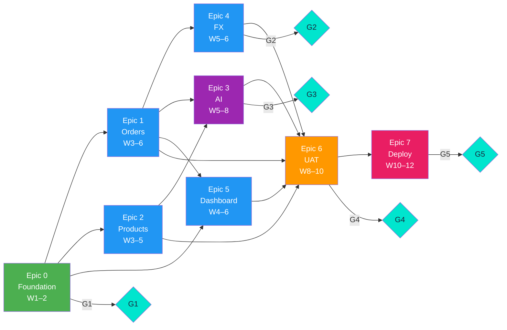
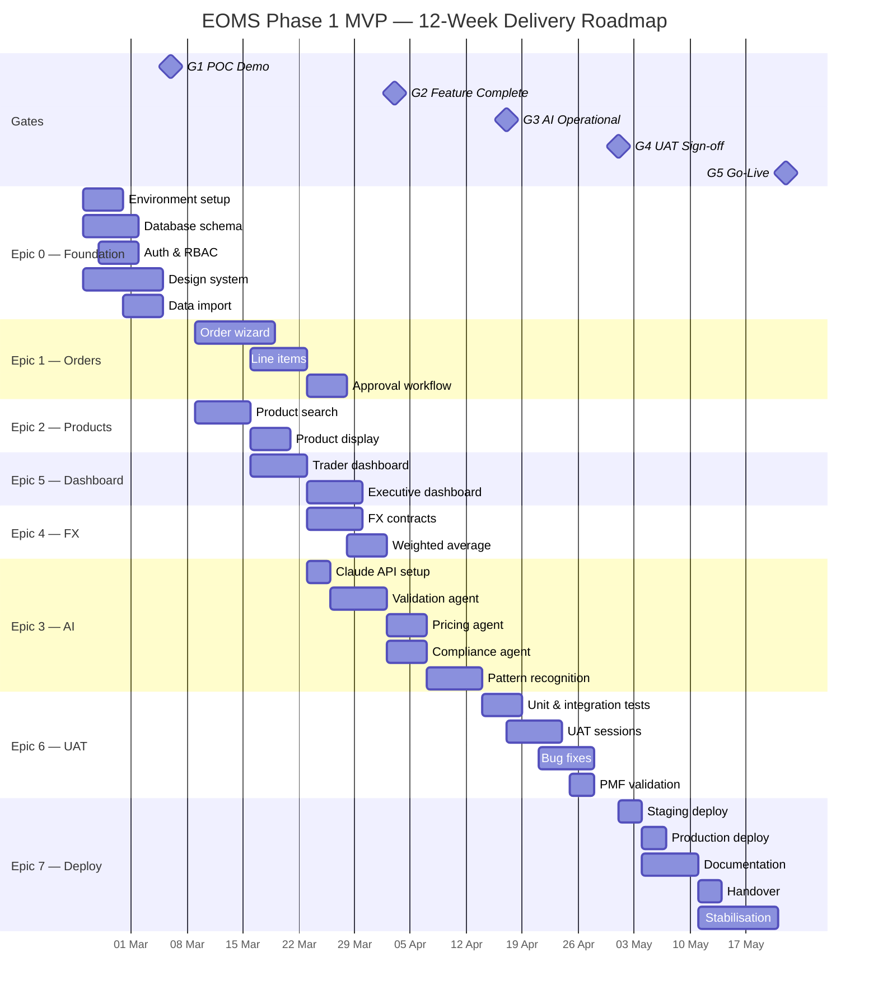

# EOMS PROJECT VSOM, OKRs, VALUE PROPOSITION & DELIVERY ROADMAP
## Phase 1 MVP — Strategic Alignment to Execution

---

| Document Control | |
|-----------------|---|
| **Document Number** | EOMS-VOR-001 |
| **Version** | 1.0 |
| **Status** | Draft |
| **Date** | 09 February 2026 |
| **Related SOW** | EOMS-SOW-001 v0.1 |
| **Related PRD** | EOMS-PRD-UNIFIED-001 v1.7 |
| **Ontology Frameworks** | VSOM-ONT v3.0.0, OKR-ONT v2.0.0, KPI-ONT v1.0.0, VP-ONT v1.2.3, PPM-ONT v4.0.0, EFS-ONT v2.0.0 |
| **Classification** | Commercial in Confidence |

---

## Table of Contents

1. [Executive Overview](#1-executive-overview)
2. [VSOM Framework](#2-vsom-framework)
3. [OKRs — Objectives & Key Results](#3-okrs--objectives--key-results)
4. [KPI Dashboard](#4-kpi-dashboard)
5. [Value Proposition](#5-value-proposition)
6. [PPM-EFS Delivery Roadmap](#6-ppm-efs-delivery-roadmap)
7. [Epics, Features & Stories](#7-epics-features--stories)
8. [8–12 Week Gantt Chart](#8-812-week-gantt-chart)
9. [Work Breakdown Structure](#9-work-breakdown-structure)
10. [SOW Executive Summary](#10-sow-executive-summary)

---

## 1. Executive Overview

### What This Document Does

This document bridges **strategy and execution** for EOMS Phase 1 MVP. It connects:

- **Why** we are building EOMS (Vision, Strategy, Value Proposition)
- **What** success looks like (Objectives, Key Results, KPIs)
- **How** we deliver it (Epics, Features, Stories, Gantt, WBS)

### Lineage Chain

The frameworks used follow the ontology lineage chain established in the OAA ontology library:

```
VSOM (Vision/Strategy/Objectives/Metrics)
  → OKR (Objectives & Key Results)
    → VP (Value Proposition — Problem/Solution/Benefit)
      → PMF (Product-Market Fit validation)
        → EFS (Epics/Features/Stories for execution)
```

Each layer feeds the next — strategic intent cascades into measurable objectives, which map to customer value, which decomposes into deliverable work items.

### At a Glance

| Dimension | Summary |
|-----------|---------|
| **Vision** | AI-enabled export order management, scaling Endeavour from $600M to $1.2Bn |
| **Investment** | ~$22,000 AUD Phase 1; ~$70,000 over 3 years |
| **ROI** | ~52x over 3 years; ~9-day payback |
| **Delivery** | 8 Epics across 12 weeks, 5 gates, iterative build |
| **Technology** | Next.js 14, shadcn/ui, Supabase, Claude AI, Vercel |

---

## 2. VSOM Framework

*Aligned to VSOM-ONT v3.0.0 — VSOMFramework → VisionComponent → StrategyComponent → ObjectivesComponent → MetricsComponent*

### 2.1 Vision

> **Transform Endeavour's export order management from manual, error-prone spreadsheet processes into an AI-enabled platform that supports 2x revenue growth ($600M → $1.2Bn) without proportional headcount increase.**

| Vision Attribute | Detail |
|-----------------|--------|
| **Time Horizon** | 3 years (Phase 1 MVP in 12 weeks) |
| **Scope** | Export market order processing — full order lifecycle |
| **Business Impact** | Operational efficiency, revenue enablement, risk reduction |
| **Outcome** | Scalable, AI-augmented operations with audit trail and compliance |
| **Value Measure** | ROI, processing time, error rate, capacity, user adoption |

### 2.2 Strategy

| Strategic Pillar | EOMS Contribution | Phase 1 MVP Deliverable |
|------------------|-------------------|------------------------|
| **Operational Excellence** | Automate order entry, validation, compliance | Order Wizard, AI Validation Engine |
| **Revenue Growth Enablement** | 3x order capacity without headcount | Scalable platform, product catalogue |
| **Risk Reduction** | AI validation on $200K–$300K containers | Compliance Agent, margin alerts |
| **Capability Building** | Introduce AI to business operations | Claude integration, pattern recognition |

### 2.3 Strategic Review Cycle

| Trigger Type | Mechanism | Frequency |
|-------------|-----------|-----------|
| **Scheduled** | Gate reviews (G1–G5) | At each gate milestone |
| **MetricBreach** | KPI thresholds not met | Continuous monitoring |
| **OpportunityIdentified** | User feedback suggests scope expansion | Sprint retrospectives |
| **RiskMaterialized** | Assumption failure or blocker | Immediate escalation |

### 2.4 Objectives (SMART)

| ID | Objective | Target | Timeline | Linked OKR |
|----|-----------|--------|----------|------------|
| O1 | Reduce order entry time | < 15 min (from 45–60 min) | MVP go-live | OKR-1 |
| O2 | Eliminate data entry errors | < 2% (from 5–8%) | MVP go-live | OKR-2 |
| O3 | Enable scaling to 2x volume | 150+ orders/day (from 50) | 6 months post-MVP | OKR-3 |
| O4 | Achieve AI validation accuracy | > 95% pass rate | MVP go-live | OKR-4 |
| O5 | Drive user adoption | Internal NPS > 50 | 3 months post-launch | OKR-5 |

### 2.5 Metrics Dashboard

| Category | Metric | Source | Threshold |
|----------|--------|--------|-----------|
| **Efficiency** | Order creation time | System timestamps | < 15 min |
| **Quality** | Error rate | Validation failures / total | < 2% |
| **Capacity** | Orders processed per day | System count | > 150 |
| **Adoption** | Daily active users | Login analytics | > 80% of traders |
| **Satisfaction** | User NPS | Quarterly survey | > 50 |
| **Value** | AI validation accuracy | Agent success rate | > 95% |
| **Financial** | Processing cost per order | Time × rate calculation | 30% reduction |

---

## 3. OKRs — Objectives & Key Results

*Aligned to OKR-ONT v2.0.0 — 2–5 Key Results per Objective, Company → Department → Team cascade*

### 3.1 Company-Level OKRs (Phase 1 MVP)

**Time Period:** Q1–Q2 2026 (12-week delivery + 4-week stabilisation)

---

#### OKR-1: Dramatically reduce order processing time

| | Detail |
|---|--------|
| **Objective** | Reduce export order entry time by 75%+ |
| **Type** | Company |
| **Status** | Not Started |
| **Linked VSOM Objective** | O1 |

| KR | Key Result | Type | Start | Target | Weight |
|----|-----------|------|-------|--------|--------|
| KR-1.1 | Reduce average order creation time from 45 min to < 15 min | Decrease | 45 min | 15 min | 30% |
| KR-1.2 | Complete 4-step order wizard build with < 10 clicks per step | Milestone | 0 | 1 | 25% |
| KR-1.3 | Achieve < 200ms product search response time across 7,816 codes | Decrease | 2000 ms | 200 ms | 25% |
| KR-1.4 | Enable auto-population of repeat customer details (80% of fields) | Increase | 0% | 80% | 20% |

---

#### OKR-2: Eliminate order data entry errors

| | Detail |
|---|--------|
| **Objective** | Reduce data entry error rate to < 2% |
| **Type** | Company |
| **Status** | Not Started |
| **Linked VSOM Objective** | O2 |

| KR | Key Result | Type | Start | Target | Weight |
|----|-----------|------|-------|--------|--------|
| KR-2.1 | Reduce error rate from 5–8% to < 2% through AI validation | Decrease | 8% | 2% | 35% |
| KR-2.2 | Achieve 95%+ AI validation accuracy on product code checks | Increase | 0% | 95% | 30% |
| KR-2.3 | Validate 100% of orders against market eligibility rules | Increase | 0% | 100% | 20% |
| KR-2.4 | Zero orders shipped with incorrect Halal certification status | Decrease | Unknown | 0 | 15% |

---

#### OKR-3: Build scalable platform for 2x revenue growth

| | Detail |
|---|--------|
| **Objective** | Deliver a platform capable of supporting $1.2Bn order volume |
| **Type** | Company |
| **Status** | Not Started |
| **Linked VSOM Objective** | O3 |

| KR | Key Result | Type | Start | Target | Weight |
|----|-----------|------|-------|--------|--------|
| KR-3.1 | Support 150+ orders/day without performance degradation | Increase | 50 | 150 | 30% |
| KR-3.2 | Handle 7,816+ product codes with sub-200ms search | Milestone | 0 | 1 | 25% |
| KR-3.3 | Achieve 99.5% system uptime in production | Increase | N/A | 99.5% | 25% |
| KR-3.4 | Support concurrent use by 10+ traders without conflict | Increase | 1 | 10 | 20% |

---

#### OKR-4: Establish AI as a trusted operational tool

| | Detail |
|---|--------|
| **Objective** | Deploy AI validation that staff trust and use daily |
| **Type** | Company |
| **Status** | Not Started |
| **Linked VSOM Objective** | O4 |

| KR | Key Result | Type | Start | Target | Weight |
|----|-----------|------|-------|--------|--------|
| KR-4.1 | AI validation passes > 95% accuracy on test data at G3 gate | Increase | 0% | 95% | 30% |
| KR-4.2 | All 7 AI check types operational (product, market, compliance, FX, margin, fields, reorder) | Milestone | 0 | 7 | 25% |
| KR-4.3 | AI response time < 3 seconds per order validation | Decrease | N/A | 3s | 25% |
| KR-4.4 | > 80% of traders report AI validation is "helpful" or "very helpful" | Increase | 0% | 80% | 20% |

---

#### OKR-5: Achieve strong internal adoption

| | Detail |
|---|--------|
| **Objective** | Achieve > 80% voluntary adoption within 3 months of go-live |
| **Type** | Company |
| **Status** | Not Started |
| **Linked VSOM Objective** | O5 |

| KR | Key Result | Type | Start | Target | Weight |
|----|-----------|------|-------|--------|--------|
| KR-5.1 | > 90% UAT task success rate at G4 gate | Increase | 0% | 90% | 30% |
| KR-5.2 | Internal NPS > 50 at 3-month post-launch review | Increase | 0 | 50 | 25% |
| KR-5.3 | > 80% of export orders processed through EOMS (not Excel) within 8 weeks of go-live | Increase | 0% | 80% | 25% |
| KR-5.4 | < 30 minutes total onboarding time for new user | Decrease | N/A | 30 min | 20% |

---

### 3.2 OKR Cascade Summary

```
Company: OKR-1 (Speed) ──→ Operations Dept: Order processing team targets
Company: OKR-2 (Quality) ──→ Trading Dept: Error-free order submission
Company: OKR-3 (Scale) ──→ Technology: Platform capacity & reliability
Company: OKR-4 (AI Trust) ──→ All Teams: AI adoption & feedback
Company: OKR-5 (Adoption) ──→ All Teams: Transition from Excel to EOMS
```

---

## 4. KPI Dashboard

*Aligned to KPI-ONT v1.0.0 — Vision → Strategy → Objective → KR → KPI → Metric chain*

### 4.1 Phase 1 MVP KPIs

| KPI ID | KPI Name | Linked OKR | Metric | Baseline | Target | Measurement |
|--------|----------|-----------|--------|----------|--------|-------------|
| KPI-01 | Order Processing Speed | OKR-1 | Avg. minutes per order | 45–60 min | < 15 min | System timestamp delta |
| KPI-02 | Data Entry Error Rate | OKR-2 | Errors / total orders × 100 | 5–8% | < 2% | AI validation rejection log |
| KPI-03 | Order Throughput Capacity | OKR-3 | Max orders/day sustained | 50 | 150+ | Load test + production count |
| KPI-04 | AI Validation Accuracy | OKR-4 | Correct validations / total × 100 | N/A | > 95% | Agent accuracy log |
| KPI-05 | System Uptime | OKR-3 | % time available | N/A | 99.5% | Monitoring service |
| KPI-06 | User Adoption Rate | OKR-5 | % orders via EOMS (not Excel) | 0% | > 80% | Order source tracking |
| KPI-07 | User Satisfaction (NPS) | OKR-5 | Net Promoter Score | N/A | > 50 | Quarterly survey |
| KPI-08 | Product Search Latency | OKR-1 | p95 response time (ms) | > 2000 ms | < 200 ms | Application performance monitoring |
| KPI-09 | AI Response Time | OKR-4 | Avg. seconds per validation | N/A | < 3s | Agent timing log |
| KPI-10 | UAT Pass Rate | OKR-5 | % test scenarios passed | N/A | > 90% | UAT test results |

### 4.2 KPI Measurement Cadence

| Cadence | KPIs | Owner |
|---------|------|-------|
| **Real-time** | KPI-05 (Uptime), KPI-08 (Search latency), KPI-09 (AI response) | Technical Adviser |
| **Daily** | KPI-01 (Processing speed), KPI-03 (Throughput), KPI-06 (Adoption) | COO |
| **Weekly** | KPI-02 (Error rate), KPI-04 (AI accuracy) | COO |
| **Gate milestones** | KPI-10 (UAT pass rate) | COO |
| **Quarterly** | KPI-07 (NPS) | GM |

### 4.3 KPI Threshold Alerting

| Alert Level | Condition | Action |
|-------------|-----------|--------|
| **Green** | KPI within target | Continue |
| **Amber** | KPI within 80% of target | Review at next standup |
| **Red** | KPI below 80% of target | Escalate to Product Owner, trigger strategic review |

---

## 5. Value Proposition

*Aligned to VP-ONT v1.2.3 — ValueProposition → ICP → Problem → PainPoint → Solution → Benefit → Differentiator*

### 5.1 Primary Value Proposition Statement

> **For Endeavour's export trading and finance teams** who are constrained by manual, error-prone spreadsheet processes that cannot scale with business growth, **EOMS is an AI-enabled order management system** that reduces order processing time by 87%, eliminates data entry errors, and provides real-time validation across 7,816+ product codes — **unlike** the current Excel system which requires 45–60 minutes per order, is limited to 50 orders/day, and has no automated compliance checking.

### 5.2 Ideal Customer Profiles (ICPs)

| ICP | Role | Seniority | Function Scope | Decision Authority | Primary Pain |
|-----|------|-----------|---------------|-------------------|-------------|
| **ICP-1** | Export Trader | Operational | Order creation & management | Submit orders | Slow, repetitive data entry |
| **ICP-2** | Finance / FX Manager | Tactical | FX contracts, margin analysis | Approve FX terms | Manual FX calculations, no visibility |
| **ICP-3** | COO (Product Owner) | Strategic | Process excellence, cross-functional | Approve system, gate decisions | Cannot scale operations |
| **ICP-4** | GM (Budget Approver) | Executive | Revenue growth, investment | Budget authority | Growth constrained by manual processes |

### 5.3 Problem → Pain Point → Epic Mapping

| Problem | Severity | Pain Points | Maps to Epic |
|---------|----------|-------------|--------------|
| **P1: Manual order entry is slow and error-prone** | Critical | 45–60 min/order; 5–8% error rate; no validation; risk on $200K+ containers | Epic 1: Order Management |
| **P2: Product data is scattered and hard to search** | Major | 7,816 codes across spreadsheets; no eligibility filtering; no market validation | Epic 2: Product Catalogue |
| **P3: No automated compliance or validation** | Critical | Manual Halal checks; no market eligibility alerts; no margin warnings | Epic 3: AI Validation |
| **P4: FX management is manual and opaque** | Major | Manual weighted average calculation; no contract utilisation visibility | Epic 4: FX Management |
| **P5: No real-time visibility for management** | Moderate | No pipeline view; no KPI tracking; decisions based on stale data | Epic 5: Dashboard |
| **P6: System cannot scale with growth** | Critical | 50 orders/day ceiling; proportional headcount required for growth | Epic 0: Foundation (scalable architecture) |

### 5.4 Solution → Benefit → Differentiator

| Solution | Addresses Problem | Delivers Benefit | Differentiator |
|----------|------------------|-----------------|----------------|
| **4-step Order Wizard** | P1 (slow entry) | 87% faster order creation (45 min → 6 min) | Guided workflow vs blank spreadsheet |
| **AI Validation Engine** | P3 (no validation) | 95%+ validation accuracy; zero compliance misses | Real-time AI checks vs manual review |
| **Smart Product Search** | P2 (scattered data) | < 200ms search across 7,816 codes with filtering | Instant search vs VLOOKUP |
| **FX Contract Integration** | P4 (manual FX) | Automated weighted average; contract visibility | System-calculated vs manual arithmetic |
| **Executive Dashboard** | P5 (no visibility) | Real-time pipeline, KPIs, market breakdown | Live dashboards vs monthly spreadsheet reports |
| **Cloud-native Platform** | P6 (cannot scale) | 150+ orders/day; 99.5% uptime; concurrent users | Scalable cloud vs desktop spreadsheet |

### 5.5 Benefit → Success Metric → User Story Bridge

| Benefit | Success Metric | Realizes In Story |
|---------|---------------|-------------------|
| 87% faster order creation | KPI-01: < 15 min/order | US-1.1.1: Create new export order |
| 95%+ AI validation accuracy | KPI-04: > 95% accuracy | US-3.1.1: AI validation feedback |
| < 200ms product search | KPI-08: p95 < 200ms | US-2.1.1: Search products |
| Zero compliance misses | KPI-02: < 2% error rate | US-3.1.3: Market eligibility confirmation |
| Real-time FX calculation | KPI-01: time savings | US-4.1.2: Weighted average rate |
| Management visibility | KPI-06: > 80% adoption | US-5.1.1: Active orders on login |

### 5.6 Stakeholder Messaging

| Stakeholder | Key Message | Evidence |
|-------------|-------------|----------|
| **GM** | "EOMS pays for itself in 9 days and supports your $1.2Bn growth target without adding headcount" | ~52x 3-year ROI; 3x capacity |
| **COO** | "Your team gets 87% of their order processing time back, with AI catching errors before they ship" | 45 min → 6 min; < 2% errors |
| **CFO** | "FX contracts are tracked automatically, margin alerts prevent below-threshold orders, full audit trail" | Automated weighted avg; margin warnings |
| **Traders** | "No more VLOOKUP — search 7,816 products instantly, AI checks your work, finish orders in minutes" | < 200ms search; AI validation |

---

## 6. PPM-EFS Delivery Roadmap

*Aligned to PPM-ONT v4.0.0 (Portfolio → Programme → Project → PBS/WBS) and EFS-ONT v2.0.0 (Epic → Feature → UserStory → Task)*

### 6.1 Programme Structure

| Level | Entity | Detail |
|-------|--------|--------|
| **Portfolio** | Endeavour Digital Transformation | Business growth and operational excellence |
| **Programme** | EOMS — Endeavour Order Management System | Full order lifecycle digitisation |
| **Project** | EOMS Phase 1 MVP | Export market AI-augmented order management |

### 6.2 Epic Sequence & Dependencies

EOMS Phase 1 MVP comprises **8 Epics** delivered across **5 phases** with **5 quality gates**:

| Epic | Name | Phase | Weeks | Gate | Dependencies |
|------|------|-------|-------|------|-------------|
| **Epic 0** | Foundation & Infrastructure | Phase 1 | 1–2 | G1 | None |
| **Epic 1** | Order Management | Phase 2 | 3–6 | G2 | Epic 0 |
| **Epic 2** | Product Catalogue | Phase 2 | 3–5 | G2 | Epic 0 |
| **Epic 5** | Dashboard & Analytics | Phase 2 | 4–6 | G2 | Epic 0, Epic 1 (partial) |
| **Epic 4** | FX Management | Phase 2 | 5–6 | G2 | Epic 1 |
| **Epic 3** | AI Validation & Insights | Phase 3 | 5–8 | G3 | Epic 1, Epic 2 |
| **Epic 6** | Testing & UAT | Phase 4 | 8–10 | G4 | Epics 1–5 |
| **Epic 7** | Deployment & Handover | Phase 5 | 10–12 | G5 | Epic 6 |

### 6.3 Epic Dependency Diagram



---

## 7. Epics, Features & Stories

*Aligned to EFS-ONT v2.0.0 — Epic → Feature → UserStory with AcceptanceCriteria, Persona, and Priority*

### Epic 0: Foundation & Infrastructure
**Phase 1 | Weeks 1–2 | Gate: G1 | Priority: Must Have**
*PBS Reference: PBS 1.0, 2.0, 6.0*

| Feature | User Stories | Priority |
|---------|-------------|----------|
| **F0.1: Environment Setup** | US-0.1.1: Set up Supabase project (Sydney region) with PostgreSQL | Must |
| | US-0.1.2: Set up Vercel deployment pipeline from Git | Must |
| | US-0.1.3: Configure development, staging, and production environments | Must |
| **F0.2: Database Schema** | US-0.2.1: Implement order, product, customer, and FX database schemas | Must |
| | US-0.2.2: Configure Row Level Security policies | Must |
| | US-0.2.3: Set up audit logging tables | Must |
| **F0.3: Authentication & RBAC** | US-0.3.1: Implement Supabase Auth with email/password | Must |
| | US-0.3.2: Configure role-based access (Trader, Approver, Admin, Viewer) | Must |
| **F0.4: Design System** | US-0.4.1: Create Endeavour-DS with brand tokens (Navy #19253B, Rust #BC4620) | Must |
| | US-0.4.2: Build core shadcn/ui component library | Must |
| | US-0.4.3: Complete Figma design for key screens | Must |
| **F0.5: Data Import** | US-0.5.1: Import product catalogue (7,816 codes) from client CSV | Must |
| | US-0.5.2: Import sample customer data (buyers, consignees) | Must |
| | US-0.5.3: Import sample FX contract data | Must |

**Acceptance Criteria for G1:**
- [ ] Working prototype deployable to staging
- [ ] Database schema confirmed with client data loaded
- [ ] Auth flow functional with role differentiation
- [ ] Figma designs reviewed by COO
- [ ] Product search returns results from imported data

---

### Epic 1: Order Management
**Phase 2 | Weeks 3–6 | Gate: G2 | Priority: Must Have**
*PBS Reference: PBS 3.4, 2.1 | PRD Reference: Epic 1*

| Feature | User Stories | Priority |
|---------|-------------|----------|
| **F1.1: Order Creation Wizard** | US-1.1.1: As a trader, I can create a new export order with customer and shipping details | Must |
| | US-1.1.2: As a trader, I can search and select from existing customers | Must |
| | US-1.1.3: As a trader, I can specify container type, incoterms, and shipping dates | Must |
| | US-1.1.4: As a trader, I can save an order as draft to complete later | Should |
| **F1.2: Order Line Items** | US-1.2.1: As a trader, I can add products to an order with quantity and pricing | Must |
| | US-1.2.2: As a trader, I can search 7,816+ products by code, description, or brand | Must |
| | US-1.2.3: As a trader, I can see market eligibility warnings | Must |
| | US-1.2.4: As a trader, I can edit or remove line items before submission | Must |
| **F1.3: Order Workflow** | US-1.3.1: As a trader, I can submit an order for approval | Must |
| | US-1.3.2: As an approver, I can approve or reject pending orders | Must |
| | US-1.3.3: As a trader, I can view order status and history | Must |

---

### Epic 2: Product Catalogue
**Phase 2 | Weeks 3–5 | Gate: G2 | Priority: Must Have**
*PBS Reference: PBS 3.5, 2.2 | PRD Reference: Epic 2*

| Feature | User Stories | Priority |
|---------|-------------|----------|
| **F2.1: Product Search** | US-2.1.1: As a trader, I can search products with < 200ms response time | Must |
| | US-2.1.2: As a trader, I can filter products by market eligibility | Must |
| | US-2.1.3: As a trader, I can filter by brand, feed type, product state | Should |
| | US-2.1.4: As a trader, I can see recently used products | Should |
| **F2.2: Product Data Display** | US-2.2.1: As a trader, I can view full product details with all eligibility flags | Must |
| | US-2.2.2: As a trader, I can see product codes in monospace font | Should |

---

### Epic 3: AI Validation & Insights
**Phase 3 | Weeks 5–8 | Gate: G3 | Priority: Must Have**
*PBS Reference: PBS 4.0 | PRD Reference: Epic 3*

| Feature | User Stories | Priority |
|---------|-------------|----------|
| **F3.1: Validation Agent** | US-3.1.1: As a trader, I receive AI validation feedback before submitting | Must |
| | US-3.1.2: As a trader, I see product code validation results | Must |
| | US-3.1.3: As a trader, I see market eligibility confirmation | Must |
| | US-3.1.4: As a trader, I see compliance policy validation | Must |
| **F3.2: Pricing Agent** | US-3.2.1: As a trader, I can see automated FX conversion using contract rates | Must |
| | US-3.2.2: As a trader, I can see margin analysis before submission | Must |
| | US-3.2.3: As a trader, I receive warnings if margin is below threshold | Must |
| **F3.3: Pattern Recognition** | US-3.3.1: As a trader, I see suggested products based on reordering patterns | Should |
| | US-3.3.2: As a trader, I see smart data entry suggestions | Should |

**Acceptance Criteria for G3:**
- [ ] All 7 AI check types return results (product, market, compliance, FX, margin, fields, reorder)
- [ ] AI accuracy > 90% on test data
- [ ] AI response time < 3 seconds per order validation
- [ ] Human-in-the-loop: AI advises, does not auto-approve

---

### Epic 4: FX Management
**Phase 2 | Weeks 5–6 | Gate: G2 | Priority: Must Have**
*PBS Reference: PBS 3.7, 2.4 | PRD Reference: Epic 4*

| Feature | User Stories | Priority |
|---------|-------------|----------|
| **F4.1: FX Contract Integration** | US-4.1.1: As a trader, I can select FX contracts for an order | Must |
| | US-4.1.2: As a trader, I can see weighted average rate for multiple contracts | Must |
| | US-4.1.3: As finance, I can view FX contract utilisation | Should |

---

### Epic 5: Dashboard & Analytics
**Phase 2 | Weeks 4–6 | Gate: G2 | Priority: Must Have / Could Have**
*PBS Reference: PBS 3.3, 3.8 | PRD Reference: Epic 5*

| Feature | User Stories | Priority |
|---------|-------------|----------|
| **F5.1: Trader Dashboard** | US-5.1.1: As a trader, I see my active orders on login | Must |
| | US-5.1.2: As a trader, I see pending actions requiring my attention | Must |
| | US-5.1.3: As a trader, I have quick access to create new orders | Must |
| **F5.2: Executive Dashboard** | US-5.2.1: As management, I see order pipeline value | Could |
| | US-5.2.2: As management, I see orders by market breakdown | Could |
| | US-5.2.3: As management, I see FX exposure summary | Could |

---

### Epic 6: Testing & UAT
**Phase 4 | Weeks 8–10 | Gate: G4 | Priority: Must Have**
*PBS Reference: PBS 8.0*

| Feature | User Stories | Priority |
|---------|-------------|----------|
| **F6.1: Automated Testing** | US-6.1.1: Unit tests cover critical business logic (order creation, validation, FX) | Must |
| | US-6.1.2: Integration tests verify end-to-end order flow | Must |
| **F6.2: User Acceptance Testing** | US-6.2.1: Traders complete test scenarios for order creation workflow | Must |
| | US-6.2.2: Finance completes test scenarios for FX and margin validation | Must |
| | US-6.2.3: Management reviews dashboard and reporting | Must |
| **F6.3: Bug Resolution** | US-6.3.1: All P1 (critical) defects resolved before G4 | Must |
| | US-6.3.2: P2 (major) defects triaged with resolution plan | Must |
| **F6.4: PMF Validation** | US-6.4.1: Conduct structured feedback sessions with each user group | Must |
| | US-6.4.2: Achieve > 80% "would choose EOMS over Excel" response | Must |

**Acceptance Criteria for G4:**
- [ ] > 90% UAT test scenarios pass
- [ ] Zero P1 (critical) defects open
- [ ] > 80% user satisfaction score
- [ ] PMF validation complete with positive indicators

---

### Epic 7: Deployment & Handover
**Phase 5 | Weeks 10–12 | Gate: G5 | Priority: Must Have**
*PBS Reference: PBS 1.1, 7.0*

| Feature | User Stories | Priority |
|---------|-------------|----------|
| **F7.1: Production Deployment** | US-7.1.1: Deploy to Vercel production (Sydney region) | Must |
| | US-7.1.2: Configure production Supabase with backups | Must |
| | US-7.1.3: Set up monitoring and alerting | Must |
| **F7.2: User Provisioning** | US-7.2.1: Create production user accounts with correct roles | Must |
| | US-7.2.2: Configure production domain and DNS | Must |
| **F7.3: Documentation** | US-7.3.1: Deliver user guide for traders and approvers | Must |
| | US-7.3.2: Deliver API documentation | Must |
| | US-7.3.3: Deliver system administration guide | Must |
| **F7.4: Knowledge Transfer** | US-7.4.1: Conduct handover session with client technical contact | Must |
| | US-7.4.2: Transfer repository to client-owned GitHub account | Must |
| | US-7.4.3: Complete stabilisation support period | Must |

**Acceptance Criteria for G5:**
- [ ] Production environment operational and accessible
- [ ] User accounts provisioned and tested
- [ ] Documentation delivered
- [ ] Handover session completed
- [ ] Management demo and sign-off

---

## 8. 8–12 Week Gantt Chart

### Sprint-Level Delivery Schedule



### Phase Summary

| Phase | Weeks | Epics | Gate | Key Deliverable |
|-------|-------|-------|------|----------------|
| **Phase 1: Foundation** | 1–2 | Epic 0 | G1: POC Demo | Working prototype with data, auth, design system |
| **Phase 2: Core Build** | 3–6 | Epics 1, 2, 4, 5 | G2: Feature Complete | All core modules functional in staging |
| **Phase 3: AI Integration** | 5–8 | Epic 3 | G3: AI Operational | All 7 AI check types working, > 90% accuracy |
| **Phase 4: UAT & Polish** | 8–10 | Epic 6 | G4: UAT Sign-off | > 90% test pass, zero P1 defects |
| **Phase 5: Deploy & Stabilise** | 10–12 | Epic 7 | G5: Go-Live | Production live, docs delivered, handover complete |

---

## 9. Work Breakdown Structure

### WBS → Epic → PBS Traceability

| WBS | Task Group | Epic | PBS | Deliverable |
|-----|-----------|------|-----|-------------|
| **1.0** | Design & Setup | Epic 0 | PBS 1.0, 6.0 | D9, D10 |
| 1.1 | Figma Design System | Epic 0 | PBS 6.1 | D9 |
| 1.2 | Component Library | Epic 0 | PBS 6.2 | D9 |
| 1.3 | Screen Mockups | Epic 0 | PBS 6.3 | D9 |
| 1.4 | Environment Config | Epic 0 | PBS 1.1 | D10 |
| **2.0** | Data & Infrastructure | Epic 0 | PBS 1.0, 2.0 | D7, D8 |
| 2.1 | Supabase Setup | Epic 0 | PBS 1.2 | D10 |
| 2.2 | Database Schema | Epic 0 | PBS 2.1–2.6 | D8 |
| 2.3 | Auth Setup | Epic 0 | PBS 1.3 | D7 |
| 2.4 | Product Import | Epic 0 | PBS 5.1 | D8 |
| 2.5 | Customer Import | Epic 0 | PBS 5.1 | D8 |
| **3.0** | Core Development | Epics 1,2,4,5 | PBS 3.0 | D1–D6 |
| 3.1 | Dashboard Module | Epic 5 | PBS 3.3 | D5 |
| 3.2 | Order Module | Epic 1 | PBS 3.4 | D1 |
| 3.3 | Product Catalogue | Epic 2 | PBS 3.5 | D2 |
| 3.4 | Approval Module | Epic 1 | PBS 3.6 | D6 |
| 3.5 | FX Module | Epic 4 | PBS 3.7 | D4 |
| **4.0** | AI Integration | Epic 3 | PBS 4.0 | D3 |
| 4.1 | Claude API | Epic 3 | PBS 1.4 | D3 |
| 4.2 | Validation Agent | Epic 3 | PBS 4.1 | D3 |
| 4.3 | Pricing Agent | Epic 3 | PBS 4.2 | D3 |
| 4.4 | Compliance Agent | Epic 3 | PBS 4.4 | D3 |
| 4.5 | Pattern Agent | Epic 3 | PBS 4.6 | D3 |
| **5.0** | Testing & UAT | Epic 6 | PBS 8.0 | D12 |
| 5.1 | Unit Tests | Epic 6 | PBS 8.1 | D12 |
| 5.2 | Integration Tests | Epic 6 | PBS 8.2 | D12 |
| 5.3 | UAT Sessions | Epic 6 | PBS 8.3 | D12 |
| 5.4 | PMF Validation | Epic 6 | — | D12 |
| **6.0** | Deployment | Epic 7 | PBS 1.1, 7.0 | D10, D11 |
| 6.1 | Staging Deploy | Epic 7 | — | D10 |
| 6.2 | Production Deploy | Epic 7 | — | D10 |
| 6.3 | Documentation | Epic 7 | PBS 7.0 | D11 |
| 6.4 | Handover | Epic 7 | — | D11 |

### WBS Diagram

```mermaid
flowchart TB
    WBS["EOMS Phase 1 MVP<br/>Work Breakdown Structure"]

    WBS --> W1["WBS 1.0<br/>Design & Setup<br/>Epic 0"]
    WBS --> W2["WBS 2.0<br/>Data & Infra<br/>Epic 0"]
    WBS --> W3["WBS 3.0<br/>Core Dev<br/>Epics 1,2,4,5"]
    WBS --> W4["WBS 4.0<br/>AI Integration<br/>Epic 3"]
    WBS --> W5["WBS 5.0<br/>Testing & UAT<br/>Epic 6"]
    WBS --> W6["WBS 6.0<br/>Deployment<br/>Epic 7"]

    W1 --> W1a["Figma Design<br/>D9"]
    W1 --> W1b["Components<br/>D9"]
    W1 --> W1c["Mockups<br/>D9"]
    W1 --> W1d["Environment<br/>D10"]

    W2 --> W2a["Supabase<br/>D10"]
    W2 --> W2b["Schema<br/>D8"]
    W2 --> W2c["Auth<br/>D7"]
    W2 --> W2d["Data Import<br/>D8"]

    W3 --> W3a["Orders<br/>D1"]
    W3 --> W3b["Products<br/>D2"]
    W3 --> W3c["Dashboard<br/>D5"]
    W3 --> W3d["FX<br/>D4"]
    W3 --> W3e["Approvals<br/>D6"]

    W4 --> W4a["Validation<br/>D3"]
    W4 --> W4b["Pricing<br/>D3"]
    W4 --> W4c["Compliance<br/>D3"]
    W4 --> W4d["Patterns<br/>D3"]

    W5 --> W5a["Unit Tests<br/>D12"]
    W5 --> W5b["Integration<br/>D12"]
    W5 --> W5c["UAT<br/>D12"]

    W6 --> W6a["Deploy<br/>D10"]
    W6 --> W6b["Docs<br/>D11"]
    W6 --> W6c["Handover<br/>D11"]

    style WBS fill:#19253B,color:#fff
    style W1 fill:#4caf50,color:#fff
    style W2 fill:#4caf50,color:#fff
    style W3 fill:#2196f3,color:#fff
    style W4 fill:#9c27b0,color:#fff
    style W5 fill:#ff9800,color:#fff
    style W6 fill:#e91e63,color:#fff
```



---

## 10. SOW Executive Summary

### For the General Manager and COO

**What we are proposing:**

Endeavour Meats currently manages all export orders through Excel spreadsheets. This works today at $600M revenue and 50 orders per day, but it is the single biggest constraint on reaching $1.2Bn. Orders take 45–60 minutes each, error rates run at 5–8%, and there is no automated compliance checking on containers worth $200K–$300K each.

**What EOMS Phase 1 delivers:**

A purpose-built, AI-augmented order management system that:

1. **Cuts order time by 87%** — from 45 minutes to under 6 minutes via a guided 4-step wizard
2. **Eliminates errors** — AI validates every order against product codes, market eligibility, compliance rules, and margin thresholds before submission
3. **Scales to 3x capacity** — 150+ orders/day without adding staff
4. **Provides real-time visibility** — dashboards for traders, finance, and management
5. **Introduces AI safely** — human-in-the-loop design means AI advises, humans decide

**Investment and return:**

| | Phase 1 MVP | 3-Year Total |
|---|---:|---:|
| **Investment** | ~$22,000 AUD | ~$70,000 AUD |
| **Benefit (conservative)** | $906,900 | $3,674,100 |
| **ROI** | ~41x | ~52x |
| **Payback** | ~9 days | — |

**How we deliver it:**

- **12 weeks**, 5 phases, 5 quality gates
- Client approves at each gate before we proceed — stop/adjust rights at every stage
- Fixed price with milestone-based payments (see Terms Sheet)
- All code and IP transfers to the client on final payment
- 2-week stabilisation support included after go-live

**What the client needs to provide:**

- A Product Owner (expected: COO) with decision authority
- Product catalogue data, sample customer data, sample FX contracts
- 2–3 users for UAT sessions (approx. 20–30 hours total)
- Supabase and Vercel account authorisation

**The recommendation:**

Approve the Statement of Work and Terms Sheet to begin Phase 1 MVP delivery. The system pays for itself within 9 days of operation and removes the operational ceiling on Endeavour's growth trajectory.

---

## Document References

| Document | Version | Relationship |
|----------|---------|-------------|
| EOMS_STATEMENT_OF_WORK_v0.1.md | 0.1 | Scope, deliverables, gates |
| EOMS_TERMS_SHEET_v0.1.md | 0.1 | Commercial terms, payment, IP |
| EOMS_PROPOSAL_v2.1.md | 2.1 | Business case, ROI |
| EOMS_PRD_UNIFIED_v1.7.md | 1.7 | Product requirements |
| EOMS_HLD.md | 1.1 | Technical architecture |
| EOMS_IMPLEMENTATION_PLAN.md | 1.1 | WBS, schedule |
| EOMS_CLIENT_READINESS_VSOM.md | 1.0 | Client readiness, scope gaps |

---

**--- END OF VSOM / OKR / VP / ROADMAP ---**

*Version 1.0 | Draft*
*09 February 2026*
