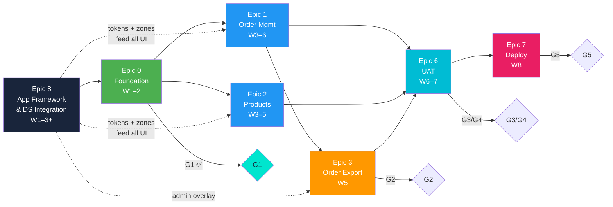

# PFI-EOMS-PLAN: Programme Status & Plan

**Product Code:** PFI-EOMS
**Document Type:** PLAN — Programme Plan & Status Report
**Version:** v1.0.0
**Date:** 2026-03-10
**Status:** Active — Updated Weekly
**PFI Instance:** `pfi-w4m-eoms` | **Repo:** [`ajrmooreuk/pfi-w4m-eoms-dev`](https://github.com/ajrmooreuk/pfi-w4m-eoms-dev)
**Go-Live Target:** 18 April 2026

---

## 1. Weekly Status Summary

| Field | Current |
|-------|---------|
| **Reporting Week** | W3 — 10 Mar 2026 |
| **Overall RAG** | GREEN |
| **Epics In Scope** | 5 (Epic 0, 1, 2, 3-Export, 8) |
| **Epics Complete** | 1 (Epic 0 — G1 passed) |
| **Features In Scope** | 17 |
| **Features Complete** | 5 / 17 (F0.1–F0.5) |
| **Stories Complete** | 13 / 53 |
| **Next Gate** | G2 — Core Feature Complete |
| **Blockers** | None |
| **Key Decisions This Week** | Epic 8 added. Test data CSV imported. File-based JSON before DB — early client visualisation. |

### Status History

| Week | Date | RAG | Notes |
|------|------|-----|-------|
| W1 | 24 Feb 2026 | GREEN | Epic 0 started. Env + DB setup. |
| W2 | 3 Mar 2026 | GREEN | G1 passed. Auth, data import, design tokens. |
| W3 | 10 Mar 2026 | GREEN | Epic 8 added. DS-ONT instance + skeleton created. Test data CSV imported. File-based JSON approach adopted for early client visualisation. Epic 1+2 starting. |

---

## 2. Vision & Brief

> **Vision:** Transform Endeavour's export order management from manual spreadsheets into an AI-enabled platform supporting 2x revenue growth ($600M → $1.2Bn) without proportional headcount increase.

> **Brief:** Prove workflow efficiency first. Replace the spreadsheets. Keep it contained and low-risk. Layer intelligence later.

**Phase 1 approved 22 Feb 2026** — G1 passed.

---

## 3. Epic & Feature Status Tracker

### Epic 0: Foundation & Infrastructure — COMPLETE

| Phase 1 | Weeks 1–2 | Gate: G1 PASSED | PBS: 1.0, 2.0, 6.0 |
|---------|-----------|-----------------|---------------------|

| Feature | Story | Priority | Status | Notes |
|---------|-------|:--------:|:------:|-------|
| **F0.1: Environment Setup** | | | **DONE** | |
| | US-0.1.1: Set up Supabase project (Sydney) | Must | Done | |
| | US-0.1.2: Set up Vercel deployment pipeline | Must | Done | |
| | US-0.1.3: Configure dev/staging/prod environments | Must | Done | |
| **F0.2: Database Schema** | | | **DONE** | |
| | US-0.2.1: Implement order/product/customer DB schemas | Must | Done | |
| | US-0.2.2: Configure Row Level Security policies | Must | Done | |
| | US-0.2.3: Set up audit logging tables | Must | Done | |
| **F0.3: Authentication & RBAC** | | | **DONE** | |
| | US-0.3.1: Implement Supabase Auth (email/password) | Must | Done | |
| | US-0.3.2: Configure RBAC (Trader, Admin) | Must | Done | Lean scope: 2 roles |
| **F0.4: Design System** | | | **DONE** | |
| | US-0.4.1: Create Endeavour-DS brand tokens | Must | Done | Now DS-ONT instance (Epic 8) |
| | US-0.4.2: Build core shadcn/ui component library | Must | Done | |
| | US-0.4.3: ~~Complete Figma design for key screens~~ | ~~Must~~ | Removed | Lean scope: no Figma phase |
| **F0.5: Data Import** | | | **DONE** | |
| | US-0.5.1: Import product catalogue (7,816 codes) | Must | Done | |
| | US-0.5.2: Import sample customer data | Must | Done | |
| | US-0.5.3: ~~Import sample FX contract data~~ | ~~Must~~ | Removed | Deferred: FX = Phase 3 |
| | US-0.5.4: Import anonymised sale order test data (7,635 lines) | Must | Done | `PBS/Data-Test/` — CSV source for JSON conversion |

---

### Epic 1: Order Management — IN PROGRESS

| Phase 2 | Weeks 3–6 | Gate: G2 | PBS: 2.0, 3.0 | PRD: Epic 1 |
|---------|-----------|----------|---------------|-------------|

> **Approach:** File-based JSON data (converted from test CSV) before Supabase DB. Enables early client visualisation of look and feel using DS-ONT tokens + Application Skeleton zones. DB migration follows once UI is validated.

| Feature | Story | Priority | Status | Notes |
|---------|-------|:--------:|:------:|-------|
| **F1.1: Order Creation Wizard** | | | **Not Started** | File-based JSON for early UI demo |
| | US-1.1.1: Create new export order with customer/shipping | Must | Not Started | |
| | US-1.1.2: Search and select from existing customers | Must | Not Started | |
| | US-1.1.3: Specify container type, incoterms, shipping dates | Must | Not Started | |
| | US-1.1.4: Save order as draft to complete later | Should | Not Started | |
| | US-1.1.5: Select supplier and establishment number | Must | Not Started | |
| **F1.2: Order Line Items** | | | **Not Started** | JSON data from test CSV (7,635 lines) |
| | US-1.2.1: Add products with quantity and pricing | Must | Not Started | |
| | US-1.2.2: Search 7,816+ products by code/description/brand | Must | Not Started | |
| | US-1.2.3: See market eligibility for selected products | Must | Not Started | |
| | US-1.2.4: Edit or remove line items before completing | Must | Not Started | |
| **F1.3: Order Lifecycle** | | | **Not Started** | |
| | US-1.3.1: Mark order as complete | Must | Not Started | |
| | US-1.3.2: View list of all orders with status filtering | Must | Not Started | |
| | US-1.3.3: View full details and history of any order | Must | Not Started | |
| | US-1.3.4: Edit a draft order | Must | Not Started | |

---

### Epic 2: Product Catalogue — IN PROGRESS

| Phase 2 | Weeks 3–5 | Gate: G2 | PBS: 4.0 | PRD: Epic 2 |
|---------|-----------|----------|----------|-------------|

> **Approach:** File-based JSON product data for early client visualisation. DS-ONT branded product catalogue rendered in Z-EOMS-004 zone. DB migration after UI sign-off.

| Feature | Story | Priority | Status | Notes |
|---------|-------|:--------:|:------:|-------|
| **F2.1: Product Search** | | | **Not Started** | File-based JSON for early UI demo |
| | US-2.1.1: Search products with < 200ms response time | Must | Not Started | |
| | US-2.1.2: Filter products by market eligibility | Must | Not Started | |
| | US-2.1.3: Filter by brand, feed type, product state | Should | Not Started | |
| | US-2.1.4: See recently used products for quick access | Should | Not Started | |
| **F2.2: Product Data Display** | | | **Not Started** | |
| | US-2.2.1: View full product details with eligibility flags | Must | Not Started | |
| | US-2.2.2: Product codes in monospace font | Should | Not Started | |

---

### Epic 3 (Export): Order Export to Finance — NOT STARTED

| Phase 2 | Week 5 | Gate: G2 | PBS: 5.0 | PRD: Epic 3 |
|---------|--------|----------|----------|-------------|

| Feature | Story | Priority | Status | Notes |
|---------|-------|:--------:|:------:|-------|
| **F3.1: Order Export** | | | **Not Started** | |
| | US-3.1.1: Export completed order in clean format | Must | Not Started | |
| | US-3.1.2: Export multiple orders in batch | Must | Not Started | |
| | US-3.1.3: See which orders have been exported | Must | Not Started | |
| **F3.2: Export Format** | | | **Not Started** | |
| | US-3.2.1: Export contains all order/line item/customer data | Must | Not Started | |
| | US-3.2.2: Format compatible with finance system import | Must | Not Started | |
| | US-3.2.3: Choose between CSV and JSON formats | Must | Not Started | |

---

### Epic 8: App Framework & DS Integration — IN PROGRESS

| Phase 1–2 | Weeks 1–3+ | Gate: G1→G2 | [Strategy Briefing](PFI-EOMS-BRIEF-Application-Framework-Design-System-Integration-v1.0.0.md) |
|-----------|-----------|-------------|------|

| Feature | Story | Priority | Status | Notes |
|---------|-------|:--------:|:------:|-------|
| **F8.1: DS-ONT Instance** | | | **DONE** | |
| | S8.1.1: Primitive tokens (colours, typography, spacing, radius) | Must | Done | 90+ tokens |
| | S8.1.2: Semantic tokens (7 intent groups) | Must | Done | 50+ semantic tokens |
| | S8.1.3: BrandVariant entity for Endeavour Meats | Must | Done | |
| | S8.1.4: ThemeMode entity (light default) | Must | Done | |
| | S8.1.5: Validate against DS-ONT v3.0.0 schema | Must | Done | |
| **F8.2: App Skeleton** | | | **DONE** | |
| | S8.2.1: Define 8 EOMS zones | Must | Done | |
| | S8.2.2: L4-EOMS nav layer (6 items) | Must | Done | |
| | S8.2.3: 10 action entities with guards | Must | Done | |
| | S8.2.4: ZoneComponent with Endeavour brand overrides | Must | Done | |
| | S8.2.5: Validate cascade: PFC → PFI-EOMS | Must | Done | |
| **F8.3: Token Bridge** | | | **Not Started** | |
| | S8.3.1: Create `lib/ds-css-bridge.ts` | Must | Not Started | |
| | S8.3.2: DS-ONT → shadcn CSS var mapping | Must | Not Started | |
| | S8.3.3: Tailwind theme.extend via CSS vars | Must | Not Started | |
| | S8.3.4: Skeleton token override merge | Must | Not Started | |
| | S8.3.5: WCAG AA contrast check | Must | Not Started | |
| **F8.4: Admin Overlay** | | | **Not Started** | |
| | S8.4.1: CSS Live tab — all `--ds-*` vars with source badges | Should | Not Started | |
| | S8.4.2: DS-ONT Source tab — divergence flags | Should | Not Started | |
| | S8.4.3: Zone Inspector tab | Should | Not Started | |
| | S8.4.4: Token edit sandbox (non-persistent) | Could | Not Started | |
| | S8.4.5: Export current state as JSONLD patch | Could | Not Started | |
| **F8.5: Brand Refinement Workflow** | | | **Not Started** | |
| | S8.5.1: Document brand refinement loop | Must | Not Started | |
| | S8.5.2: Figma ↔ DS-ONT token mapping table | Should | Not Started | |
| | S8.5.3: WCAG verification matrix | Must | Not Started | |
| | S8.5.4: Integration test: skeleton → tokens → render | Must | Not Started | |

---

### Epic 6: Testing & UAT — NOT STARTED

| Phase 3 | Weeks 6–7 | Gate: G3/G4 | PBS: 8.0 |
|---------|-----------|-------------|----------|

| Feature | Story | Priority | Status | Notes |
|---------|-------|:--------:|:------:|-------|
| **F6.1: Functional Testing** | | | **Not Started** | |
| | US-6.1.1: Unit tests cover critical business logic | Must | Not Started | |
| | US-6.1.2: Integration tests verify e2e order flow | Must | Not Started | |
| **F6.2: User Acceptance Testing** | | | **Not Started** | |
| | US-6.2.1: Traders complete order creation test scenarios | Must | Not Started | |
| | US-6.2.2: ~~Finance completes FX/margin test scenarios~~ | ~~Must~~ | Removed | FX deferred |
| | US-6.2.3: ~~Management reviews dashboard~~ | ~~Must~~ | Removed | Dashboard deferred |
| **F6.3: Bug Resolution** | | | **Not Started** | |
| | US-6.3.1: All P1 (critical) defects resolved before G4 | Must | Not Started | |
| | US-6.3.2: P2 (major) defects triaged with resolution plan | Must | Not Started | |
| **F6.4: PMF Validation** | | | **Not Started** | |
| | US-6.4.1: Structured feedback sessions with each user group | Must | Not Started | |
| | US-6.4.2: > 80% "would choose EOMS over Excel" | Must | Not Started | |

---

### Epic 7: Deployment & Handover — NOT STARTED

| Phase 4 | Week 8 | Gate: G5 | PBS: 1.1, 7.0 |
|---------|--------|----------|---------------|

| Feature | Story | Priority | Status | Notes |
|---------|-------|:--------:|:------:|-------|
| **F7.1: Production Deployment** | | | **Not Started** | |
| | US-7.1.1: Deploy to Vercel production (Sydney) | Must | Not Started | |
| | US-7.1.2: Configure production Supabase with backups | Must | Not Started | |
| | US-7.1.3: Set up monitoring and alerting | Must | Not Started | |
| **F7.2: User Provisioning** | | | **Not Started** | |
| | US-7.2.1: Create production user accounts with roles | Must | Not Started | |
| | US-7.2.2: Configure production domain and DNS | Must | Not Started | |
| **F7.3: Documentation** | | | **Not Started** | |
| | US-7.3.1: User guide for traders | Must | Not Started | |
| | US-7.3.2: API documentation | Must | Not Started | |
| | US-7.3.3: System administration guide | Must | Not Started | |
| **F7.4: Knowledge Transfer** | | | **Not Started** | |
| | US-7.4.1: Handover session with client technical contact | Must | Not Started | |
| | US-7.4.2: Transfer repository to client-owned GitHub | Must | Not Started | |
| | US-7.4.3: Stabilisation support period | Must | Not Started | |

---

## 4. Epic Dependency Diagram

---

## 5. Timeline

| Week | Dates | Epics | Gate | Deliverables |
|------|-------|-------|------|-------------|
| **1** | 23 Feb – 28 Feb | Epic 0 + Epic 8 (F8.1, F8.2) | — | Env, DB, auth, DS-ONT instance, skeleton JSONLD |
| **2** | 3 Mar – 7 Mar | Epic 0 + Epic 8 (F8.3) | **G1 ✅** | Data import, token bridge wired, design tokens live |
| **3–4** | 10–21 Mar | Epic 1 + Epic 2 | — | Order wizard, product search — rendering into zones |
| **5** | 24–28 Mar | Epic 3 (Export) + Epic 8 (F8.4) | — | Order export, admin overlay |
| **6–7** | 31 Mar – 11 Apr | Epic 6 + Epic 8 (F8.5) | **G2→G4** | UAT, brand refinement, bug fixes |
| **8** | 14–18 Apr | Epic 7 | **G5** | Go-live, handover |

---

## 6. Quality Gates

| Gate | Milestone | Key Deliverables | Approver | Status |
|------|-----------|-----------------|----------|:------:|
| **G1** | Project Kickoff | Scope approved, accounts provisioned, design tokens agreed | CFO/COO | PASSED |
| **G2** | Core Feature Complete | Order wizard, product search, order export functional | CFO/COO | Pending |
| **G3** | UAT Complete | > 90% task success, trader sign-off | CFO/COO | Pending |
| **G4** | PMF Feedback | Feedback collected, priority fixes done | COO | Pending |
| **G5** | Go-Live | Production deployment, team trained | CEO | Pending |

---

## 7. OKRs (Phase 1)

| OKR | Objective | Key Result | Target | Current |
|-----|-----------|-----------|--------|---------|
| OKR-1 | Reduce order processing time | Order creation < 20 min (from 45–60) | 55–65% reduction | N/A — not yet built |
| OKR-2 | Reduce data entry errors | Error rate < 3% (from 5–8%) | 50%+ reduction | N/A |
| OKR-3 | Scalable platform | 150+ orders/day, 99.5% uptime | 3x capacity | N/A |
| OKR-5 | User adoption | > 80% orders via EOMS within 8 weeks | Replaces Excel | N/A |

---

## 8. Zone Framework

| Zone | Name | Type | Position | Epic Source | Status |
|------|------|------|----------|-------------|:------:|
| Z-EOMS-001 | Dashboard | Fixed | center | Epic 1 (F1.3) | Defined |
| Z-EOMS-002 | Order Wizard | Fixed | center | Epic 1 (F1.1) | Defined |
| Z-EOMS-003 | Order Detail | Sliding | right | Epic 1 (F1.3) | Defined |
| Z-EOMS-004 | Product Catalogue | Sliding | right | Epic 2 (F2.1) | Defined |
| Z-EOMS-005 | Approval Queue | Sliding | left | Future (deferred) | Deferred |
| Z-EOMS-006 | FX Management | Sliding | left | Future (deferred) | Deferred |
| Z-EOMS-007 | Admin Overlay | Floating | right | Epic 8 (F8.4) | Defined |
| Z-EOMS-008 | Skeleton Inspector | Floating | right | Epic 8 (F8.4) | Defined |

---

## 9. Endeavour Brand Tokens

| Token Group | Count | Key Values |
|-------------|:-----:|------------|
| **Colour Primitives** | 21 | Primary `#19253B` Deep Navy · Secondary `#BC4620` Burnt Sienna · Accent `#6B9EFE` Sky Blue |
| **Typography** | 17 | Headings: Baskervville · Body: Lato · Mono: JetBrains Mono · Scale: 12–48px |
| **Spacing** | 8 | 2px → 48px (xxs → 3xl) |
| **Radius** | 7 | 2px → pill (xs → full) |
| **Semantic** | 50+ | 7 intent groups × surface/border/text variants |

| shadcn Slot | DS-ONT Token | Endeavour Value |
|-------------|-------------|-----------------|
| `--primary` | `primary.surface.default` | `#19253B` Deep Navy |
| `--secondary` | `secondary.surface.default` | `#BC4620` Burnt Sienna |
| `--accent` | `accent.surface.default` | `#6B9EFE` Sky Blue |
| `--muted` | `neutral.surface.subtle` | `#F8FAFC` |
| `--foreground` | `neutral.text.body` | `#3A5A68` |
| `--destructive` | `error.surface.default` | `#EEC800` Gold |
| `--border` | `neutral.border.default` | `#C6E8F5` Ice Blue |

---

## 10. Technology Stack

| Layer | Technology | Notes |
|-------|-----------|-------|
| **Frontend** | Next.js 14 (App Router) + TypeScript | PFC skeleton-driven zone architecture |
| **Components** | shadcn/ui + Tailwind CSS | Token-bridged via DS-ONT → CSS vars |
| **Backend** | Next.js API Routes | Server-side data access |
| **Database** | Supabase PostgreSQL | JSONB schemas, RLS, RBAC |
| **Auth** | Supabase Auth | 2 roles: Trader, Admin |
| **Hosting** | Vercel (Sydney) | Edge deployment |
| **Design System** | DS-ONT v3.0.0 | [eoms-endeavour-ds-instance-v1.0.0.jsonld](../../instance-data/tokens/EOMS-DESIGN-SYSTEM-ONT/eoms-endeavour-ds-instance-v1.0.0.jsonld) |
| **App Skeleton** | PFC skeleton v1.0.0 | [eoms-app-skeleton-v1.0.0.jsonld](../../instance-data/skeleton/eoms-app-skeleton-v1.0.0.jsonld) |

---

## 11. Risk Register

| Risk | Likelihood | Impact | Mitigation | Status |
|------|:----------:|:------:|------------|:------:|
| Data extract delays (product/customer) | Medium | Medium | Start with sample data, iterative import | Mitigated |
| Export format uncertainty | Low | Low | Flexible export (CSV/JSON) | Open |
| User availability for UAT | Medium | High | Schedule early, flexible sessions | Open |
| Scope creep | Medium | Medium | Fixed Phase 1 scope, strict CC | Monitoring |
| Endeavour semantic colours fail WCAG | Medium | Medium | Contrast check at bridge init (S8.3.5) | Open |
| Brand evolves significantly | High | Low | DS-ONT designed for this — update JSONLD | Accepted |

---

## 12. Reference Documents

### Strategy & Planning

| # | Document | Version | Status | Purpose | Link |
|---|----------|---------|--------|---------|------|
| 1 | Scope On A Page | 1.0 | APPROVED | Executive scope summary | [Link](../PROPOSALS/EOMS_SCOPE_ON_A_PAGE.md) |
| 2 | Client Readiness VSOM | 1.0 | Final Draft | Exec summary, VSOM, scope gaps | [Link](../PROPOSALS/EOMS_CLIENT_READINESS_VSOM.md) |
| 3 | Statement of Work | 0.1 | Draft | Scope, deliverables, acceptance | [Link](../PROPOSALS/EOMS_STATEMENT_OF_WORK_v0.1.md) |
| 4 | Terms Sheet | 0.1 | Draft | Payment, IP, commercial | [Link](../PROPOSALS/EOMS_TERMS_SHEET_v0.1.md) |
| 5 | Proposal | 3.1 | For Sign-Off | Business case | [Link](../PROPOSALS/EOMS_PROPOSAL_v3.0.md) |
| 6 | PRD Unified | 2.1 | For Implementation | Product requirements, PBS, stories | [Link](../PROPOSALS/EOMS_PRD_UNIFIED_v2.0.md) |
| 7 | HLD | 2.1 | For Implementation | Architecture, tech stack | [Link](../PROPOSALS/EOMS_HLD_v2.0.md) |
| 8 | Implementation Plan | 2.1 | For Implementation | WBS, milestones, critical path | [Link](../PROPOSALS/EOMS_IMPLEMENTATION_PLAN_v2.0.md) |
| 9 | VSOM/OKR/VP Roadmap | 1.0 | Draft | OKRs, KPIs, VP, epic roadmap | [Link](../PROPOSALS/EOMS_VSOM_OKR_VP_ROADMAP.md) |
| 10 | App Framework & DS Brief | 1.0.0 | Draft | Epic 8 specification | [Link](PFI-EOMS-BRIEF-Application-Framework-Design-System-Integration-v1.0.0.md) |
| 11 | CI/CD Programme Linkages | 1.0.0 | Candidate | Unified change control | [Link](BRIEFING-PBS-PFC-CICD-Programme-Roadmap-Linkages.md) |

### Governance

| Document | Version | Link |
|----------|---------|------|
| Change Control | 1.0 | [Link](../PROPOSALS/EOMS_CHANGE_CONTROL.md) |
| Document Traceability | 2.0 | [Link](../PROPOSALS/EOMS_DOCUMENT_TRACEABILITY.md) |
| Document Register | 5.0 | [Link](../PROPOSALS/EOMS_DOCUMENT_REGISTER.md) |

### Instance Data Artefacts

| Artefact | Version | Link |
|----------|---------|------|
| PFI Config | - | [Link](../../instance-data/config/pfi-config.json) |
| DS-ONT Instance | 1.0.0 | [Link](../../instance-data/tokens/EOMS-DESIGN-SYSTEM-ONT/eoms-endeavour-ds-instance-v1.0.0.jsonld) |
| App Skeleton | 1.0.0 | [Link](../../instance-data/skeleton/eoms-app-skeleton-v1.0.0.jsonld) |
| Test Data CSV (Sale Orders) | - | [Link](../../PBS/Data-Test/EOMS%20%20ANON2%20Ord-Anon%20%20Sale%20Order%20Item%20Report_220120261650(Sale%20Order%20Item%20Report)%20-%20EOMS%20Test%20Data%20Anonymised.csv) |

### PFC Pattern References

| PFC Pattern | EOMS Implementation | Reference |
|---|---|---|
| DS-ONT v3.0.0 | `eoms-endeavour-ds-instance-v1.0.0.jsonld` — 90+ tokens | [DS-ONT](https://github.com/ajrmooreuk/Azlan-EA-AAA/tree/main/PBS/ONTOLOGIES/ontology-library/PE-Series/DS-ONT) |
| App Skeleton | `eoms-app-skeleton-v1.0.0.jsonld` — 8 zones, 6 nav, 10 actions | [PFC Skeleton](https://github.com/ajrmooreuk/Azlan-EA-AAA/tree/main/PBS/ONTOLOGIES/ontology-library/PE-Series/DS-ONT/instance-data) |
| Token Bridge | `ds-css-bridge` pattern → shadcn CSS vars | [Epic 65 pfc-web-app](https://github.com/ajrmooreuk/Azlan-EA-AAA/tree/main/PBS/TOOLS/pfc-web-app) |
| EMC Cascade | PFC → PFI-EOMS (4-tier, PFC immutable) | [EMC-ONT v5.0.0](https://github.com/ajrmooreuk/Azlan-EA-AAA/tree/main/PBS/ONTOLOGIES/ontology-library/Orchestration/EMC-ONT) |
| PFI Triad | dev/test/prod promotion pipeline | [promotion.env](../../promotion/promotion.env) |

---

## 13. Contacts

| Role | Name | Responsibility |
|------|------|---------------|
| GM | Fin | Budget Approver, Sign-Off |
| COO / Product Owner | F. Blacket | Approvals, scope decisions |
| CFO | Anthony | Finance, commercial terms |
| Technical Adviser | wings4mind.ai | Architecture, development, PFC alignment |

---

## Appendix A: Deferred Epics (Future Phases)

These epics were in the original 8-epic VSOM roadmap but **explicitly deferred** during lean scope (Feb 2026). Numbering preserved for traceability. Full feature/story detail in [VSOM/OKR/VP Roadmap](../PROPOSALS/EOMS_VSOM_OKR_VP_ROADMAP.md).

### Epic 3 (AI): AI Validation & Insights — DEFERRED to Phase 2

| Feature | Stories | Reason Deferred |
|---------|---------|-----------------|
| **F3.1: Validation Agent** | US-3.1.1 AI validation feedback · US-3.1.2 Product code validation · US-3.1.3 Market eligibility confirmation · US-3.1.4 Compliance policy validation | Prove workflow first, add intelligence later |
| **F3.2: Pricing Agent** | US-3.2.1 Automated FX conversion · US-3.2.2 Margin analysis · US-3.2.3 Margin threshold warnings | FX booked separately; requires data flowing first |
| **F3.3: Pattern Recognition** | US-3.3.1 Suggested products from reorder patterns · US-3.3.2 Smart data entry suggestions | Requires historical data |

### Epic 4: FX Management — DEFERRED to Phase 3

| Feature | Stories | Reason Deferred |
|---------|---------|-----------------|
| **F4.1: FX Contract Integration** | US-4.1.1 Select FX contracts · US-4.1.2 Weighted average rate · US-4.1.3 Contract utilisation view | FX booked separately; daily PnL covers actual rates |

### Epic 5: Dashboard & Analytics — DEFERRED to Phase 4

| Feature | Stories | Reason Deferred |
|---------|---------|-----------------|
| **F5.1: Trader Dashboard** | US-5.1.1 Active orders on login · US-5.1.2 Pending actions · US-5.1.3 Quick access to new orders | Requires data flowing through system first |
| **F5.2: Executive Dashboard** | US-5.2.1 Order pipeline value · US-5.2.2 Market breakdown · US-5.2.3 FX exposure summary | Requires FX integration (Phase 3) |

---

## Appendix B: Removed Items (Lean Scope Changes)

Items removed during the lean scope approval (19 Feb 2026). Documented for traceability.

| Item | Original Location | Reason Removed | Change Control |
|------|------------------|----------------|----------------|
| Figma design phase | F0.4 US-0.4.3 | Brand tokens applied directly in code — no separate design phase | CC-049 |
| FX data import | F0.5 US-0.5.3 | FX deferred to Phase 3 | CC-050 |
| Operations role (3rd RBAC) | F0.3 | Operations folded into Trader — 2 roles sufficient | CC-051 |
| Mobile responsive (MUST) | Cross-cutting | Downgraded to SHOULD — desktop-first | CC-052 |
| Approval workflow (8-state) | F1.3 | Simplified to Draft → Complete → Exported | CC-053 |
| Finance UAT scenarios | F6.2 US-6.2.2 | FX deferred — no finance scenarios in Phase 1 | CC-054 |
| Management dashboard review | F6.2 US-6.2.3 | Dashboard deferred — no dashboard in Phase 1 | CC-055 |
| Separate PMF research phase | Cross-cutting | PMF folded into UAT (F6.4) | CC-056 |

---

## Appendix C: Version History

| Version | Date | Author | Changes |
|---------|------|--------|---------|
| 1.0.0 | 10 Mar 2026 | Design Director + Claude Code | Initial plan: 7 epics, 17 features, 53 stories. Epic 8 added. Deferred items in appendices. |

---

*PFI-EOMS Phase 1 — Endeavour Order Management System*
*Programme Status & Plan v1.0.0 · 10 March 2026*
*Updated weekly for status calls*
