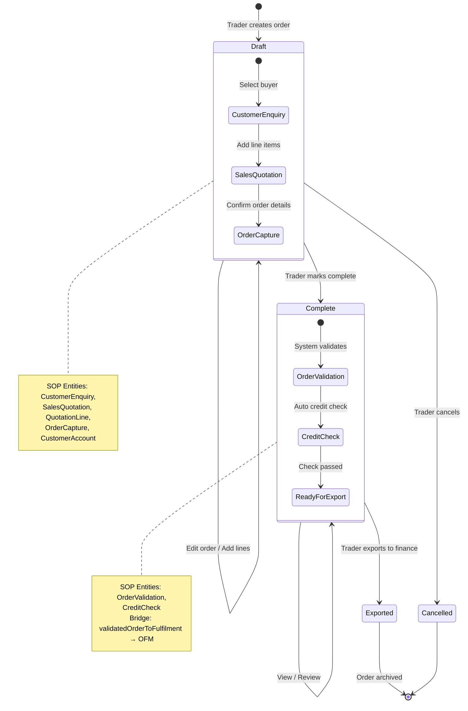
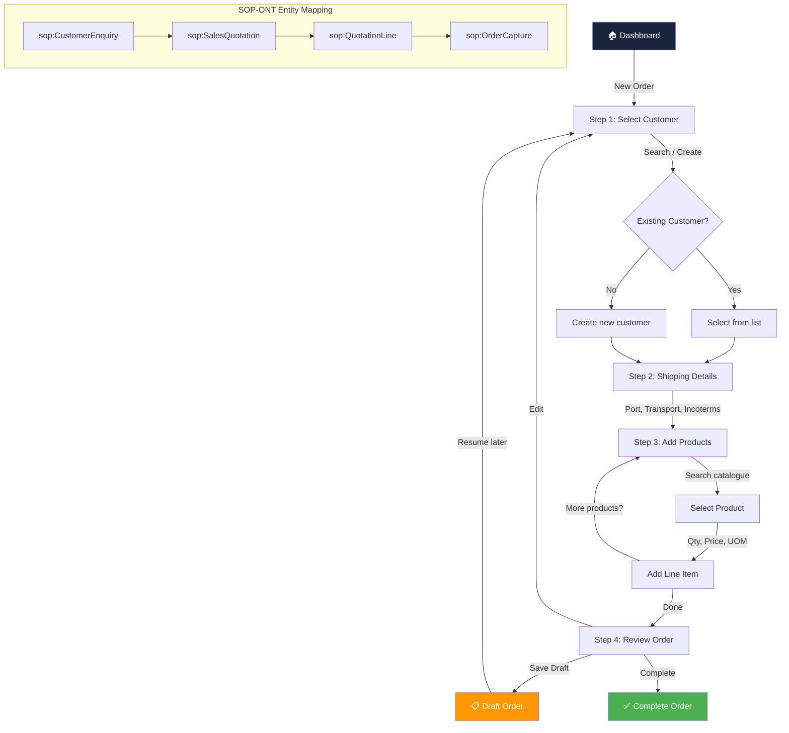
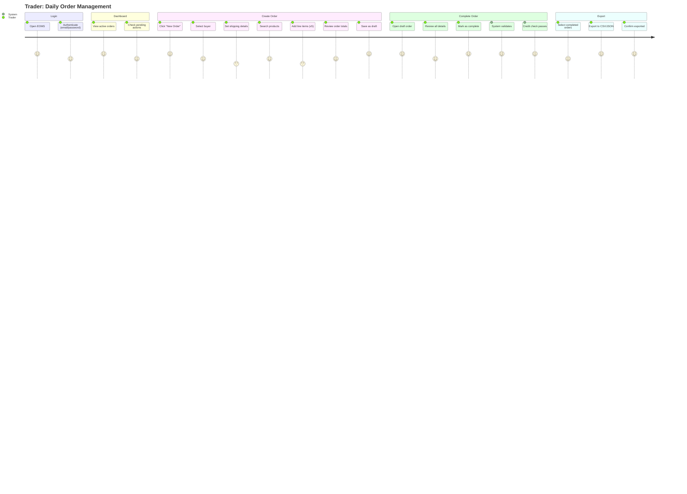
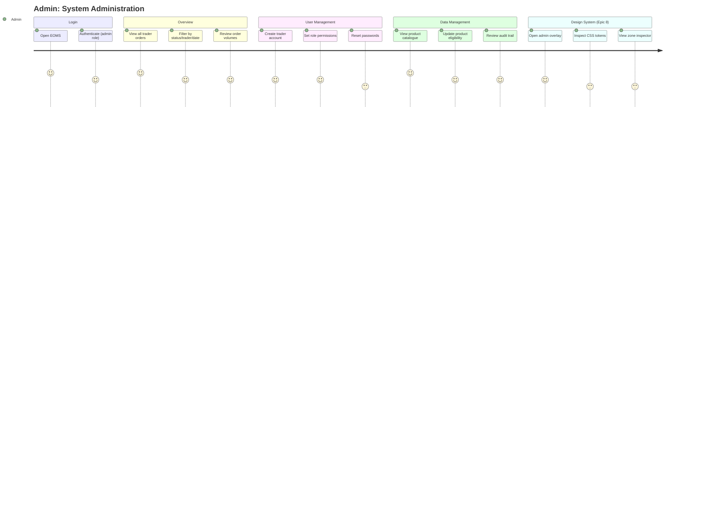
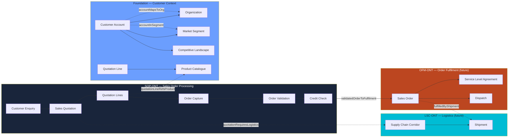
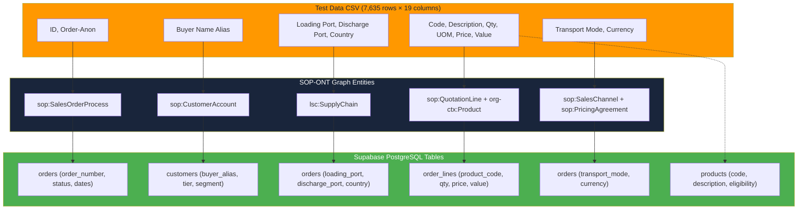
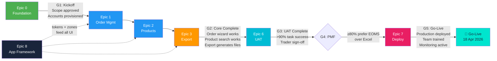
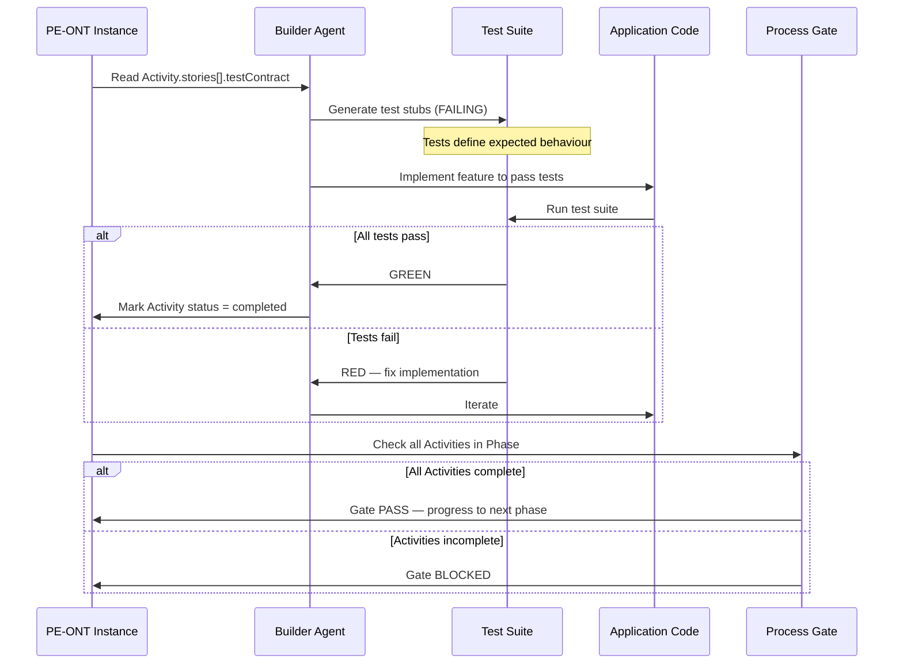
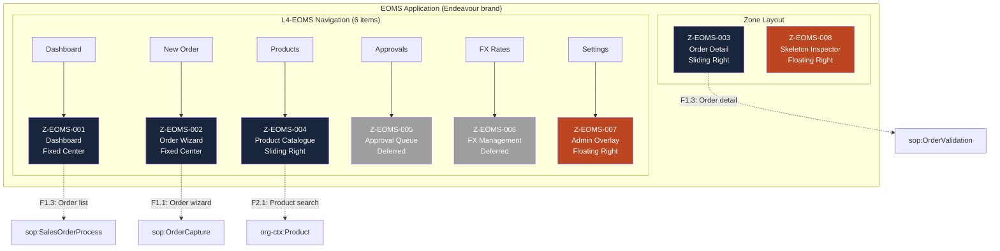

# PFI-EOMS-PROC: Order Management Process Workflow

**Product Code:** PFI-EOMS
**Document Type:** PROC — Process Definition & Workflow Specification
**Version:** v1.0.0
**Date:** 2026-03-10
**Status:** Draft
**PE-ONT Instance:** `pe-eoms-process-instance-v1.0.0.jsonld`
**SOP Graph Mapping:** `eoms-test-data-graph-mapping-v1.0.0.json`

---

## 1. Purpose

This document defines the EOMS order management processes, user roles, and workflow journeys. It maps directly to the PE-ONT process instance and SOP-ONT graph entities. Every process step is a testable unit for TDD — the PE process instance provides `testContract` specifications that the builder uses to generate test stubs.

---

## 2. User Roles

| Role | Access Level | Primary Actions | RBAC Guard |
|------|-------------|-----------------|------------|
| **Trader** | Standard | Create orders, add line items, search products, complete orders, export | `role = 'trader'` |
| **Admin** | Elevated | All Trader actions + user management, system config, view all orders | `role = 'admin'` |
| **Finance** (future) | Read + Export | View orders, download exports, FX data | Deferred to Phase 3 |
| **Operations** (future) | Read + Logistics | Shipping status, container tracking | Deferred to Phase 2 |

---

## 3. Core Order Lifecycle

The EOMS order lifecycle follows the SOP-ONT entity chain. Each state transition maps to a specific SOP entity.

---

## 4. Order Creation Process (F1.1)

The order creation wizard is the primary workflow. It maps to the SOP enquiry→quotation→capture chain.

---

## 5. Trader User Journey

Complete journey from login to order export.

---

## 6. Admin User Journey

Admin has elevated access for user management and system oversight.

---

## 7. End-to-End Process Flow

Full process from customer enquiry through to finance export, showing all SOP→OFM→LSC bridges.

---

## 8. Data Flow: CSV Test Data → SOP Graph → Database

Shows how the 7,635 test order lines flow through the SOP graph into database tables.

---

## 9. Quality Gates (PE-ONT Process Gates)

Each gate maps to a PE-ONT ProcessGate entity with threshold and criteria.

---

## 10. TDD Test Generation Workflow

The PE process instance drives test-driven design. The builder reads testContracts and generates test stubs before implementation.

---

## 11. Zone Architecture (Application Skeleton)

How the 8 EOMS zones map to the order management process.

---

## 12. Cross-Ontology Bridge Summary

| Bridge | From | To | Direction | Phase |
|--------|------|----|-----------|-------|
| `validatedOrderToFulfilment` | `sop:OrderValidation` | `ofm:SalesOrder` | SOP → OFM | Future (OFM instances) |
| `orderSelectsSLA` | `sop:OrderCapture` | `ofm:ServiceLevelAgreement` | SOP → OFM | Future |
| `quotationRequiresLogistics` | `sop:QuotationLine` | `lsc:SupplyChain` | SOP → LSC | Future (LSC instances) |
| `accountMapsToOrg` | `sop:CustomerAccount` | `org:Organization` | SOP → ORG | Phase 1 (customers table) |
| `accountInSegment` | `sop:CustomerAccount` | `org-ctx:MarketSegment` | SOP → ORG-CTX | Phase 1 (destination_country) |
| `quotationLineRefsProduct` | `sop:QuotationLine` | `org-ctx:Product` | SOP → ORG-CTX | Phase 1 (products table) |

---

## 13. Trackable Items

| # | Item | Owner | Priority | Status | PE-ONT Ref |
|---|------|-------|----------|--------|------------|
| TI-001 | Map test customer data to SOP graph — validate DB table design | Platform | P1 | Done | `eoms-test-data-graph-mapping-v1.0.0.json` |
| TI-002 | Create PE-ONT process instance for EOMS (TDD backbone) | Platform | P1 | Done | `pe-eoms-process-instance-v1.0.0.jsonld` |
| TI-003 | Generate Supabase migration DDL from graph mapping | Dev | P1 | Pending | Table schemas in mapping doc |
| TI-004 | Create OFM instance data when SOP→OFM handoff exercised | Platform | P2 | Future | EMC instanceDataRefs[OFM] |
| TI-005 | Create LSC instance data when product catalogue defines sourcing | Platform | P2 | Future | EMC instanceDataRefs[LSC] |
| TI-006 | Resolve product catalogue stock sourcing (external LSC vs own inventory) | Product | P2 | Future | EMC composedGraphSpec.note |
| TI-007 | Generate test stubs from PE-ONT testContracts for F1.x stories | Dev | P1 | Pending | PE Activity.stories[].testContract |

---

## Appendix A: SOP Entity → DB Table Quick Reference

| SOP-ONT Entity | DB Table | Key Columns |
|---------------|----------|-------------|
| `sop:SalesOrderProcess` | `orders` | order_number, status, dates |
| `sop:CustomerAccount` | `customers` | buyer_alias, tier, segment |
| `sop:QuotationLine` | `order_lines` | product_code, qty, price, value |
| `sop:SalesChannel` | `orders` | transport_mode |
| `sop:PricingAgreement` | `orders` | currency |
| `sop:OrderValidation` | `orders` | validation_status |
| `sop:CreditCheck` | `orders` | credit_check_status |
| `org:Organization` | `organizations` | name, abn |
| `org-ctx:Product` | `products` | product_code, description, eligibility |
| `org-ctx:MarketSegment` | `orders` | destination_country |
| `lsc:SupplyChain` | `orders` | loading_port, discharge_port |
| `lsc:Shipment` | `orders` | vessel_name, voyage_number |

---

*PFI-EOMS Phase 1 — Order Management Process Workflow v1.0.0*
*PE-ONT Process Instance: `pe-eoms-process-instance-v1.0.0.jsonld`*
*10 March 2026*
