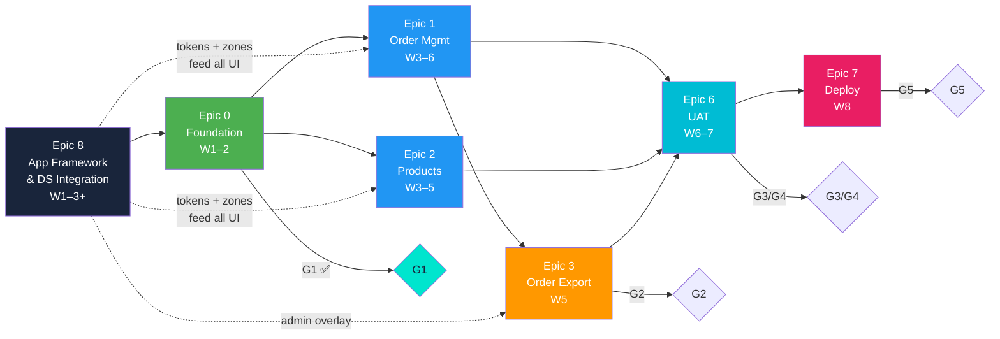

# PFI-EOMS-STRAT-SOA: Plan On A Page

**Product Code:** PFI-EOMS
**Document Type:** STRAT-SOA — Strategy On A Page
**Version:** v1.0.0
**Date:** 2026-03-10
**Status:** Active
**PFI Instance:** `pfi-w4m-eoms` | **Repo:** [`ajrmooreuk/pfi-w4m-eoms-dev`](https://github.com/ajrmooreuk/pfi-w4m-eoms-dev)
**Go-Live Target:** 18 April 2026

---

## Vision

> Transform Endeavour's export order management from manual spreadsheets into an AI-enabled platform supporting 2x revenue growth ($600M → $1.2Bn) without proportional headcount increase.

---

## The Brief

> Prove workflow efficiency first. Replace the spreadsheets. Keep it contained and low-risk. Layer intelligence later.

**Phase 1 approved 22 Feb 2026** — G1 passed.

---

## Strategy Documents

| # | Document | Version | Status | Purpose | Link |
|---|----------|---------|--------|---------|------|
| 1 | **Scope On A Page** | 1.0 | APPROVED | Executive scope summary | [EOMS_SCOPE_ON_A_PAGE.md](../PROPOSALS/EOMS_SCOPE_ON_A_PAGE.md) |
| 2 | **Client Readiness VSOM** | 1.0 | Final Draft | Plain-English exec summary, VSOM, scope gaps | [EOMS_CLIENT_READINESS_VSOM.md](../PROPOSALS/EOMS_CLIENT_READINESS_VSOM.md) |
| 3 | **Statement of Work** | 0.1 | Draft | Scope, deliverables, acceptance criteria | [EOMS_STATEMENT_OF_WORK_v0.1.md](../PROPOSALS/EOMS_STATEMENT_OF_WORK_v0.1.md) |
| 4 | **Terms Sheet** | 0.1 | Draft | Payment milestones, IP, commercial terms | [EOMS_TERMS_SHEET_v0.1.md](../PROPOSALS/EOMS_TERMS_SHEET_v0.1.md) |
| 5 | **Proposal** | 3.1 | For Sign-Off | Business case — order entry foundation | [EOMS_PROPOSAL_v3.0.md](../PROPOSALS/EOMS_PROPOSAL_v3.0.md) |
| 6 | **PRD Unified** | 2.1 | For Implementation | Product requirements (3+1 epics), PBS, user stories | [EOMS_PRD_UNIFIED_v2.0.md](../PROPOSALS/EOMS_PRD_UNIFIED_v2.0.md) |
| 7 | **HLD** | 2.1 | For Implementation | Architecture — Next.js 14, Supabase, shadcn/ui | [EOMS_HLD_v2.0.md](../PROPOSALS/EOMS_HLD_v2.0.md) |
| 8 | **Implementation Plan** | 2.1 | For Implementation | WBS, milestones, critical path, 5 gates | [EOMS_IMPLEMENTATION_PLAN_v2.0.md](../PROPOSALS/EOMS_IMPLEMENTATION_PLAN_v2.0.md) |
| 9 | **VSOM/OKR/VP Roadmap** | 1.0 | Draft | VSOM, OKRs, KPIs, VP, 8-Epic delivery roadmap | [EOMS_VSOM_OKR_VP_ROADMAP.md](../PROPOSALS/EOMS_VSOM_OKR_VP_ROADMAP.md) |
| 10 | **App Framework & DS Brief** | 1.0.0 | Draft | **Epic 8** — DS-ONT + skeleton + token bridge | [PFI-EOMS-BRIEF-...v1.0.0.md](PFI-EOMS-BRIEF-Application-Framework-Design-System-Integration-v1.0.0.md) |
| 11 | **CI/CD Programme Linkages** | 1.0.0 | Candidate | Unified change control, audit, governance | [BRIEFING-PBS-PFC-CICD-...md](BRIEFING-PBS-PFC-CICD-Programme-Roadmap-Linkages.md) |

### Governance Documents

| Document | Version | Link |
|----------|---------|------|
| Change Control | 1.0 | [EOMS_CHANGE_CONTROL.md](../PROPOSALS/EOMS_CHANGE_CONTROL.md) |
| Document Traceability | 2.0 | [EOMS_DOCUMENT_TRACEABILITY.md](../PROPOSALS/EOMS_DOCUMENT_TRACEABILITY.md) |
| Document Register | 5.0 | [EOMS_DOCUMENT_REGISTER.md](../PROPOSALS/EOMS_DOCUMENT_REGISTER.md) |

### Instance Data Artefacts

| Artefact | Version | Link |
|----------|---------|------|
| PFI Config | - | [pfi-config.json](../../instance-data/config/pfi-config.json) |
| DS-ONT Instance (Endeavour brand tokens) | 1.0.0 | [eoms-endeavour-ds-instance-v1.0.0.jsonld](../../instance-data/tokens/EOMS-DESIGN-SYSTEM-ONT/eoms-endeavour-ds-instance-v1.0.0.jsonld) |
| App Skeleton (zones, nav, actions) | 1.0.0 | [eoms-app-skeleton-v1.0.0.jsonld](../../instance-data/skeleton/eoms-app-skeleton-v1.0.0.jsonld) |

---

## Epic Map

### Phase 1 Core (Approved Scope — PRD v2.1)

| Epic | Name | Phase | Weeks | Gate | Features | Status |
|------|------|-------|-------|------|----------|--------|
| **0** | Foundation & Infrastructure | 1 | 1–2 | G1 | Env config, DB schema, auth, data import | G1 Passed |
| **1** | Order Management | 2 | 3–6 | G2 | F1.1 Order Wizard, F1.2 Line Items, F1.3 Lifecycle | Ready |
| **2** | Product Catalogue | 2 | 3–5 | G2 | F2.1 Product Search, F2.2 Product Display | Ready |
| **3** | Order Export to Finance | 2 | 5 | G2 | F3.1 Order Export, F3.2 Export Format | Ready |

### Phase 1 Enhancement (NEW — Epic 8)

| Epic | Name | Phase | Weeks | Gate | Features | Status |
|------|------|-------|-------|------|----------|--------|
| **8** | App Framework & DS Integration | 1–2 | 1–3+ | G1→G2 | F8.1–F8.5 (see below) | **NEW** |

### Deferred (Future Phases)

| Epic | Name | Phase | Deferred Reason |
|------|------|-------|-----------------|
| 3* | AI Validation & Insights | Phase 2 | Prove workflow first, add intelligence later |
| 4 | FX Management | Phase 3 | FX booked separately; adds complexity |
| 5 | Dashboard & Analytics | Phase 4 | Requires data flowing through system first |
| 6 | Testing & UAT | Phase 4 | 8–10 weeks |
| 7 | Deployment & Handover | Phase 5 | 10–12 weeks |

*Epic 3 (AI) was in original 8-epic roadmap but deferred in lean scope. Numbering preserved.*

---

## Epic 8: Feature & Story Breakdown

| Feature | Stories | Deliverable |
|---------|---------|-------------|
| **F8.1: DS-ONT Instance** | S8.1.1 Primitive tokens (colours, typography, spacing, radius) · S8.1.2 Semantic tokens (7 intent groups) · S8.1.3 BrandVariant entity · S8.1.4 ThemeMode · S8.1.5 Schema validation | [`eoms-endeavour-ds-instance-v1.0.0.jsonld`](../../instance-data/tokens/EOMS-DESIGN-SYSTEM-ONT/eoms-endeavour-ds-instance-v1.0.0.jsonld) |
| **F8.2: App Skeleton** | S8.2.1 8 EOMS zones · S8.2.2 L4-EOMS nav layer (6 items) · S8.2.3 10 action entities · S8.2.4 Context bar ZoneComponent · S8.2.5 Cascade validation | [`eoms-app-skeleton-v1.0.0.jsonld`](../../instance-data/skeleton/eoms-app-skeleton-v1.0.0.jsonld) |
| **F8.3: Token Bridge** | S8.3.1 `ds-css-bridge.ts` · S8.3.2 DS-ONT → shadcn CSS var mapping · S8.3.3 Tailwind theme.extend · S8.3.4 Skeleton override merge · S8.3.5 WCAG AA contrast check | `lib/ds-css-bridge.ts` |
| **F8.4: Admin Overlay** | S8.4.1 CSS Live tab · S8.4.2 DS-ONT Source tab · S8.4.3 Zone Inspector · S8.4.4 Token edit sandbox · S8.4.5 Export JSONLD patch | Zone Z-EOMS-007 |
| **F8.5: Brand Refinement** | S8.5.1 Workflow doc · S8.5.2 Figma ↔ DS-ONT mapping · S8.5.3 WCAG verification matrix · S8.5.4 Integration test | Process documentation |

---

## Epic Dependency Diagram

---

## Zone Framework (8 Zones)

| Zone | Name | Type | Position | Epic Source |
|------|------|------|----------|-------------|
| Z-EOMS-001 | Dashboard | Fixed | center | Epic 1 (F1.3) |
| Z-EOMS-002 | Order Wizard | Fixed | center | Epic 1 (F1.1) |
| Z-EOMS-003 | Order Detail | Sliding | right | Epic 1 (F1.3) |
| Z-EOMS-004 | Product Catalogue | Sliding | right | Epic 2 (F2.1) |
| Z-EOMS-005 | Approval Queue | Sliding | left | Future (Epic 3 AI) |
| Z-EOMS-006 | FX Management | Sliding | left | Future (Epic 4) |
| Z-EOMS-007 | Admin Overlay | Floating | right | Epic 8 (F8.4) |
| Z-EOMS-008 | Skeleton Inspector | Floating | right | Epic 8 (F8.4) |

---

## Endeavour Brand Tokens (Summary)

| Token Group | Count | Key Values |
|-------------|:-----:|------------|
| **Colour Primitives** | 21 | Primary `#19253B` Deep Navy · Secondary `#BC4620` Burnt Sienna · Accent `#6B9EFE` Sky Blue |
| **Typography** | 17 | Headings: Baskervville (serif) · Body: Lato (sans) · Mono: JetBrains Mono · Scale: 12–48px |
| **Spacing** | 8 | 2px → 48px (xxs → 3xl) |
| **Radius** | 7 | 2px → pill (xs → full) |
| **Semantic** | 50+ | 7 intent groups × surface/border/text variants |

**shadcn CSS Var Mapping:**

| shadcn Slot | DS-ONT Token | Endeavour Value |
|-------------|-------------|-----------------|
| `--primary` | `primary.surface.default` | `#19253B` Deep Navy |
| `--secondary` | `secondary.surface.default` | `#BC4620` Burnt Sienna |
| `--accent` | `accent.surface.default` | `#6B9EFE` Sky Blue |
| `--muted` | `neutral.surface.subtle` | `#F8FAFC` |
| `--foreground` | `neutral.text.body` | `#3A5A68` |
| `--destructive` | `error.surface.default` | `#EEC800` Gold |
| `--border` | `neutral.border.default` | `#C6E8F5` Ice Blue |

---

## Technology Stack

| Layer | Technology | Notes |
|-------|-----------|-------|
| **Frontend** | Next.js 14 (App Router) + TypeScript | PFC skeleton-driven zone architecture |
| **Components** | shadcn/ui + Tailwind CSS | Token-bridged via DS-ONT → CSS vars |
| **Backend** | Next.js API Routes | Server-side data access |
| **Database** | Supabase PostgreSQL | JSONB schemas, RLS, RBAC |
| **Auth** | Supabase Auth | 2 roles: Trader, Admin |
| **Hosting** | Vercel (Sydney) | Edge deployment |
| **Design System** | DS-ONT v3.0.0 instance | `eoms-endeavour-ds-instance-v1.0.0.jsonld` |
| **App Skeleton** | PFC skeleton v1.0.0 override | `eoms-app-skeleton-v1.0.0.jsonld` |

---

## Timeline

| Week | Dates | Epics | Gate | Deliverables |
|------|-------|-------|------|-------------|
| **1** | 23 Feb – 28 Feb | Epic 0 + Epic 8 (F8.1, F8.2) | — | Env, DB, auth, DS-ONT instance, skeleton JSONLD |
| **2** | 3 Mar – 7 Mar | Epic 0 + Epic 8 (F8.3) | **G1 ✅** | Data import, token bridge wired, design tokens live |
| **3–4** | 10–21 Mar | Epic 1 + Epic 2 | — | Order wizard, product search — rendering into zones |
| **5** | 24–28 Mar | Epic 3 (Export) + Epic 8 (F8.4) | — | Order export, admin overlay |
| **6–7** | 31 Mar – 11 Apr | Epic 6 + Epic 8 (F8.5) | **G2→G4** | UAT, brand refinement, bug fixes |
| **8** | 14–18 Apr | Epic 7 | **G5** | Go-live, handover |

---

## OKRs (Phase 1)

| OKR | Objective | Key Result | Target |
|-----|-----------|-----------|--------|
| OKR-1 | Reduce order processing time | Order creation < 20 min (from 45–60) | 55–65% reduction |
| OKR-2 | Reduce data entry errors | Error rate < 3% (from 5–8%) | 50%+ reduction |
| OKR-3 | Scalable platform | 150+ orders/day, 99.5% uptime | 3x capacity |
| OKR-5 | User adoption | > 80% orders via EOMS within 8 weeks | Replaces Excel |

---

## Quality Gates

| Gate | Milestone | Key Deliverables | Approver |
|------|-----------|-----------------|----------|
| **G1** ✅ | Project Kickoff | Scope approved, accounts provisioned, design tokens agreed | CFO/COO |
| **G2** | Core Feature Complete | Order wizard, product search, order export functional | CFO/COO |
| **G3** | UAT Complete | > 90% task success, trader sign-off | CFO/COO |
| **G4** | PMF Feedback | Feedback collected, priority fixes done | COO |
| **G5** | Go-Live | Production deployment, team trained | CEO |

---

## PFC Pattern Alignment

| PFC Pattern | EOMS Implementation | Reference |
|---|---|---|
| **DS-ONT v3.0.0** | `eoms-endeavour-ds-instance-v1.0.0.jsonld` — 90+ tokens | [DS-ONT](https://github.com/ajrmooreuk/Azlan-EA-AAA/tree/main/PBS/ONTOLOGIES/ontology-library/PE-Series/DS-ONT) |
| **App Skeleton** | `eoms-app-skeleton-v1.0.0.jsonld` — 8 zones, 6 nav, 10 actions | [PFC Skeleton](https://github.com/ajrmooreuk/Azlan-EA-AAA/tree/main/PBS/ONTOLOGIES/ontology-library/PE-Series/DS-ONT/instance-data) |
| **Token Bridge** | `ds-css-bridge` pattern → shadcn CSS vars | [Epic 65 pfc-web-app](https://github.com/ajrmooreuk/Azlan-EA-AAA/tree/main/PBS/TOOLS/pfc-web-app) |
| **EMC Cascade** | PFC → PFI-EOMS (4-tier, PFC immutable) | [EMC-ONT v5.0.0](https://github.com/ajrmooreuk/Azlan-EA-AAA/tree/main/PBS/ONTOLOGIES/ontology-library/Orchestration/EMC-ONT) |
| **Admin Overlay** | Z-EOMS-007 token inspector + Z-EOMS-008 skeleton inspector | VHF Z7/Z8 pattern |
| **PFI Triad** | dev/test/prod promotion pipeline | [`promotion/promotion.env`](../../promotion/promotion.env) |

---

## Contacts

| Role | Responsibility |
|------|---------------|
| GM (Fin) | Budget Approver, Sign-Off |
| COO (F. Blacket) | Product Owner, Approvals |
| CFO (Anthony) | Finance, Commercial Terms |
| Technical Adviser (wings4mind.ai) | Architecture, Development, PFC Alignment |

---

*EOMS Phase 1 — Endeavour Order Management System*
*Plan On A Page v1.0.0 · 10 March 2026*
