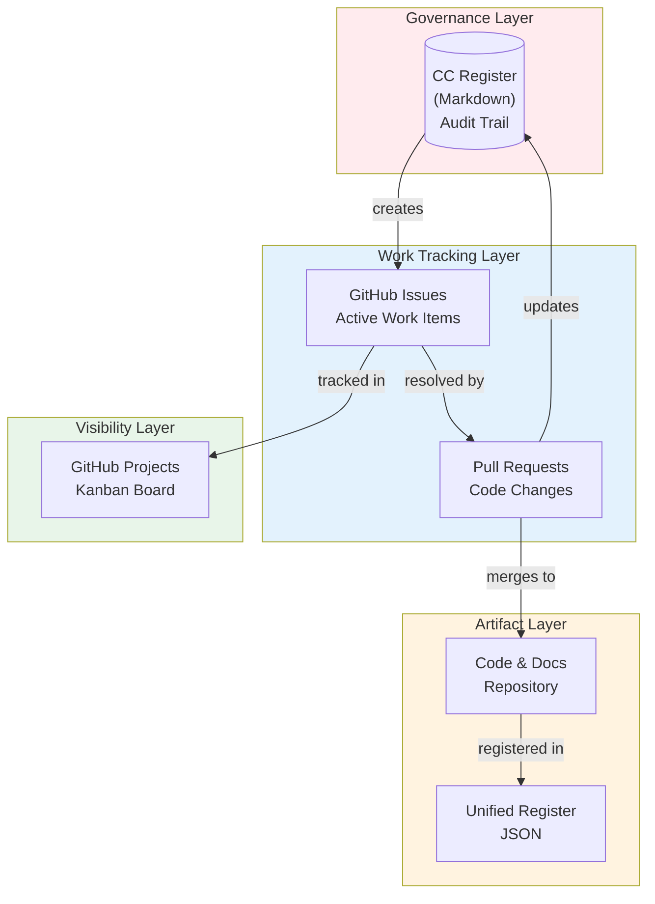
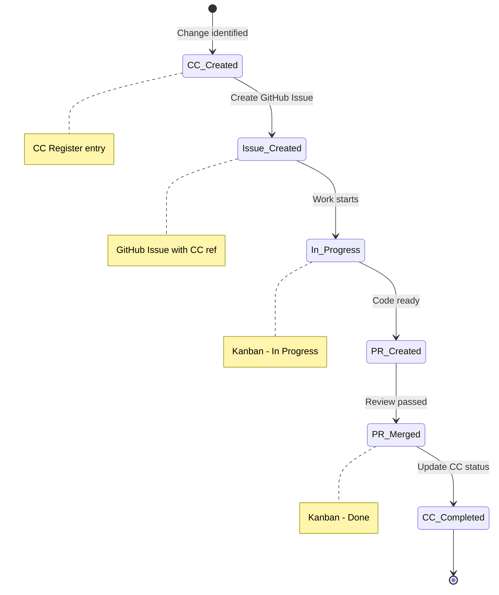

# EOMS Change Control & GitHub Workflow
## CC Register ↔ GitHub Issues ↔ Kanban Integration

---

| Document Control | |
|-----------------|---|
| **Document Number** | EOMS-STD-005 |
| **Version** | 1.2 |
| **Status** | Active |
| **Date** | 26 January 2026 |

---

## 1. PURPOSE

This document defines how Change Control (CC) items integrate with GitHub Issues and Projects to provide:
- **Governance** - CC Register as audit trail
- **Visibility** - GitHub Projects Kanban for team
- **Traceability** - Links between CC, Issues, and PRs
- **No duplication** - Single source of truth per concern
- **Value-first** - Changes must demonstrate benefit before work begins

---

## 2. DEFINITION OF READY

Before creating a CC item or GitHub Issue, the proposer must answer three questions:

```
┌─────────────────────────────────────────────────────────┐
│  CHANGE REQUEST GATE                                    │
├─────────────────────────────────────────────────────────┤
│  1. VALUE: What benefit does this deliver?              │
│  2. DONE:  How do we know it's complete?                │
│  3. WORKS: How do we verify it works?                   │
├─────────────────────────────────────────────────────────┤
│  Can't answer all three? → Don't create the request     │
└─────────────────────────────────────────────────────────┘
```

### Value Categories (link to VE)

| Category | Maps To |
|----------|---------|
| Error Reduction | Fewer mistakes, rework, corrections |
| Labour Efficiency | Less manual effort, faster processing |
| Capacity Enablement | Handle more volume without more staff |
| Faster Onboarding | New staff productive sooner |
| Customer Retention | Better service, fewer complaints |
| Margin Protection | Prevent revenue leakage |
| Compliance | Meet regulatory/policy requirements |
| Technical Debt | Reduce future maintenance burden |

### CC Entry Template

```markdown
| CC-### | Doc | Section | Type | Current | Proposed | Priority | Status |
```

**Required thinking (not in table, but documented in Section 3):**
- **Value:** [Category] - [One sentence on benefit]
- **Done:** [Acceptance criteria - what must be true]
- **Works:** [How to verify - test/review/demo]

### GitHub Issue Template

```markdown
## Value Hypothesis
**Category:** [Error Reduction | Labour Efficiency | ...]
**Benefit:** [What problem this solves]

## Acceptance Criteria
- [ ] [Verifiable criterion 1]
- [ ] [Verifiable criterion 2]

## Verification
- [ ] [How to test/verify this works]

---
CC Reference: CC-###
```

### Quick Decision Test

> "If I can't explain the value, define done, or describe how to test it - I shouldn't be requesting it."

---

## 3. WORKFLOW OVERVIEW



---

## 4. SEPARATION OF CONCERNS

| Layer | Tool | Purpose | Owner |
|-------|------|---------|-------|
| **Governance** | CC Register (MD) | Audit trail, approvals, history | PMA |
| **Work Tracking** | GitHub Issues | Active tasks, assignments, progress | Dev Team |
| **Visibility** | GitHub Projects | Kanban view, sprint planning | All |
| **Artifacts** | Repository + Register | Code, docs, JSON registry | OAA |

---

## 5. ITEM LIFECYCLE



---

## 6. NAMING CONVENTIONS

### GitHub Issues
```
[CC-###] Brief description
```
Example: `[CC-027] Remove timeline references from PRD`

### Pull Requests
```
CC-###: Description of change
```
Example: `CC-027: Remove timeline references from PRD`

### Branch Names
```
feature/cc-###-brief-description
```
Example: `feature/cc-027-remove-timelines`

---

## 7. LINKING RULES

### CC Register → GitHub Issue
In CC Register, add Issue link:
```markdown
| CC-027 | PRD | ... | PARTIAL | [#15](link) |
```

### GitHub Issue → CC Register
In Issue description:
```markdown
**CC Reference:** CC-027
**CC Register:** [EOMS_CHANGE_CONTROL.md](link)
```

### PR → CC + Issue
In PR description:
```markdown
Closes #15
CC Reference: CC-027
```

---

## 8. WORKFLOW BY PHASE

### Phase 1: Documentation (Current)
- CC Register is primary tracking
- GitHub Issues for active items only
- PRs link to CC numbers

### Phase 2: Build
- GitHub Issues created from WBS
- GitHub Projects Kanban active
- CC Register updated on completion

### Phase 3: Maintenance
- New issues reference CC or create new CC
- Kanban for sprint planning
- CC Register for audit/compliance

---

## 9. GITHUB PROJECTS SETUP

### Recommended Columns

| Column | WIP Limit | Contains |
|--------|-----------|----------|
| **Backlog** | - | Future work, unprioritised |
| **Ready** | 10 | Refined, ready to start |
| **In Progress** | 5 | Active development |
| **Review** | 5 | PR open, awaiting review |
| **Done** | - | Merged, CC updated |

### Labels

| Label | Colour | Usage |
|-------|--------|-------|
| `cc-item` | Purple | Linked to CC Register |
| `epic:order-mgmt` | Green | Epic 1 items |
| `epic:product-cat` | Blue | Epic 2 items |
| `epic:ai-validation` | Pink | Epic 3 items |
| `epic:fx-mgmt` | Orange | Epic 4 items |
| `epic:dashboard` | Cyan | Epic 5 items |
| `wbs:1.x` | Grey | WBS Phase 1 |
| `wbs:2.x` | Grey | WBS Phase 2 |
| `priority:high` | Red | High priority |
| `priority:medium` | Yellow | Medium priority |
| `priority:low` | White | Low priority |

---

## 10. AUTOMATION (FUTURE)

### Git Hooks
```bash
# On commit: validate CC reference in message
# On PR merge: update CC register status
# On issue close: flag for CC update
```

### GitHub Actions
```yaml
# Auto-label issues with CC references
# Sync CC status to Project board
# Generate CC summary report
```

---

## 11. QUICK REFERENCE

### Create Issue from CC Item
```bash
gh issue create \
  --title "[CC-027] Remove timeline references from PRD" \
  --body "CC Reference: CC-027

## Task
Remove specific timeline references from PRD body.

## Acceptance Criteria
- [ ] No day/week references in PRD body
- [ ] References point to Implementation Plan
- [ ] CC-027 marked COMPLETED" \
  --label "cc-item,priority:medium"
```

### Update CC After PR Merge
1. PR merged → Issue auto-closes
2. Update CC Register: status → **COMPLETED**
3. Add PR/Issue link to CC entry

---

## 12. SUMMARY

```
┌─────────────────────────────────────────────────────────┐
│  CC Register        GitHub Issues      GitHub Projects  │
│  ════════════       ═════════════      ═══════════════  │
│  Audit/Governance   Work Tracking      Visibility       │
│  Historical         Active             Real-time        │
│  Markdown           Issue #            Kanban Board     │
│  CC-###             [CC-###] Title     Card             │
└─────────────────────────────────────────────────────────┘
```

**Rule:** One source of truth per concern. No duplication.

---

**--- END OF WORKFLOW DOCUMENT ---**

*Version 1.0 | Active*
*26 January 2026*
