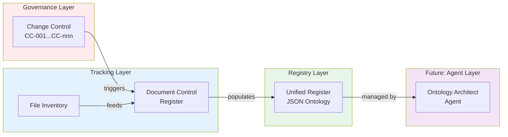

# EOMS UNIFIED REGISTER PROCESS
## From Change Control to Self-Documenting Artifacts

---

| Document Control | |
|-----------------|---|
| **Document Number** | EOMS-URP-001 |
| **Version** | 1.0 |
| **Status** | Active |
| **Date** | 26 January 2026 |
| **Based On** | PF-Core-BAIV Registry 4.0.0 Pattern |

---

## 1. PURPOSE

This document defines the process for connecting:
- **Change Control (CC)** - What changes are being made
- **Document Control Register (DCR)** - What documents exist
- **Unified Register** - All artifacts from idea to execution

**Future State:** Self-documenting platform where agents maintain the registry automatically.

---

## 2. ARTIFACT FLOW



---

## 3. PROCESS WORKFLOW

### 3.1 Change Control → Document Register

When a CC item is completed:

1. **Update CC Register** - Mark status as COMPLETED
2. **Update DCR** - If new document created, add entry
3. **Update File Inventory** - Regenerate if needed
4. **Register Artifact** - Add to Unified Register JSON

### 3.2 Integration Prompt

Use this prompt to update registers after completing changes:

```markdown
## Register Update Task

Change completed: CC-{number}
Change description: {description}
Affected documents: {list}
New artifacts created: {list}

Actions required:
1. Update EOMS_CHANGE_CONTROL.md - Mark CC-{number} as COMPLETED
2. Update EOMS_DOCUMENT_CONTROL_REGISTER.md - Add/update document entries
3. Update eoms_unified_register.json - Add artifact entries
4. Commit all changes with CC reference

Output: Confirmation of all register updates
```

### 3.3 File Inventory Integration

Use `file-inventory-prompt.md` to generate inventories:

```bash
# Generate JSON inventory for Unified Register
find . -type f ! -path "./.git/*" ! -name ".DS_Store" \
  -printf '{"path":"%p","type":"%f"}\n' > inventory.jsonl
```

---

## 4. SIMPLIFIED JSON SCHEMA (EOMS MVP)

### 4.1 Artifact Categories

| Category | Types | Tier |
|----------|-------|------|
| **governance** | CC, DCR, Traceability | 1 |
| **strategic** | Proposal, PRD | 1 |
| **technical** | HLD, Implementation Plan | 2 |
| **design** | Figma, Design Tokens | 2 |
| **data** | Schema, Ontology | 2 |
| **standard** | Prompts, Templates | 3 |

### 4.2 Artifact Schema

```json
{
  "$schema": "https://json-schema.org/draft/2020-12/schema",
  "title": "EOMS Artifact",
  "type": "object",
  "required": ["id", "type", "category", "name", "version", "status"],
  "properties": {
    "id": {
      "type": "string",
      "pattern": "^eoms:[a-z]+:[a-z0-9-]+$",
      "description": "Unique ID: eoms:{category}:{name}"
    },
    "type": {
      "type": "string",
      "description": "Artifact type (PRD, HLD, CC, etc.)"
    },
    "category": {
      "type": "string",
      "enum": ["governance", "strategic", "technical", "design", "data", "standard"]
    },
    "name": {
      "type": "string",
      "description": "Human-readable name"
    },
    "version": {
      "type": "string",
      "pattern": "^\\d+\\.\\d+(\\.\\d+)?$"
    },
    "status": {
      "type": "string",
      "enum": ["draft", "review", "approved", "active", "superseded"]
    },
    "path": {
      "type": "string",
      "description": "File path relative to repo root"
    },
    "created": {
      "type": "string",
      "format": "date"
    },
    "modified": {
      "type": "string",
      "format": "date"
    },
    "cc_refs": {
      "type": "array",
      "items": {"type": "string"},
      "description": "Related Change Control items"
    },
    "dependencies": {
      "type": "array",
      "items": {"type": "string"},
      "description": "Artifact IDs this depends on"
    }
  }
}
```

### 4.3 Example Entries

```json
{
  "id": "eoms:strategic:proposal-v2.1",
  "type": "Proposal",
  "category": "strategic",
  "name": "EOMS Business Case & ROI",
  "version": "2.1",
  "status": "approved",
  "path": "PROPOSALS/EOMS_PROPOSAL_v2.1.md",
  "created": "2026-01-26",
  "modified": "2026-01-26",
  "cc_refs": ["CC-011", "CC-012", "CC-013", "CC-014", "CC-015"],
  "dependencies": []
}
```

```json
{
  "id": "eoms:technical:hld-v1.0",
  "type": "HLD",
  "category": "technical",
  "name": "EOMS High-Level Design",
  "version": "1.0",
  "status": "draft",
  "path": "PROPOSALS/EOMS_HLD.md",
  "created": "2026-01-26",
  "modified": "2026-01-26",
  "cc_refs": ["CC-030", "CC-031"],
  "dependencies": ["eoms:strategic:prd-v1.5"]
}
```

---

## 5. UNIFIED REGISTER OPERATIONS

### 5.1 Register Artifact

```bash
# Add artifact to register
jq '.artifacts += [NEW_ARTIFACT]' eoms_unified_register.json > tmp.json
mv tmp.json eoms_unified_register.json
```

### 5.2 Query Artifacts

```bash
# Find all strategic artifacts
jq '.artifacts[] | select(.category == "strategic")' eoms_unified_register.json

# Find artifacts by CC reference
jq '.artifacts[] | select(.cc_refs[] == "CC-030")' eoms_unified_register.json

# Find dependencies
jq '.artifacts[] | select(.dependencies[] | contains("eoms:strategic:prd"))' eoms_unified_register.json
```

### 5.3 Update Artifact

```bash
# Update version of artifact
jq '(.artifacts[] | select(.id == "eoms:technical:hld-v1.0")).version = "1.1"' \
  eoms_unified_register.json > tmp.json
mv tmp.json eoms_unified_register.json
```

---

## 6. FUTURE: AGENT INTEGRATION

### 6.1 OAA Pattern (PF-Core-BAIV)

When ready to scale, integrate with Ontology Architect Agent (OAA):

```
OAA Responsibilities:
- Auto-register new artifacts on commit
- Validate artifact dependencies
- Detect orphaned references
- Generate traceability reports
- Maintain semantic consistency
```

### 6.2 Self-Documenting System

Evolution path:

1. **Manual** (Current) - Human updates registers via prompts
2. **Semi-Auto** - Git hooks trigger register updates
3. **Agent-Assisted** - OAA suggests updates, human approves
4. **Self-Documenting** - Agents maintain registry automatically

### 6.3 Competency Questions

The Unified Register should answer:

1. What artifacts exist for EOMS?
2. What is the current version of the PRD?
3. Which artifacts were affected by CC-022?
4. What does the HLD depend on?
5. Which documents need review?
6. What changed since last week?

---

## 7. QUICK START

### Step 1: Initialize Register

Create `std-docs/eoms_unified_register.json`:

```json
{
  "register": "EOMS Unified Register",
  "version": "1.0.0",
  "created": "2026-01-26",
  "artifacts": []
}
```

### Step 2: Register Existing Documents

Run the registration prompt for each document in DCR.

### Step 3: Establish Process

After each CC completion:
1. Update CC Register ✓
2. Update DCR if new doc ✓
3. Add to Unified Register ✓
4. Commit with CC ref ✓

### Step 4: Query as Needed

Use jq queries to answer questions about artifacts.

---

## 8. REFERENCES

| Resource | Location |
|----------|----------|
| PF-Core-BAIV Registry 4.0 | PBS/ONTOLOGIES/pfc-foundation-ont/ |
| File Inventory Prompt | std-docs/file-inventory-prompt.md |
| Document Control Register | std-docs/EOMS_DOCUMENT_CONTROL_REGISTER.md |
| Change Control | PROPOSALS/EOMS_CHANGE_CONTROL.md |

---

**--- END OF UNIFIED REGISTER PROCESS ---**

*Version 1.0 | Active*
*26 January 2026*
